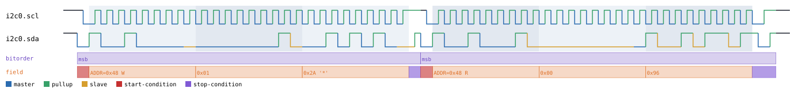
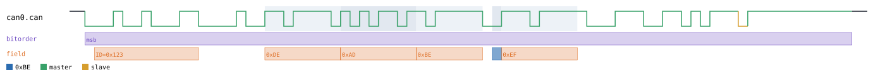

# protowavegen

**Synthesize realistic timing diagrams for 45 embedded protocols — no hardware, no logic analyzer required.**

`protowavegen` takes a plain JSON description of a bus transaction ("write these bytes to this I2C address, then read this many back") and *synthesizes* the electrical waveform that transaction would actually produce — down to real bit timing, checksums, and framing. It never decodes anything; it generates output as if a real logic analyzer had captured a real device. That output comes out as:

- **SVG** — a labeled, human-readable timing diagram for documentation, specs, or teaching material.
- **`.sr`** — a sigrok capture file, importable into [PulseView](https://sigrok.org/wiki/PulseView) or decodable with `sigrok-cli`, exactly like a real capture.
- **`.vcd`** — a standard waveform file, importable into GTKWave.

Every protocol's generator is checked against a **real, independently-written decoder** (sigrok's own, a vendored third-party one, or a decoder built for this project and cross-validated against a second tool) — the waveform isn't just self-consistent with its own encoder, it's proven to decode correctly by something that never saw the encoder's code.

## Why this exists

Writing accurate protocol documentation, testing a decoder, or teaching how a bus works usually means either drawing waveforms by hand (slow, easy to get subtly wrong) or wiring up real hardware just to capture one example transaction. `protowavegen` skips both: describe the transaction in a few lines of JSON, run one command, get a diagram and a capture file that a real analyzer tool will decode correctly.

## A few examples

**I2C** — a 7-bit-addressed write followed by a read:



**CAN** — a standard-frame message with a real CRC-15 and bit-stuffing:



**IR RC-5** — a Philips RC-5 remote-control button press, biphase-encoded:


Every protocol page under [`docs/protocols/`](docs/USAGE.md) has more of these, including before/after images showing exactly what a CLI override changes.

## Quick start

```bash
python3 -m venv .venv && .venv/bin/pip install -e ".[dev]"
.venv/bin/python -m protowavegen --config examples/i2c_7bit.json
```

This reads `examples/i2c_7bit.json` and writes the SVG/`.sr`/`.vcd` outputs it declares. Every protocol has a ready-to-run example under [`examples/`](examples/).

## Customizing a capture from the CLI

You don't have to hand-edit JSON for the common changes — two flags cover most of it:

```bash
# Change the payload a write/read sends — hex, text, binary, or int form
.venv/bin/python -m protowavegen --config examples/i2c_7bit.json \
    --data-hex "i2c0:0:data:2a2a"

# Change a scalar field — a target address, a CAN ID, a DAC channel, etc.
.venv/bin/python -m protowavegen --config examples/can_basic.json \
    --set "can0:0:identifier=0x321"
```

`--data-*` (in `hex`/`text`/`bin`/`int` flavors, plus a floating-bit marker alphabet for "don't care" bits) reaches any byte-array payload field; `--set` reaches any other scalar field — an address, an identifier, a boolean flag — by name. Both can target a specific operation (`protocol_id:op_index[:field]`) when a config has more than one candidate. Full syntax, every flag, and the floating-bit marker system: **[docs/USAGE.md](docs/USAGE.md)**.

## Supported protocols

45 protocols, grouped by transport family — each family's page documents the transport plus everything stacked on it, with runnable CLI examples:

| Family | Protocols |
|---|---|
| [I2C](docs/protocols/i2c.md) | I2C, plus LM75, 24xx EEPROM, DS1307, TCA6408A, MLX90614, Nunchuk, ADXL345, PCA9571, RTC-8564 |
| [I3C](docs/protocols/i3c.md) | I3C (ENTDAA, CCCs, private read/write) |
| [SPI/QSPI/OctoSPI](docs/protocols/spi.md) | SPI, plus JEDEC CFI, MAX7219, SD-card SPI mode, 7-segment shift register, SPI flash |
| [UART](docs/protocols/uart.md) | UART, plus LIN, Modbus RTU, DMX512 |
| [1-Wire](docs/protocols/onewire.md) | 1-Wire, plus DS2408, DS243x, DS28EA00 |
| [Microwire](docs/protocols/microwire.md) | Microwire, plus 93xx-series EEPROM |
| [USB](docs/protocols/usb.md) | USB Full-Speed, plus HID, CDC/ACM, Mass Storage, DFU |
| [CAN](docs/protocols/can.md) | CAN (real CRC-15 + bit-stuffing) |
| [DALI](docs/protocols/dali.md) | DALI (Manchester-encoded lighting control) |
| [IrDA](docs/protocols/irda.md) | IrDA (SIR + IrLAP) |
| [Wiegand](docs/protocols/wiegand.md) | Wiegand (access-control card readers) |
| [PS/2](docs/protocols/ps2.md) | PS/2 keyboard/mouse |
| [NES gamepad](docs/protocols/nes_gamepad.md) | NES controller |
| [IR remotes](docs/protocols/ir.md) | RC-5, NEC, RC-6 |
| [TLC5620](docs/protocols/tlc5620.md) | Shift-register quad DAC |
| [EM4100](docs/protocols/em4100.md) | 125kHz RFID tag |
| [AM230x](docs/protocols/am230x.md) | DHTxx-family humidity/temperature sensor |
| [DCF77](docs/protocols/dcf77.md) | Longwave time-signal broadcast |

## Documentation

- **[docs/USAGE.md](docs/USAGE.md)** — install, the JSON config shape, the full CLI reference, and the payload datatype/floating-marker system.
- **[docs/protocols/](docs/USAGE.md)** — one page per family (table above), each with a plain-language intro, a quick start, and runnable CLI recipes with real before/after waveform images.
- **[CLAUDE.md](CLAUDE.md)** — architecture and validation methodology, for anyone extending the tool itself.
