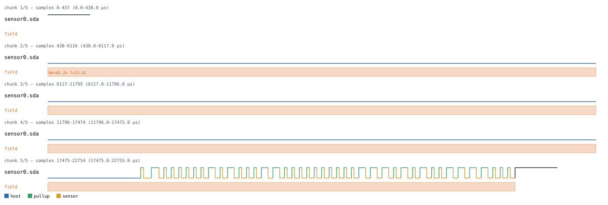
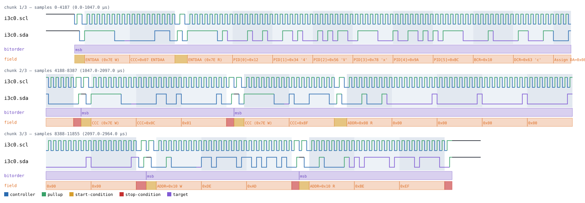
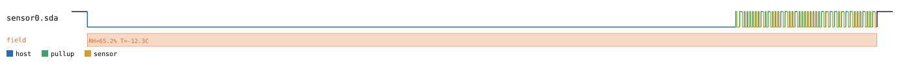

# AM230x / DHTxx

Back to [usage overview](../USAGE.md).

## What this is

The AM230x family (Aosong's AM2301/AM2302, better known by their DHTxx/RHTxx
clones — DHT11, DHT22, and friends) are the cheap combined
humidity-and-temperature sensors found in just about every hobbyist weather
station, HVAC controller, and Arduino tutorial. A microcontroller reads one
the same way every time: pull the sensor's single data pin low to wake it
up, release it, and the sensor replies with a fixed 40-bit frame — humidity,
then temperature, then a checksum — all pulse-width-encoded on that same
wire with no separate clock line.

That single `sda` line is open-drain, and the timing shape is a close
cousin of 1-Wire (a host-initiated low pulse, the device answering with its
own low-then-high "I'm here" pulse, then a run of pulse-width-encoded
bits) — but simpler, since a real AM230x/DHTxx has no ROM ID and no
addressing at all. There's exactly one sensor on the wire, always, and it
always sends the same 40 bits in the same order.

This page generates that waveform — a bare `sda` line, no MCU-side
GPIO signal modeled, since a real host readout is entirely driven by pulse
widths on the one shared wire — as a diagram (SVG) and/or a capture file
(`.sr`/`.vcd`) you can open in PulseView, sigrok-cli, or GTKWave as if a
logic analyzer had actually probed the sensor.

`sda` is open-drain (`SignalKind.TRISTATE`), same convention as I2C's SDA/
SCL and 1-Wire's `dq`: a logic-1 level in the diagram always means "the
pull-up resistor is holding the line high, nobody's driving it," never the
sensor or host actively driving high.

## Quick start

```bash
.venv/bin/python -m protowavegen --config examples/am230x_basic.json
```

This runs `examples/am230x_basic.json` (shown in full in the appendix
below) and writes `output/am230x_basic.svg`/`.sr`/`.vcd` — one simulated
reading of 65.2% relative humidity and 23.4C:



## What you can customize

There are exactly two things about the simulated reading itself:
- **The humidity value** (`humidity` on `send_reading`) — a percentage,
  encoded as a 16-bit fixed-point value (x10, so 65.2% becomes `652`).
- **The temperature value** (`temperature` on `send_reading`) — degrees C,
  encoded as a sign bit plus a 15-bit magnitude (also x10 fixed-point), so
  negative readings are fully supported.

Both are plain scalar fields on `send_reading` (not a byte-array payload,
and not a constructor param), so `--set` reaches them directly — see the
recipes below. The 8-bit checksum that closes the frame is always
recomputed from whatever humidity/temperature values actually end up
encoded, so it's never stale no matter which value you override.

There is no separate JSON-only knob here (no constructor `params` at all —
unlike 1-Wire or EM4100, this protocol has no bit-rate or addressing
constant to tune): every value the sensor sends is already reachable from
the CLI.

## Recipes — customizing via the CLI

### Simulating a different humidity reading

`humidity` is a plain scalar on `send_reading`, so `--set` changes it
directly — the checksum byte updates too, since it's computed at
generation time from the actual encoded value, not carried over stale from
the JSON:

```bash
.venv/bin/python -m protowavegen --config examples/am230x_basic.json --format svg \
    --set "sensor0:0:humidity=99.9"
```



### Simulating a different temperature reading

Same shape, targeting `temperature` instead — negative values work too,
exercising the sign bit in the 16-bit temperature field:

```bash
.venv/bin/python -m protowavegen --config examples/am230x_basic.json --format svg \
    --set "sensor0:0:temperature=-12.3"
```



Both `--set` calls use the same value-coercion rules as everywhere else in
this tool (plain decimal, `0x`/`0b`-prefixed integer, `true`/`false`, or a
bare string — see
[Overriding any other field from the CLI](../USAGE.md#overriding-any-other-field-from-the-cli)).
A typo'd field name fails with a clear list of the real ones:

```
$ .venv/bin/python -m protowavegen --config examples/am230x_basic.json --set "sensor0:0:humid=50"
ValueError: --set: Am230x.send_reading() has no parameter 'humid' (real parameters: ['humidity', 'temperature'])
```

`--data-hex`/`--data-int`/etc. don't apply here at all — `send_reading` has
no byte-array payload field, only these two scalars — so any `--data-*`
flag reports there's nothing for it to target:

```
$ .venv/bin/python -m protowavegen --config examples/am230x_basic.json --data-hex "aabb"
ValueError: no data-carrying operation found to target; specify --data-target
```

and naming the operation explicitly gets the same answer, spelled out
differently — it lists every payload field name known across *all*
protocols in this tool (a shared, global set), not because any of them
apply here, but because that's the full universe `--data-target` checks
against before concluding none of them are present on this operation:

```
$ .venv/bin/python -m protowavegen --config examples/am230x_basic.json --data-target sensor0:0 --data-hex "aabb"
ValueError: --data-target: operation sensor0:0 has no payload field; specify one explicitly, one of [...]
```

### When you still need to edit the JSON

`send_reading`'s two fields are both already reachable from the CLI, and
the constructor takes no other params (no bit-rate constant to tune, no
ROM ID to switch — unlike 1-Wire or EM4100). The one thing that's still
JSON-only is the *shape* of the scenario itself: `--set`/`--data-*` only
ever change a value already sitting on an existing operation, they can't
add a new one. Simulating a second, back-to-back reading (say, a
low-power device that samples twice a few seconds apart) means adding a
second `send_reading` entry to the `operations` list:

```diff
       "operations": [
-        { "op": "send_reading", "humidity": 65.2, "temperature": 23.4 }
+        { "op": "send_reading", "humidity": 65.2, "temperature": 23.4 },
+        { "op": "send_reading", "humidity": 64.8, "temperature": 23.6 }
       ]
```

---

## Appendix — operations reference

### AM230x — `type: "am230x"`

`Am230x`, `protocols/am230x.py`. One open-drain `sda` line
(`SignalKind.TRISTATE`), pulse-width-timed — real hardware, no ROM
addressing (unlike 1-Wire, which this otherwise resembles in shape:
host-initiated low pulse, device responds with an ack-style pulse, then
pulse-width-encoded bits).

No constructor params.

Timing constants confirmed against sigrok's own `am230x` decoder's exact
thresholds — every value here sits comfortably mid-window rather than at
a boundary (e.g. `BIT 0 HIGH` is 20-35us and `BIT 1 HIGH` is 65-80us, a
30us dead zone between them), the same "don't sit on a real decoder's
classification threshold" lesson `onewire.py` already had to learn the
hard way.

Single-call frame: host pulls SDA low, releases; sensor acks low then
high; then 40 bits, MSB-first: 16-bit humidity (x10 fixed-point), 16-bit
temperature (bit 0 = sign, remaining 15 bits = magnitude x10), 8-bit
checksum (sum of the first 4 bytes, mod 256). A final low-then-release
pulse closes the frame.

Operations: `send_reading(humidity, temperature)` — both plain floats
(e.g. `65.2`, `-12.3`). No `datatype` (neither field is a byte-array
payload).

```json
{
  "samplerate": 1000000,
  "protocols": [
    {
      "id": "sensor0", "type": "am230x",
      "operations": [
        { "op": "send_reading", "humidity": 65.2, "temperature": 23.4 }
      ]
    }
  ],
  "outputs": [
    { "type": "svg", "path": "output/am230x_basic.svg" },
    { "type": "sigrok", "path": "output/am230x_basic.sr" },
    { "type": "vcd", "path": "output/am230x_basic.vcd" }
  ]
}
```
