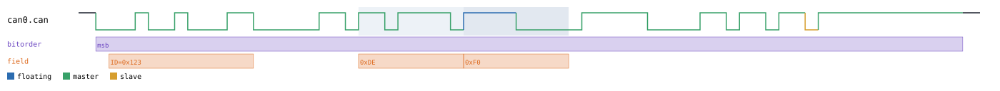
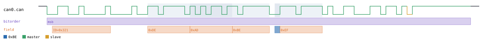
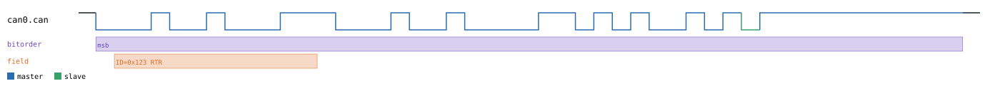
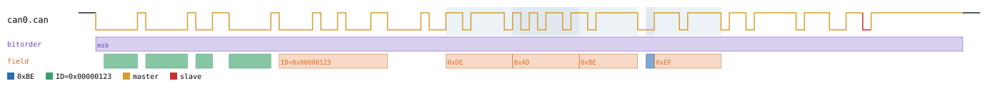

# CAN

Back to [usage overview](../USAGE.md).

## What this is

CAN (Controller Area Network) is the differential two-wire bus (CAN_H/
CAN_L) used throughout automotive and industrial systems for
multi-drop, multi-master messaging — engine/body control units, motor
drives, sensor networks. Physically it's differential and
"dominant"/"recessive" (any node driving dominant wins the bus), but every
real logic analyzer's CAN decoder — and this tool — collapses that pair to
a single logical line: `0` = dominant, `1` = recessive idle.

This page generates a realistic CAN frame — arbitration ID, control field,
data bytes, a real CRC-15 checksum, and real bit-stuffing — without any
real hardware. The output is a diagram (SVG) and/or a capture file
(`.sr`/`.vcd`) you can open in PulseView, sigrok-cli, or GTKWave as if a
logic analyzer had actually probed the bus.

Only one node's transmission is synthesized at a time: this models "one
node sending a frame uncontested," not real multi-node bus arbitration
(where two nodes transmitting simultaneously resolve by dominant-wins bit
comparison) — there's only ever one transmitter's data to generate. The
frame's own driver annotation still distinguishes the transmitter (the
whole frame) from the receiving node that pulls the ACK slot dominant.

This is a plain push-pull-style `DIGITAL` signal, not open-drain like I2C
or 1-Wire — CAN transceivers actively drive both dominant and recessive —
so there's no "protocol-defined pull" for a floating bit to resolve
through: a floating data bit needs `l`/`h` (low/high) explicitly, `z`
alone is a hard error here. See
[the datatype/floating-marker guide](../USAGE.md#the-floating-bit-marker-system-lhz).

## Quick start

```bash
.venv/bin/python -m protowavegen --config examples/can_basic.json
```

This runs `examples/can_basic.json` (shown in full in the appendix below)
and writes `output/can_basic.svg`/`.sr`/`.vcd` — one node sending an
11-bit-ID frame, ID `0x123`, with a 4-byte payload:


## What you can customize

Without touching the JSON at all, the CLI can change:
- **The arbitration identifier** (`identifier` on `send`) — simulate the
  exact same frame appearing to come from a different node on the bus, via
  `--set`.
- **The data bytes** (`data` on `send`) — via
  `--data-hex`/`--data-string`/`--data-int`/etc.
- **The RTR (remote transmission request) flag** (`rtr` on `send`) — also
  a plain scalar, reachable via `--set`.
- **The bitrate and 11-bit-vs-29-bit addressing** (`bitrate`, `extended`)
  — these are constructor `params`, not operation fields, so they need a
  JSON edit (see below).

## Recipes — customizing via the CLI

### Changing the payload

`send`'s `data` field takes the usual floating-marker treatment. This
overrides the payload and marks one byte's low nibble floating-high (`h`)
— useful for showing a byte position the transmitter genuinely isn't
driving a fixed value into, e.g. a padding byte:

```bash
.venv/bin/python -m protowavegen --config examples/can_basic.json --format svg \
    --data-hex "can0:0:data:deh0"
```



### Changing the arbitration identifier

`identifier` is a plain field on the `send` operation itself (not a
constructor param) — every frame can carry a different ID, so `--set`
reaches it directly. This is the CAN equivalent of I2C's "change the
target address": same frame content, different node claiming to send it,
useful for checking how the diagram (and any downstream decoder) reads a
different priority/ID without hand-editing the file:

```bash
.venv/bin/python -m protowavegen --config examples/can_basic.json --format svg \
    --set "can0:0:identifier=0x321"
```



### Flagging a remote frame

`rtr` is also a plain scalar operation field:

```bash
.venv/bin/python -m protowavegen --config examples/can_basic.json --format svg \
    --set "can0:0:rtr=true"
```

The identifier annotation switches to `ID=0x123 RTR`. Note that a real RTR
frame carries no data field at all — `send()` skips emitting data bits
when `rtr=true` regardless of what `data` still says in the JSON, so the
DLC-only control field is what actually goes out on the wire even though
the example config's `data` list is untouched:



### When you still need to edit the JSON

`bitrate` and `extended` are constructor `params`, not operation fields —
there's no operation for `--set` to target, confirmed by the actual error
if you try:

```
$ .venv/bin/python -m protowavegen --config examples/can_basic.json --set "can0:0:bitrate=250000"
ValueError: --set: CanBus.send() has no parameter 'bitrate' (real parameters: ['data', 'datatype', 'identifier', 'rtr'])
```

Switching to 29-bit extended addressing means editing the config directly:

```diff
-      "params": { "bitrate": 500000 },
+      "params": { "bitrate": 500000, "extended": true },
```

The same `identifier=291` (`0x123`) now renders as an 8-hex-digit extended
ID (`0x00000123`) with the extra SRR/IDE/r1 bits arbitration-field
convention requires, instead of the 3-digit 11-bit form:

```bash
.venv/bin/python -m protowavegen --config examples/can_basic.json --format svg
```



---

## Appendix — operations reference

`type: "can"` — `CanBus`, `protocols/can.py`. Classic CAN (2.0A 11-bit or
2.0B 29-bit extended). Single logical `can` signal (dominant=0/recessive=1
— the differential CAN_H/CAN_L pair collapses to one logical line, same
as a logic analyzer's CAN decoder treats it). Real CRC-15 and bit-stuffing.
Synthesizes one node transmitting a frame uncontested — real multi-node
bus arbitration isn't modeled. Plain `DIGITAL` — `z`/`Z` on `data` needs
`l`/`h` used explicitly.

### Constructor params

```json
"params": { "bitrate": 500000, "extended": false }
```

- `bitrate` (required).
- `extended` — `false` (default, 11-bit ID) or `true` (29-bit ID).

### Operations

- **`send`** — `identifier`, `data=None`, `datatype="bytes"`,
  `rtr=False`. Only `data` (0-8 bytes) is floating-marker capable;
  `identifier` and `rtr` are always plain values, no `datatype`.

Full frame shape: SOF, arbitration field (+SRR/IDE/r1 for extended),
control field (RTR/IDE/r0 + 4-bit DLC), 0-8 data bytes, 15-bit CRC
(polynomial `0x4599`, computed over the *logical* pre-stuffing bit
sequence from SOF through the end of the data field — matching what a
real CAN controller computes, since stuff bits are inserted after CRC
calculation and removed again before a receiver checks it), CRC
delimiter, ACK slot + delimiter, 7-bit EOF, 3-bit intermission.

Bit stuffing applies from SOF through the end of the CRC field: one
opposite-polarity bit is inserted after every 5 consecutive identical
bits. A stuffed bit is always a real, always-driven protocol-mandated
insertion — never eligible to be marked floating, even if the payload bit
that triggered the stuffing run was.

`driver` is `"master"` for the whole frame except the ACK slot, which is
annotated `"slave"` (a receiving node pulling it dominant) — the rest of
the bus doesn't get its own open-drain "pullup" concept the way I2C does,
since a real CAN transceiver actively drives recessive too; this
single-transmitter model doesn't need to represent that distinction beyond
marking who's acknowledging.

### Example — `examples/can_basic.json`

```json
{
  "samplerate": 8000000,
  "protocols": [
    {
      "id": "can0",
      "type": "can",
      "params": { "bitrate": 500000 },
      "operations": [
        { "op": "send", "identifier": 291, "data": [222, 173, 190, 239] }
      ]
    }
  ],
  "outputs": [
    { "type": "svg", "path": "output/can_basic.svg" },
    { "type": "sigrok", "path": "output/can_basic.sr" },
    { "type": "vcd", "path": "output/can_basic.vcd" }
  ]
}
```
