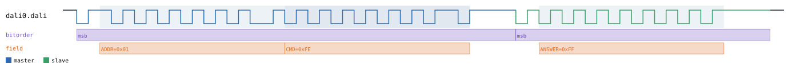
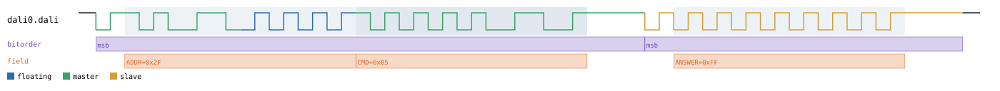
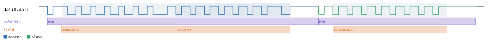

# DALI

Back to [usage overview](../USAGE.md).

## What this is

DALI (Digital Addressable Lighting Interface) is the lighting-industry bus
that lets a controller address individual ballasts (or groups, or
everyone) over a simple two-wire current loop, telling them to dim, switch
scenes, or report status back. This page generates realistic DALI timing
diagrams — a controller sending a forward frame (address + command) to a
ballast, and a ballast sending a backward frame (a one-byte reply) back —
without any real hardware. The output is a diagram (SVG) and/or a capture
file (`.sr`/`.vcd`) you can open in PulseView, sigrok-cli, or GTKWave as if
a logic analyzer had actually probed the bus.

The differential current-loop pair collapses to one logical signal here
(`dali`), the same simplification used for CAN. DALI is Manchester encoded
(G.E. Thomas convention: bit `1` is a low-to-high transition at the bit's
midpoint, bit `0` is high-to-low) at roughly 1200 bits/second. There's only
one transmitter on the line at any moment — the controller during a
forward frame, the ballast during its reply — so unlike I2C or 1-Wire
there's no shared open-drain pull-up: the signal is plain `DIGITAL`, and a
floating bit always needs `l`/`h` picked explicitly (`z` has no pull to
resolve against — see [the floating-bit marker
guide](../USAGE.md#the-floating-bit-marker-system-lhz)).

## Quick start

```bash
.venv/bin/python -m protowavegen --config examples/dali_basic.json
```

This runs `examples/dali_basic.json` (shown in full in the appendix below)
and writes `output/dali_basic.svg`/`.sr`/`.vcd` — a forward frame
addressing ballast `1` with command `254` (`DAPC` "go to max level" in the
real DALI opcode table, though this tool doesn't validate or decode the
opcode itself — it's just a byte on the wire), followed by a backward
frame replying `255`:



## What you can customize

Without touching the JSON at all, the CLI can change:
- **The ballast address and command byte** in the forward frame
  (`DALI_ADDRESS`, `command`) — via `--data-hex`/`--data-string`/
  `--data-bin`/etc. (see the caveat about `--data-int` below).
- **The reply byte** in the backward frame (`answer`) — same flags.

There is **no genuine scalar field** anywhere in DALI's operations —
`DALI_ADDRESS`, `command`, and `answer` are all single-byte *payload*
fields (see below), not plain scalars, so `--set` can't reach any of them.
The only thing left over is `baudrate`, and that's a constructor param, so
it needs a JSON edit regardless (see the last recipe).

## Recipes — customizing via the CLI

### Changing the forward frame's address and command

`send_forward_frame`'s `DALI_ADDRESS` and `command` are independently
typed — each gets its own `<field>_datatype` kwarg instead of a single
shared `datatype` (DALI is one of the few protocols in this tool that
works this way; see [Chaining multiple overrides](../USAGE.md#chaining-multiple-overrides-in-one-invocation)
for the general mechanism), but from the CLI you never have to know that —
`--data-hex`/`--data-string`/etc. figure out the right kwarg name from the
operation's real signature. Both fields can be overridden in one
invocation as long as each flag carries its own inline
`dali0:0:<field>:` target:

```bash
.venv/bin/python -m protowavegen --config examples/dali_basic.json --format svg \
    --data-hex "dali0:0:DALI_ADDRESS:2h" --data-string "dali0:0:command:\x05"
```

`DALI_ADDRESS:2h` is a floating-marker hex literal — high nibble `2`,
low nibble floating high, resolving to `0x2F` — and `command:\x05` uses
the text datatype's raw-byte escape to set the command byte to `0x05`.
(The field is named `DALI_ADDRESS`, not `address`, specifically so it can
live in the CLI's payload-field list without colliding with I2C's own
unrelated `address` field — see the appendix.)



### Changing the ballast's reply

`send_backward_frame`'s `answer` is a single payload field, reachable the
same way — here with a binary literal:

```bash
.venv/bin/python -m protowavegen --config examples/dali_basic.json --format svg \
    --data-bin "dali0:1:answer:0b11001100"
```


### A genuine limitation: `--data-int` doesn't work here

Every other `--data-*` flag works on DALI's fields, but `--data-int`
crashes with a raw Python traceback instead of a clean error:

```
$ .venv/bin/python -m protowavegen --config examples/dali_basic.json \
    --data-int "dali0:0:command:5"
Traceback (most recent call last):
  ...
  File ".../protowavegen/protocols/dali.py", line 109, in send_forward_frame
    cmd_bits = bits_of_byte(command)
  File ".../protowavegen/protocols/base.py", line 100, in bits_of_byte
    if not (0 <= byte <= 0xFF):
TypeError: '<=' not supported between instances of 'int' and 'list'
```

Why: `--data-int` always resolves under `datatype: "bytes"` and always
produces a `list[int]` (even for a single value), but DALI's
`DALI_ADDRESS`/`command`/`answer` are single-byte fields whose `"bytes"`
datatype branch (`resolve_single_byte()`) expects a bare `int`, not a
list — that mismatch is what the codebase's other `datatype="bytes"`
fields never hit, since those are genuine byte-array fields expecting a
list either way. Use `--data-hex`/`--data-string`/`--data-bin` instead (as
in both recipes above) — anything that resolves under a datatype other
than `"bytes"` goes through the single-byte decode path and works fine.

### Scalar fields and `--set`

Every field on every DALI operation — `DALI_ADDRESS`, `command`, and
`answer` — is a recognized payload (byte-array) field, even though each
one individually only ever holds one byte. `--set` refuses all three the
same way:

```
$ .venv/bin/python -m protowavegen --config examples/dali_basic.json \
    --set "dali0:0:command=5"
ValueError: --set: 'command' is a payload (byte-array) field, not a scalar — use
--data-hex/--data-string/--data-int/--data-bin/--data-bits/--data-file instead
```

So unlike I2C's `address` or CAN's `identifier`, there's no scalar
operation field on DALI to demonstrate `--set` with at all — every
override on this page goes through `--data-*` instead.

### When you still need to edit the JSON

`baudrate` is a constructor param (the DALI spec's nominal ~1200bps),
not an operation field — there's no operation for `--set`/`--data-*` to
target, so changing it means editing the config directly:

```diff
-      "id": "dali0", "type": "dali",
+      "id": "dali0", "type": "dali", "params": { "baudrate": 2400 },
```

Doubling the baud rate halves every bit's duration, visibly compressing
both frames in the diagram:



---

## Appendix — operations reference

`type: "dali"` — `DaliBus`, `protocols/dali.py`. Single logical `dali`
line (the differential current-loop pair collapses to one signal, same
simplification `CanBus` uses) — single transmitter per frame like CAN, so
no open-drain/pull-up concept either. Plain `DIGITAL` — `z`/`Z` needs
`l`/`h` used explicitly.

### Constructor params

```json
"params": { "baudrate": 1200 }
```

- `baudrate` — default `1200` (the DALI spec's ~1200bps, bit period
  ~833us), exposed for flexibility.

### Operations

- **`send_forward_frame`** (controller->ballast) — `DALI_ADDRESS`,
  `command`, `DALI_ADDRESS_datatype="bytes"`, `command_datatype="bytes"`.
  **Note the field is `DALI_ADDRESS`, not `address`** — deliberately
  namespaced so it can be `--data-target`-ed without colliding with
  I2C's own unrelated `address` field (the CLI's target-field set is
  shared across every protocol type). Both fields independently
  floating-marker capable (`l`/`h` only — no protocol-defined pull to
  resolve `z` against).
- **`send_backward_frame`** (ballast->controller reply) — `answer`,
  `answer_datatype="bytes"`. Floating-marker capable, same `l`/`h`-only
  restriction.

Frame shape: a forward frame is a START bit (fixed `1`) + 8-bit address
byte (MSB-first) + 8-bit command/data byte (MSB-first) + 2 stop bits
(idle-high settling, no transitions). A backward frame is a START bit +
8-bit answer byte + 2 stop bits, no address byte. The address byte's
addressing-mode bits (short/group/broadcast) aren't decoded into separate
fields, and the command opcode table isn't validated — both are treated
as plain bytes on the wire.

### Manchester encoding

G.E. Thomas convention: bit `1` is a low-to-high transition at the bit's
midpoint, bit `0` is high-to-low — each half-bit is one clocked level.
This is the same polarity convention `dali.py` shares with RC-5's biphase
encoding, but **not universal across every Manchester/biphase protocol in
this codebase** — RC-6's leader bit needs the opposite sense to be
recognized by its decoder (see [`ir.md`](ir.md) if working on that one).
Bit order is MSB-first within each byte.

### Example — `examples/dali_basic.json`

```json
{
  "samplerate": 12000,
  "protocols": [
    {
      "id": "dali0",
      "type": "dali",
      "operations": [
        { "op": "send_forward_frame", "DALI_ADDRESS": 1, "command": 254 },
        { "op": "send_backward_frame", "answer": 255 }
      ]
    }
  ],
  "outputs": [
    { "type": "svg", "path": "output/dali_basic.svg" },
    { "type": "sigrok", "path": "output/dali_basic.sr" },
    { "type": "vcd", "path": "output/dali_basic.vcd" }
  ]
}
```
