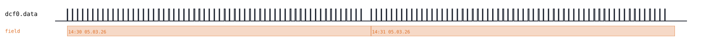
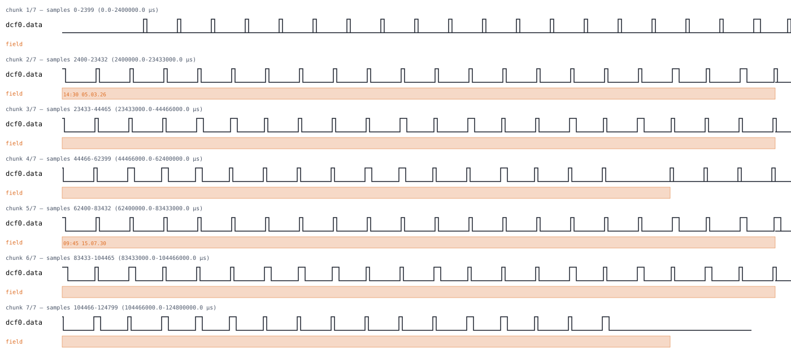
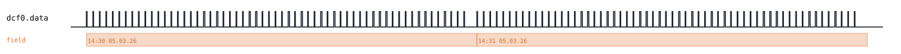
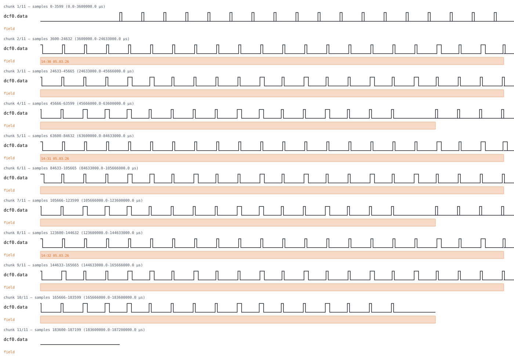

# DCF77

Back to [usage overview](../USAGE.md).

## What this is

DCF77 is the longwave time signal broadcast from Mainz, Germany (77.5kHz),
received by every "radio-controlled" clock and watch sold in most of
Europe. There's no request/response — the transmitter just continuously
amplitude-modulates one bit per second, forever, and any receiver in range
can passively lock onto it. A demodulated receiver output (what this tool
generates) is a single digital line that goes high for either ~100ms
("0") or ~200ms ("1") once per second, with 59 such bits making up one
full minute; the 60th second is left completely silent (no pulse at all)
so a receiver can recognize "a new minute just started" purely from that
gap.

Those 59 bits per minute encode, in BCD:
- bit 0 — always 0 (start-of-minute marker)
- bits 1-14 — always 0 here (civil-warning/weather-forecast data some
  receivers use; not modeled)
- bit 15 — the call bit
- bits 16-19 — summer-time announcement, CEST-in-effect, CET-in-effect,
  leap-second announcement flags
- bit 20 — always 1 (start-of-encoded-time marker)
- bits 21-28 — minute, BCD + even parity
- bits 29-35 — hour, BCD + even parity
- bits 36-58 — day / weekday / month / year, BCD + even parity over the
  whole block

This page generates that waveform on a single `data` line — no real
transmitter or receiver hardware involved — as a diagram (SVG) and/or a
capture file (`.sr`/`.vcd`) you can open in PulseView, sigrok-cli, or
GTKWave as if a logic analyzer had actually probed a receiver's
demodulated output pin. It's a plain, single-transmitter digital signal
like EM4100's, not open-drain — there's no pullup convention and no
floating-bit markers to worry about here.

One timing quirk worth knowing if you ever compare this against a
datasheet or another tool: sigrok's own `dcf77` decoder (used to
cross-check every capture this tool produces) triggers on the *rising*
edge of each second's pulse and measures how long the line then stays
*high* to decide 0 vs. 1 (40-160ms -> 0, 161-260ms -> 1) — the opposite
sense from most of the other pulse-timed protocols in this repo, where the
*low* portion is what's timed. That's matched here because it's what a
real DCF77 receiver's decoder expects, not a free choice.

## Quick start

```bash
.venv/bin/python -m protowavegen --config examples/dcf77_basic.json
```

This runs `examples/dcf77_basic.json` (shown in full in the appendix
below) and writes `output/dcf77_basic.svg`/`.sr`/`.vcd` — two consecutive
minutes, both broadcasting 14:30 and 14:31 on 05.03.26:



Two minutes, not one, is deliberate, not padding. sigrok's `dcf77`
decoder only starts annotating real fields (minute/hour/date) once it has
actually *seen* the ~2-second new-minute gap that follows a full 59-bit
sequence — a single isolated minute never produces that gap, so the
decoder never gets to start. This mirrors how a real receiver behaves too
(it locks onto a continuously-transmitting signal, it doesn't decode from
a cold, isolated snippet), so it isn't a workaround so much as accurate
modeling. Despite spanning two real-time minutes, the generated capture
stays tiny — `CaptureBuilder`'s edge list scales with the number of
transitions (~118 per minute), not with wall-clock time, so this is only
about 120,000 samples at the config's 1kHz samplerate.

## What you can customize

Every field of the broadcast date/time and every one of the four status
flags lives on each `send_minute` operation as a plain scalar (not a byte
array), so `--set` reaches all of them directly — there's no `--data-*`
payload field on this protocol at all (see the error demonstrating that
below). `Dcf77` itself takes no constructor parameters — there's no bit
rate, samplerate, or timing constant to tune the way other protocols'
`params` allow; the only thing JSON-only is the *number* of `send_minute`
calls (i.e. how many minutes the capture spans), since `--set`/`--data-*`
only ever change a field on an operation that's already in the list, they
never add one.

## Recipes — customizing via the CLI

### Simulating a different date/time

`send_minute`'s `minute`/`hour`/`day`/`weekday`/`month`/`year` fields are
all plain integers, so `--set` changes any of them. Because sigrok's
decoder only reports real fields for the *second* minute in a pair (the
first is consumed just establishing the new-minute sync gap), the useful
target is operation index `1`, not `0`. Overriding all six fields
together simulates the transmitter broadcasting 09:45 on 15.07.30
(a Tuesday) instead of the example's default 14:31 on 05.03.26:

```bash
.venv/bin/python -m protowavegen --config examples/dcf77_basic.json --format svg \
    --set "dcf0:1:minute=45" --set "dcf0:1:hour=9" --set "dcf0:1:day=15" \
    --set "dcf0:1:weekday=2" --set "dcf0:1:month=7" --set "dcf0:1:year=30"
```



Each field is targeted and coerced independently — there's no single
"set the whole datetime at once" flag the way DS1307/RTC-8564's I2C pages
use an ISO-8601 `dt` string, since DCF77's own frame format splits minute/
hour/date into separate BCD fields at the wire level to begin with; `--set`
just mirrors that shape. Real range validation still applies underneath —
an out-of-range value fails with a plain Python exception before any
output is written, e.g. `--set "dcf0:1:hour=99"` raises
`ValueError: hour 99 out of range 0-23`, not a plausible-looking but wrong
diagram.

### Simulating the summer-time / status flags

`call_bit`, `summer_time_announce`, `cest`, `cet`, and
`leap_second_announce` are plain booleans, reachable the same way:

```bash
.venv/bin/python -m protowavegen --config examples/dcf77_basic.json --format svg \
    --set "dcf0:1:cest=true" --set "dcf0:1:cet=false" --set "dcf0:1:summer_time_announce=true"
```

This flips the second minute from the example's default CET-in-effect
(`cet=true`) to CEST-in-effect with the announcement flag also raised —
the pattern a real transmitter shows for the last hour before a
spring/autumn clock change:



`true`/`false` are recognized case-sensitively as literal booleans by the
same value-coercion rules every `--set` flag uses (int/float/bool/string —
see [Overriding any other field from the CLI](../USAGE.md#overriding-any-other-field-from-the-cli)).
A typo'd field name fails with a clear list of the real ones instead of
silently doing nothing:

```
$ .venv/bin/python -m protowavegen --config examples/dcf77_basic.json --set "dcf0:1:minuet=45"
ValueError: --set: Dcf77.send_minute() has no parameter 'minuet' (real parameters: ['call_bit', 'cest', 'cet', 'day', 'hour', 'leap_second_announce', 'minute', 'month', 'summer_time_announce', 'weekday', 'year'])
```

`--data-*` doesn't apply to this protocol at all — `send_minute` has no
byte-array payload field, only scalars, so any `--data-*` flag reports
there's nothing for it to target:

```
$ .venv/bin/python -m protowavegen --config examples/dcf77_basic.json --data-int "dcf0:1:5"
ValueError: --data-target: operation dcf0:1 has no payload field; specify one explicitly, one of [...]
```

### When you still need to edit the JSON

There's no constructor `params` on `Dcf77` at all to demonstrate a
JSON-only field edit — but adding a *third* `send_minute` call is itself
JSON-only, since `--set`/`--data-*` only ever change a field on an
operation that's already there; they can't append a new one:

```diff
       "operations": [
         { "op": "send_minute", "minute": 30, "hour": 14, "day": 5, "weekday": 4, "month": 3, "year": 26 },
-        { "op": "send_minute", "minute": 31, "hour": 14, "day": 5, "weekday": 4, "month": 3, "year": 26 }
+        { "op": "send_minute", "minute": 31, "hour": 14, "day": 5, "weekday": 4, "month": 3, "year": 26 },
+        { "op": "send_minute", "minute": 32, "hour": 14, "day": 5, "weekday": 4, "month": 3, "year": 26 }
       ]
```

Running that produces three consecutive minutes (14:30, 14:31, 14:32)
back-to-back instead of two — every minute after the first now falls
after a real new-minute gap, so sigrok's decoder reports real fields for
both the second and third minutes, not just the second:



---

## Appendix — operations reference

### DCF77 — `type: "dcf77"`

`Dcf77`, `protocols/dcf77.py`. One demodulated `data` line. No constructor
params.

Operations: `send_minute(minute, hour, day, weekday, month, year,
call_bit=False, summer_time_announce=False, cest=False, cet=True,
leap_second_announce=False)`. No `datatype` — every field is a plain
scalar (int or bool), not a byte-array payload.

Validated ranges (a violation raises `ValueError` immediately, before any
output is written): `minute` 0-59, `hour` 0-23, `day` 1-31, `weekday`
1-7 (1=Monday), `month` 1-12, `year` 0-99 (2-digit).

**Needs 2+ back-to-back `send_minute()` calls for a meaningful decode**:
sigrok's decoder only starts annotating real fields once it sees the
~2000ms new-minute gap (confirmed empirically — a single isolated minute
never gets that gap). This mirrors real DCF77 behavior (a receiver locks
onto a continuously-transmitting signal) rather than being a workaround.

Real-time duration is a non-issue for this tool despite the 1-minute-per-
call span — `CaptureBuilder`'s edge list is sparse and scales with edge
count (~118/minute), not real-time span; two minutes is only 120,000
samples at a 1kHz samplerate (already 10x the pulses' own resolution).

Bit layout, one bit per second, 59 bits/minute (bit 59 is never
transmitted — a full extra silent second in its place marks the
new-minute boundary):
- bit 0 — start of minute, always 0
- bits 1-14 — special bits, always 0 here (civil warning/weather forecast
  data isn't modeled)
- bit 15 — call bit
- bits 16-19 — summer-time announcement / CEST / CET / leap-second flags
- bit 20 — start of encoded time, always 1
- bits 21-28 — minute BCD + even parity
- bits 29-35 — hour BCD + even parity
- bits 36-58 — day/weekday/month/year BCD + even parity over the whole
  date block

Confirmed against sigrok's own `dcf77` decoder: it triggers on *rising*
edges and measures the following *high* period's duration to classify
each bit (40-160ms -> 0, 161-260ms -> 1) — the opposite envelope sense
from every other pulse-timed protocol in this repo (mark/low vs.
space/high), matched here rather than chosen freely.

```json
{
  "samplerate": 1000,
  "protocols": [
    {
      "id": "dcf0", "type": "dcf77",
      "operations": [
        { "op": "send_minute", "minute": 30, "hour": 14, "day": 5, "weekday": 4, "month": 3, "year": 26 },
        { "op": "send_minute", "minute": 31, "hour": 14, "day": 5, "weekday": 4, "month": 3, "year": 26 }
      ]
    }
  ],
  "outputs": [
    { "type": "svg", "path": "output/dcf77_basic.svg" },
    { "type": "sigrok", "path": "output/dcf77_basic.sr" },
    { "type": "vcd", "path": "output/dcf77_basic.vcd" }
  ]
}
```
