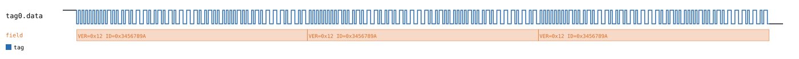
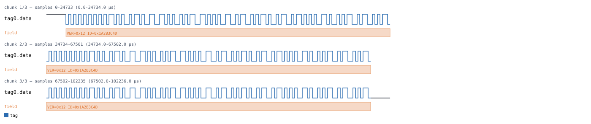
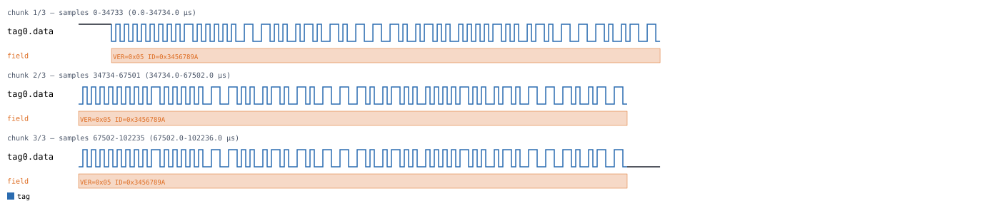

# EM4100

Back to [usage overview](../USAGE.md).

## What this is

The EM4100 is a passive 125kHz RFID tag — the chip inside the cheap
credit-card-sized access badges and glass-capsule pet/animal ID tags you
see everywhere. It has no battery and no logic of its own beyond "power up
from the reader's field and continuously repeat my 64-bit ID forever." There's
no handshake, no addressing, no command the reader ever sends — the tag
just broadcasts on a single wire the moment it's powered, over and over,
until it leaves the field.

That 64-bit frame is Manchester-encoded (self-clocking — each bit is a
mid-bit transition, so no separate clock line is needed) and laid out as:
a 9-bit all-1s header, then 10 rows of 4 data bits + 1 even row-parity bit
(the first 2 rows are an 8-bit version/customer byte, the remaining 8 rows
a 32-bit unique ID), then 4 even column-parity bits (one per data-bit
column, XORed down all 10 rows) and a stop bit.

This page generates that waveform on a single `data` line — no real
hardware, no reader/tag handshake modeled (there isn't one) — as a diagram
(SVG) and/or a capture file (`.sr`/`.vcd`) you can open in PulseView,
sigrok-cli, or GTKWave as if a logic analyzer had actually probed the tag.
Unlike I2C or 1-Wire, this line is a plain, single-transmitter digital
signal, not open-drain — there's no pullup convention and no floating-bit
markers to worry about here.

## Quick start

```bash
.venv/bin/python -m protowavegen --config examples/em4100_basic.json
```

This runs `examples/em4100_basic.json` (shown in full in the appendix
below) and writes `output/em4100_basic.svg`/`.sr`/`.vcd` — the same tag
frame (`version=18`, `unique_id=878082202`, i.e. `0x12`/`0x3456789A`)
transmitted three times back-to-back:



Three repeats, not one, is the example deliberately, not padding. A real
EM4100 tag repeats endlessly, and matching that turns out to matter for
decoding it too: sigrok's `em4100` decoder figures out which half of each
bit-cell pair means "0" and which means "1" from whichever edge it
happens to see *first*, with no separate sync step — so the very first
frame (and sometimes the second) can come out read one bit-position out of
phase, purely from bad luck about where the decoder started listening. By
the time the first full frame boundary goes by, its guess has settled onto
the right alignment, and every frame after that decodes cleanly. Two
repeats is not reliably enough; three is what this repo's own round-trip
test (decoding the generated capture with sigrok's real, independently
written decoder) confirms is enough. So: keep at least 3 `transmit()`
calls back-to-back if you want a capture that a real decoder can read
correctly, not just one that looks right in the SVG.

## What you can customize

There are exactly two things about the simulated tag itself:
- **The tag's unique ID** (`unique_id` on `transmit`) — the 32-bit number
  a real reader would show as the badge/tag's serial number.
- **The version/customer byte** (`version` on `transmit`) — an 8-bit code,
  normally used to distinguish tag batches/customers on real hardware.

Both are plain scalar fields on every `transmit` operation (not a
byte-array payload, and not a constructor param), so `--set` reaches them
directly — see the recipes below. The bit rate (`bit_us`, a constructor
param) needs a JSON edit; also covered below.

## Recipes — customizing via the CLI

### Simulating a different tag ID

`unique_id` lives on each `transmit` operation individually — it isn't a
shared, once-per-protocol setting — so simulating one consistent tag across
all three repeats means targeting all three operation indices in one
invocation:

```bash
.venv/bin/python -m protowavegen --config examples/em4100_basic.json --format svg \
    --set "tag0:0:unique_id=0x1A2B3C4D" \
    --set "tag0:1:unique_id=0x1A2B3C4D" \
    --set "tag0:2:unique_id=0x1A2B3C4D"
```

Every frame in the capture now reports `ID=0x1A2B3C4D` instead of the
example's default `0x3456789A` — useful for checking how a diagram looks
for a specific badge without hand-editing the JSON three times over:



If you only override `tag0:0` and leave `tag0:1`/`tag0:2` alone, you'll get
a (perfectly valid, but probably not what you meant) capture where the
first frame reports a different ID than the other two — `--set` only ever
touches the exact operation index you name.

### Simulating a different version/customer byte

Same shape, targeting `version` instead:

```bash
.venv/bin/python -m protowavegen --config examples/em4100_basic.json --format svg \
    --set "tag0:0:version=0x05" \
    --set "tag0:1:version=0x05" \
    --set "tag0:2:version=0x05"
```



Both `--set` calls above are ordinary integer literals; the same value
coercion rules as everywhere else in this tool apply (`0x`-prefixed hex,
`0b`-prefixed binary, plain decimal, or a bare float/bool/string — see
[Overriding any other field from the CLI](../USAGE.md#overriding-any-other-field-from-the-cli)
for the full coercion table). A typo'd field name fails with a clear list
of the real ones:

```
$ .venv/bin/python -m protowavegen --config examples/em4100_basic.json --set "tag0:0:uniqueid=1"
ValueError: --set: Em4100.transmit() has no parameter 'uniqueid' (real parameters: ['unique_id', 'version'])
```

`--data-hex`/`--data-int`/etc. don't apply here at all — `transmit` has no
byte-array payload field, only these two scalars, so any `--data-*` flag
just reports that there's nothing for it to target:

```
$ .venv/bin/python -m protowavegen --config examples/em4100_basic.json --data-int "tag0:0:unique_id:1"
ValueError: --data-target: operation tag0:0 has no payload field; specify one explicitly, one of [...]
```

### When you still need to edit the JSON

`bit_us` (the full Manchester bit period, default `512.0` microseconds —
matching a real 125kHz coil and the standard 64-cycle-per-bit EM4100 data
rate) is a constructor `param`, not an operation field, so `--set` can't
reach it:

```diff
       "id": "tag0", "type": "em4100",
+      "params": { "bit_us": 256.0 },
       "operations": [
```

That halves every frame's transmission time in the generated `.sr`/`.vcd`
capture (confirmed by checking the capture's total duration — 100014
samples at the default rate vs. 50007 at half the bit period). Worth
knowing: the *SVG* rendering of that faster capture looks pixel-identical
to the baseline. `SVGWriter` always scales the whole capture's duration to
fit a fixed-width image, so a uniform speed-up like this — every bit
proportionally shorter, nothing else about the waveform's shape changed —
produces literally the same picture. If you need to see the timing
difference, look at the `.vcd` (or open the `.sr` in PulseView, which
shows a real, absolute time axis), not the SVG.

---

## Appendix — operations reference

### EM4100 — `type: "em4100"`

`Em4100`, `protocols/em4100.py`. One Manchester-encoded `data` line,
active whenever the (passive) tag is within read range — no reader/tag
handshake modeled, since a real EM4100 tag just continuously transmits
once powered by the reader's field.

Uses the same Manchester bit convention as DALI's own encoder (bit=1:
low-then-high, bit=0: high-then-low). Decoding it needs sigrok's `em4100`
decoder given `polarity=active-low` explicitly — its own default is
`active-high`, which decodes every bit inverted.

`params`: `bit_us` (default `512.0`) — the full bit period, matching a
125kHz coil frequency at the standard 64-cycle-per-bit data rate.

Operations: `transmit(version, unique_id)`. No `datatype` (neither field
is a byte-array payload — `version` is an 8-bit scalar, `unique_id` a
32-bit scalar; both are reachable from the CLI only via `--set`, never
`--data-*`).

**Needs 3+ back-to-back `transmit()` calls for a clean decode**, not just
1 or 2: sigrok's decoder bootstraps its Manchester bit-pairing state off
whatever edge it happens to see first, so early frames can decode out of
phase — confirmed empirically (and pinned down by this repo's own
sigrok round-trip test). By the first frame boundary its pairing state has
settled, after which every subsequent frame (and the first frame's own
fields) decodes cleanly. This mirrors real EM4100 tag behavior anyway
(continuous retransmission), so it isn't a workaround so much as accurate
modeling.

```json
{
  "samplerate": 1000000,
  "protocols": [
    {
      "id": "tag0", "type": "em4100",
      "operations": [
        { "op": "transmit", "version": 18, "unique_id": 878082202 },
        { "op": "transmit", "version": 18, "unique_id": 878082202 },
        { "op": "transmit", "version": 18, "unique_id": 878082202 }
      ]
    }
  ],
  "outputs": [
    { "type": "svg", "path": "output/em4100_basic.svg" },
    { "type": "sigrok", "path": "output/em4100_basic.sr" },
    { "type": "vcd", "path": "output/em4100_basic.vcd" }
  ]
}
```
