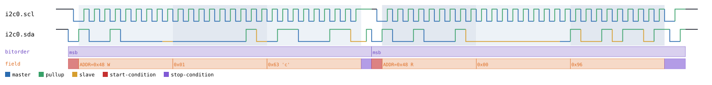
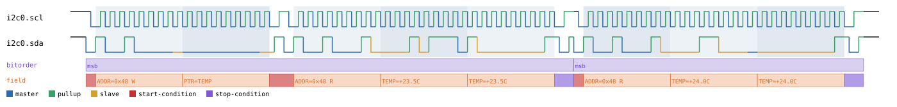
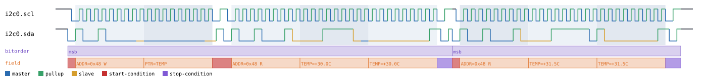
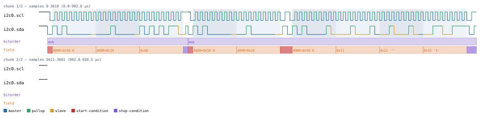
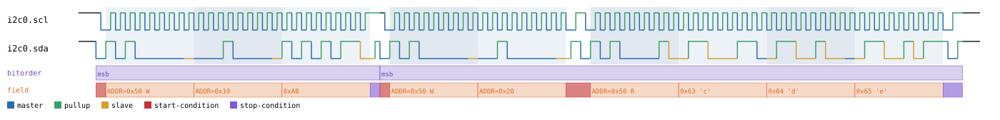

# I2C

Back to [usage overview](../USAGE.md).

## What this is

I2C (Inter-Integrated Circuit) is the two-wire bus (SCL clock, SDA data)
used all over embedded electronics to talk to sensors, EEPROMs, real-time
clocks, GPIO expanders, and dozens of other small chips. This page
generates realistic I2C timing diagrams — a master writing/reading a
generic device, plus nine specific real-world devices stacked on top of
the same bus — without any real hardware. The output is a diagram (SVG)
and/or a capture file (`.sr`/`.vcd`) you can open in PulseView, sigrok-cli,
or GTKWave as if a logic analyzer had actually probed the bus.

Both signals are open-drain (`SignalKind.TRISTATE`): a logic-1 level in
the diagram always means "the pull-up resistor is holding the line high,
nobody's driving it," never a chip actively driving high. This matters if
you ever hand-write a floating-bit payload — see
[the datatype/floating-marker guide](../USAGE.md#the-floating-bit-marker-system-lhz).

## Quick start

```bash
.venv/bin/python -m protowavegen --config examples/i2c_7bit.json
```

This runs `examples/i2c_7bit.json` (shown in full below) and writes
`output/i2c_7bit.svg`/`.sr`/`.vcd` — a master writing two bytes to device
address `72` (`0x48`), then reading two bytes back from the same address:


## What you can customize

Without touching the JSON at all, the CLI can change:
- **The address being talked to** (`address` on `write`/`read`/
  `write_then_read`) — simulate the same transaction against a different
  device on the bus, via `--set`.
- **The bytes sent or expected back** (`data`, or `write_data`/`read_data`
  on `write_then_read`) — via `--data-hex`/`--data-string`/`--data-int`/etc.
- **The bus clock speed** (`clock_hz`) — this one's a constructor param,
  not an operation field, so it needs a JSON edit (see below).

## Recipes — customizing via the CLI

### Changing the payload

Override the write's data and the read's expected reply in one invocation
(each flag targets a different operation via its inline
`protocol_id:op_index:` prefix — see
[Chaining multiple overrides](../USAGE.md#chaining-multiple-overrides-in-one-invocation)):

```bash
.venv/bin/python -m protowavegen --config examples/i2c_7bit.json --format svg \
    --data-int "i2c0:0:1,99"
```

This changes the write's payload from `[1, 42]` to `[1, 99]` — useful for
checking how a diagram looks with a different register value without
hand-editing the file:



### Changing the target address

`address` is a plain field on the `write`/`read` operations themselves
(not a constructor param, for the raw I2C bus — every transaction can
target a different device), so `--set` reaches it directly:

```bash
.venv/bin/python -m protowavegen --config examples/i2c_7bit.json --format svg \
    --set "i2c0:0:address=0x50" --set "i2c0:1:address=0x50"
```

Both operations now target `0x50` instead of `0x48` — simulating the exact
same read/write sequence against a second device on the bus:


### When you still need to edit the JSON

`addr_bits`/`clock_hz` are constructor `params`, not per-operation fields
— there's no operation to target, so `--set`/`--data-*` can't reach them.
Switch to 10-bit addressing by editing the config directly:

```diff
-      "params": { "clock_hz": 100000, "addr_bits": 7 },
+      "params": { "clock_hz": 100000, "addr_bits": 10 },
```

then re-run the same command. The same applies to adding/removing
operations entirely, or changing which protocols are in the scenario.

---

## Stacked devices

Every device below needs `"stack_on": "<i2c node id>"` and must be
declared after that I2C node in the `protocols` list. Several of them
have a **fixed or constructor-level address** (baked into `params`, not
an operation field) — for those, changing the address means editing the
JSON, the same way `addr_bits` does above; only the raw I2C bus's own
`write`/`read`/`write_then_read` take `address` as a live per-operation
field.

### LM75 — `type: "lm75"`

National LM75-style temperature sensor, 7-bit address `0x48`-`0x4F`. It
caches its own register pointer internally, so a second
`read_temperature()` in a row skips the redundant pointer-write.

```bash
.venv/bin/python -m protowavegen --config examples/lm75_basic.json
```



The temperature readings (`celsius`) are real operation fields, so
`--set` changes them directly:

```bash
.venv/bin/python -m protowavegen --config examples/lm75_basic.json --format svg \
    --set "lm75_0:0:celsius=30.0" --set "lm75_0:1:celsius=31.5"
```



The device's *address*, though, is a constructor param
(`"params": {"address": 72}`) — there's no operation to `--set` it on, so
changing which LM75 you're simulating means editing the JSON:

```diff
-      "id": "lm75_0", "type": "lm75", "stack_on": "i2c0", "params": { "address": 72 },
+      "id": "lm75_0", "type": "lm75", "stack_on": "i2c0", "params": { "address": 73 },
```


`params`: `address` (default `0x48`). Operations: `read_temperature(celsius)`,
`write_config(byte)`, `write_threshold(register, celsius)`. None take
`datatype`.

```json
{
  "samplerate": 4000000,
  "protocols": [
    { "id": "i2c0", "type": "i2c", "params": { "clock_hz": 100000, "addr_bits": 7 }, "operations": [] },
    {
      "id": "lm75_0", "type": "lm75", "stack_on": "i2c0", "params": { "address": 72 },
      "operations": [
        { "op": "read_temperature", "celsius": 23.5 },
        { "op": "read_temperature", "celsius": 24.0 }
      ]
    }
  ],
  "outputs": [
    { "type": "svg", "path": "output/lm75_basic.svg" },
    { "type": "sigrok", "path": "output/lm75_basic.sr" },
    { "type": "vcd", "path": "output/lm75_basic.vcd" }
  ]
}
```

### 24xx EEPROM — `type: "eeprom_24xx"`

Generic 24xx-series I2C EEPROM; `addr_width` (1 or 2) picks byte- vs.
word-addressing.

```bash
.venv/bin/python -m protowavegen --config examples/eeprom_24xx_basic.json
```



`read_sequential`'s `values` is a real payload field, so it takes the
usual `--data-*` treatment:

```bash
.venv/bin/python -m protowavegen --config examples/eeprom_24xx_basic.json --format svg \
    --data-int "ee0:1:99,100,101"
```



`params`: `address` (default `0x50`, constructor-level — same JSON-edit
caveat as LM75's above), `addr_width` (default `1`), `page_size`
(default `16`).

Operations: `write_page(word_addr, values)` (plain list, no `datatype`),
`write_byte(word_addr, value)`, `read_sequential(word_addr, values, datatype="bytes")`
— full floating-marker support on `values` (forwarded straight to
`I2CBus.write_then_read()`'s `read_data`, unmixed with the word-address
bytes), `read_byte(word_addr, value)`.

```json
{
  "samplerate": 4000000,
  "protocols": [
    { "id": "i2c0", "type": "i2c", "params": { "clock_hz": 100000, "addr_bits": 7 }, "operations": [] },
    {
      "id": "ee0", "type": "eeprom_24xx", "stack_on": "i2c0", "params": { "address": 80, "addr_width": 1 },
      "operations": [
        { "op": "write_byte", "word_addr": 16, "value": 171 },
        { "op": "read_sequential", "word_addr": 32, "values": [17, 34, 51] }
      ]
    }
  ],
  "outputs": [
    { "type": "svg", "path": "output/eeprom_24xx_basic.svg" },
    { "type": "sigrok", "path": "output/eeprom_24xx_basic.sr" },
    { "type": "vcd", "path": "output/eeprom_24xx_basic.vcd" }
  ]
}
```

### DS1307 — `type: "ds1307"`

Dallas DS1307 realtime clock, fixed 7-bit address `0x68` (no `address`
param at all — not configurable on real hardware, so there's nothing to
override, JSON or CLI, for the address).

`read_datetime`/`write_datetime`'s `dt` is a real (string) operation
field, reachable with `--set` since it's a scalar, not a byte array:

```bash
.venv/bin/python -m protowavegen --config examples/ds1307_basic.json --format svg \
    --set "rtc0:0:dt=2030-01-01T00:00:00"
```

Operations: `read_datetime(dt)`, `write_datetime(dt)` — `dt` is an
ISO-8601 string (JSON has no native datetime type) or a Python
`datetime`. `read_nvram(addr, values)`, `write_nvram(addr, values)`. None
take `datatype`.

```json
{
  "samplerate": 4000000,
  "protocols": [
    { "id": "i2c0", "type": "i2c", "params": { "clock_hz": 100000, "addr_bits": 7 }, "operations": [] },
    {
      "id": "rtc0", "type": "ds1307", "stack_on": "i2c0",
      "operations": [
        { "op": "read_datetime", "dt": "2026-03-05T14:30:45" }
      ]
    }
  ],
  "outputs": [
    { "type": "svg", "path": "output/ds1307_basic.svg" },
    { "type": "sigrok", "path": "output/ds1307_basic.sr" },
    { "type": "vcd", "path": "output/ds1307_basic.vcd" }
  ]
}
```

### TCA6408A — `type: "tca6408a"`

TI TCA6408A 8-bit I2C GPIO expander, 7-bit address `0x20`-`0x27`
(constructor-level, JSON-edit-only to change — same caveat as LM75's
above).

`configure`/`set_polarity`/`set_output`/`read_inputs`'s `mask`/`bits`/
`value` fields are all plain scalars, so `--set` reaches any of them,
e.g. `--set "gpio0:1:bits=0xAA"`.

`params`: `address` (default `0x20`).

Operations: `configure(mask)`, `set_polarity(mask)`, `set_output(bits)`,
`read_inputs(value)`. None take `datatype`.

```json
{
  "samplerate": 4000000,
  "protocols": [
    { "id": "i2c0", "type": "i2c", "params": { "clock_hz": 100000, "addr_bits": 7 }, "operations": [] },
    {
      "id": "gpio0", "type": "tca6408a", "stack_on": "i2c0",
      "operations": [
        { "op": "configure", "mask": 15 },
        { "op": "set_output", "bits": 170 },
        { "op": "read_inputs", "value": 85 }
      ]
    }
  ],
  "outputs": [
    { "type": "svg", "path": "output/tca6408a_basic.svg" },
    { "type": "sigrok", "path": "output/tca6408a_basic.sr" },
    { "type": "vcd", "path": "output/tca6408a_basic.vcd" }
  ]
}
```

### PCA9571 — `type: "pca9571"`

NXP PCA9571 8-bit I2C GPIO expander, fixed 7-bit address `0x25` (no
address-strap pins on real hardware, and no `address` param at all —
sigrok's own `pca9571` decoder hardcodes this same address, so there's
nothing to override for it either way).

Operations: `set_outputs(mask)`, `read_outputs(mask)`. Unlike TCA6408A,
there's no register pointer at all — a single byte sets/reads all 8
outputs directly. Neither takes `datatype`; both `mask` fields are plain
scalars reachable via `--set`.

```json
{
  "samplerate": 4000000,
  "protocols": [
    { "id": "i2c0", "type": "i2c", "params": { "clock_hz": 100000, "addr_bits": 7 }, "operations": [] },
    {
      "id": "gpio0", "type": "pca9571", "stack_on": "i2c0",
      "operations": [
        { "op": "set_outputs", "mask": 60 },
        { "op": "read_outputs", "mask": 60 }
      ]
    }
  ],
  "outputs": [
    { "type": "svg", "path": "output/pca9571_basic.svg" },
    { "type": "sigrok", "path": "output/pca9571_basic.sr" },
    { "type": "vcd", "path": "output/pca9571_basic.vcd" }
  ]
}
```

### RTC-8564 / PCF8563 — `type: "rtc8564"`

Epson RTC-8564 / NXP PCF8563 realtime clock family, fixed 7-bit address
`0x51` (no address-strap pins on real hardware, no `address` param).

Operations: `read_datetime(dt, voltage_low=False, century=False)`,
`write_datetime(dt, voltage_low=False, century=False)` — `dt` is an
ISO-8601 string or a Python `datetime`, same as `ds1307.py`. Unlike
DS1307, the date/time register block starts at `0x02` (seconds), not
`0x00` — registers `0x00`/`0x01` are control bits, not modeled.
`voltage_low`/`century` set the seconds/month registers' bit 7 flags. All
four fields are plain scalars, reachable via `--set`.

```json
{
  "samplerate": 4000000,
  "protocols": [
    { "id": "i2c0", "type": "i2c", "params": { "clock_hz": 100000, "addr_bits": 7 }, "operations": [] },
    {
      "id": "rtc0", "type": "rtc8564", "stack_on": "i2c0",
      "operations": [
        { "op": "read_datetime", "dt": "2026-03-05T14:30:45" }
      ]
    }
  ],
  "outputs": [
    { "type": "svg", "path": "output/rtc8564_basic.svg" },
    { "type": "sigrok", "path": "output/rtc8564_basic.sr" },
    { "type": "vcd", "path": "output/rtc8564_basic.vcd" }
  ]
}
```

### MLX90614 — `type: "mlx90614"`

Melexis MLX90614 infrared thermometer, default address `0x5A`
(constructor-level). Every read transaction ends with a real SMBus PEC-8
checksum byte (`checksums.pec8_smbus`), computed over the actual bus
bytes — so an overridden `celsius` value still produces a correct
checksum, not a stale one.

Operations: `read_ambient_temperature(celsius)`,
`read_object_temperature(celsius, source=1)`. None take `datatype`; both
`celsius` fields (and `source`) are plain scalars, reachable via `--set`.

```json
{
  "samplerate": 4000000,
  "protocols": [
    { "id": "i2c0", "type": "i2c", "params": { "clock_hz": 100000, "addr_bits": 7 }, "operations": [] },
    {
      "id": "mlx0", "type": "mlx90614", "stack_on": "i2c0",
      "operations": [
        { "op": "read_ambient_temperature", "celsius": 22.0 },
        { "op": "read_object_temperature", "celsius": 36.5, "source": 1 }
      ]
    }
  ],
  "outputs": [
    { "type": "svg", "path": "output/mlx90614_basic.svg" },
    { "type": "sigrok", "path": "output/mlx90614_basic.sr" },
    { "type": "vcd", "path": "output/mlx90614_basic.vcd" }
  ]
}
```

### Nunchuk — `type: "nunchuk"`

Nintendo Wii Nunchuk, fixed 7-bit address `0x52` (no `address` param).

Operations: `init()` (two fixed writes disabling the classic encryption
scheme), `poll(joystick, accel, button_z=False, button_c=False)`. None
take `datatype`. `joystick`/`accel` are plain lists (not `--data-*`
payload fields — those flags are for byte-array *datatype-controlled*
fields specifically), so changing them means a JSON edit; `button_z`/
`button_c` are plain scalars, reachable via `--set`.

```json
{
  "samplerate": 4000000,
  "protocols": [
    { "id": "i2c0", "type": "i2c", "params": { "clock_hz": 100000, "addr_bits": 7 }, "operations": [] },
    {
      "id": "nc0", "type": "nunchuk", "stack_on": "i2c0",
      "operations": [
        { "op": "init" },
        { "op": "poll", "joystick": [128, 130], "accel": [300, 310, 320], "button_z": true, "button_c": false }
      ]
    }
  ],
  "outputs": [
    { "type": "svg", "path": "output/nunchuk_basic.svg" },
    { "type": "sigrok", "path": "output/nunchuk_basic.sr" },
    { "type": "vcd", "path": "output/nunchuk_basic.vcd" }
  ]
}
```

### ADXL345 — `type: "adxl345"`

Analog Devices ADXL345 3-axis accelerometer, I2C mode, 7-bit address
`0x1D` (or `0x53`, depending on the `ALT ADDRESS` pin — constructor-level,
JSON-edit-only).

`params`: `address` (default `0x1D`).

Operations: `enable_measurement()`, `read_acceleration(x, y, z)`. None
take `datatype`; `x`/`y`/`z` are plain scalars, reachable via `--set`
(e.g. `--set "acc0:1:z=500"` to simulate a different tilt reading).

```json
{
  "samplerate": 4000000,
  "protocols": [
    { "id": "i2c0", "type": "i2c", "params": { "clock_hz": 100000, "addr_bits": 7 }, "operations": [] },
    {
      "id": "acc0", "type": "adxl345", "stack_on": "i2c0",
      "operations": [
        { "op": "enable_measurement" },
        { "op": "read_acceleration", "x": 100, "y": -50, "z": 250 }
      ]
    }
  ],
  "outputs": [
    { "type": "svg", "path": "output/adxl345_basic.svg" },
    { "type": "sigrok", "path": "output/adxl345_basic.sr" },
    { "type": "vcd", "path": "output/adxl345_basic.vcd" }
  ]
}
```
