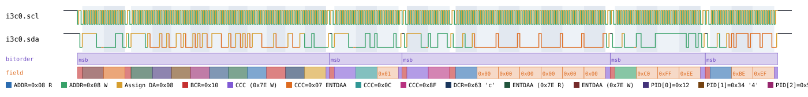
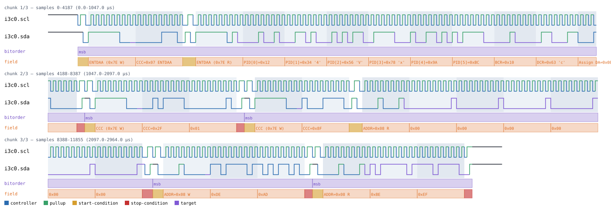

# I3C

Back to [usage overview](../USAGE.md).

## What this is

MIPI I3C is the modern successor to I2C, designed to run on the exact same
two wires (`scl`/`sda`) so it can share a bus and PCB traces with legacy
I2C devices. It keeps I2C's electrical behavior for addressing — START/
STOP conditions, a 7-bit address + R/W byte, open-drain drive — but fixes
two things that make real I2C systems annoying to design for:

- **No more address-strap pins.** I2C devices pick their bus address from
  a fixed part number or a couple of hardware pins, so you can only put so
  many of the same chip on one bus before you run out of addresses. I3C
  replaces this with **Dynamic Address Assignment (ENTDAA)**: every
  target has a unique factory-burned 48-bit Provisional ID, and the bus
  controller hands out a fresh 7-bit dynamic address to each one at
  startup, the same idea as USB or PCI enumeration.
- **Faster, cleaner data phase.** Once a transaction's address phase is
  done, I3C switches the bus from I2C's open-drain (slow, pulled up
  passively) to **push-pull** (both 0 and 1 actively driven) for
  everything that follows — the CCC command, its defining bytes, and any
  private read/write data. Push-pull bytes end in a **T-bit** (an
  odd-parity bit) instead of I2C's dedicated ACK/NACK bit.

This page generates realistic I3C timing diagrams — dynamic address
assignment, broadcast and direct Common Command Codes (CCCs), and
I3C-native private read/write — without any real hardware. The output is
a diagram (SVG) and/or a capture file (`.sr`/`.vcd`) you can open in
PulseView, sigrok-cli, or GTKWave as if a logic analyzer had actually
probed the bus.

Only SDR (Single Data Rate) mode is modeled — HDR-DDR/BT/TSP are a
genuinely separate signaling mode and out of scope. IBI, hot-join, and
real multi-target arbitration contention during ENTDAA are also out of
scope: every scenario here has exactly one target responding, deliberately
not simulating a bus contention it can't meaningfully resolve.

Both `scl` and `sda` are declared open-drain (`SignalKind.TRISTATE`), but
that only applies during the address phase — once a transaction switches
to push-pull, both signals are actively driven and never released to a
pull-up. This matters if you ever hand-write a floating-bit payload — see
[the datatype/floating-marker guide](../USAGE.md#the-floating-bit-marker-system-lhz);
a `z`/`Z` marker still resolves pull-high even on a push-pull byte, since
the marker describes authoring intent rather than a real per-bit pull
network.

## Quick start

```bash
.venv/bin/python -m protowavegen --config examples/i3c_basic.json
```

This runs `examples/i3c_basic.json` (shown in full in the appendix below)
and writes `output/i3c_basic.svg`/`.sr`/`.vcd` — five operations back to
back: **ENTDAA** assigning dynamic address `0x08` to one target, a
**broadcast CCC** (code `0x0C`, one defining byte), a **direct CCC** (code
`0x8F`, read direction, six bytes) sent to that target, then an I3C-native
**private write** and **private read** against the same address:


## What you can customize

Without touching the JSON at all, the CLI can change:
- **The target address** on `direct_ccc`/`private_write`/`private_read`
  (`address`) — simulate the same CCC or private transfer against a
  different dynamically-assigned target, via `--set`.
- **The CCC code** on `broadcast_ccc`/`direct_ccc` (`code`) — a plain
  scalar field, also reachable via `--set`.
- **The bytes sent or expected back** (`data` on every operation except
  `entdaa`) — via `--data-hex`/`--data-string`/`--data-int`/etc.

Not reachable from the CLI at all: **the bus clock speed** (`clock_hz`,
a constructor param) and **ENTDAA's target list** (`targets`, a
list-of-dicts field, not a scalar or byte array) — both need a JSON edit,
covered below.

## Recipes — customizing via the CLI

### Changing the target address

`address` is a plain field on `direct_ccc`/`private_write`/`private_read`
themselves (not a constructor param) — every one of those operations can
target a different dynamically-assigned device, so `--set` reaches it
directly, the same way it reaches I2C's own `address` field:

```bash
.venv/bin/python -m protowavegen --config examples/i3c_basic.json --format svg \
    --set "i3c0:3:address=0x10" --set "i3c0:4:address=0x10"
```

This re-points the private write and private read (operations `3` and `4`)
at address `0x10` instead of `0x08` — simulating the exact same transfer
sequence against a second target that ENTDAA assigned a different dynamic
address:


### Changing the payload

`private_write`'s `data` is a real payload field, so it takes the usual
`--data-*` treatment. A config with more than one data-carrying operation
needs the inline `protocol_id:op_index:field` prefix to disambiguate which
one a flag targets (see
[Chaining multiple overrides](../USAGE.md#chaining-multiple-overrides-in-one-invocation))
— without it, `protowavegen` refuses to guess, listing every candidate:

```
$ .venv/bin/python -m protowavegen --config examples/i3c_basic.json --data-hex "c0ffee"
ValueError: multiple data-carrying operations found (i3c0:1:data (op=broadcast_ccc),
i3c0:2:data (op=direct_ccc), i3c0:3:data (op=private_write), i3c0:4:data (op=private_read));
specify which one with --data-target protocol_id:op_index[:field]
```

Targeting the private write explicitly works fine:

```bash
.venv/bin/python -m protowavegen --config examples/i3c_basic.json --format svg \
    --data-hex "i3c0:3:data:c0ffee"
```



### Changing a CCC code

`code` on `broadcast_ccc`/`direct_ccc` is also a plain scalar operation
field (not one of the tool's generic byte-array field names), reachable
via `--set`:

```bash
.venv/bin/python -m protowavegen --config examples/i3c_basic.json --format svg \
    --set "i3c0:1:code=0x2F"
```

This changes the broadcast CCC from `0x0C` to `0x2F` — useful for trying a
different Common Command Code without hand-editing the JSON (this tool
doesn't attach real CCC names to code values; you supply whatever code
your scenario needs):



### When you still need to edit the JSON

`clock_hz` is a constructor param, not an operation field — `--set` says
so plainly when tried:

```
$ .venv/bin/python -m protowavegen --config examples/i3c_basic.json --set "i3c0:0:clock_hz=400000"
ValueError: --set: I3CBus.entdaa() has no parameter 'clock_hz' (real parameters: ['targets'])
```

(The error names `entdaa` because operation `0` in the example config
happens to be the ENTDAA call — `--set` always reports against the actual
operation at that index, not the field you were hoping to hit.) Changing
the bus speed means editing the JSON directly:

```diff
-      "params": { "clock_hz": 100000 },
+      "params": { "clock_hz": 400000 },
```

`entdaa`'s `targets` list is JSON-edit-only for the same underlying
reason: it's a list of dictionaries (`pid`/`bcr`/`dcr`/`dynamic_address`
per target), not a plain scalar or a byte array, so neither `--set` nor
`--data-*` has anywhere to attach. Trying to reach a nested field like
`dynamic_address` directly fails the same clear way:

```
$ .venv/bin/python -m protowavegen --config examples/i3c_basic.json --set "i3c0:0:dynamic_address=0x20"
ValueError: --set: I3CBus.entdaa() has no parameter 'dynamic_address' (real parameters: ['targets'])
```

Changing a target's Provisional ID, BCR/DCR, or assigned dynamic address
means editing the `targets` list in the JSON directly:

```diff
           "op": "entdaa",
           "targets": [
-            { "pid": 20015998343868, "bcr": 16, "dcr": 99, "dynamic_address": 8 }
+            { "pid": 20015998343868, "bcr": 16, "dcr": 99, "dynamic_address": 16 }
           ]
```

(v1 also only models exactly one responding target per `entdaa` call — a
second entry in `targets` is rejected at generation time, not silently
ignored: `entdaa: v1 models exactly one responding target, got 2`.)

---

## Appendix — operations reference

`type: "i3c"` — `I3CBus`, `protocols/i3c.py`. `scl`/`sda` are the same
wires I2C uses (both `SignalKind.TRISTATE`), and only the *address phase*
of every transaction (START/repeated-START/STOP, the address+R/W byte,
the following ACK/NACK bit) is open-drain like I2C. Once addressing
completes, an I3C-native transfer (CCC code/defining bytes, ENTDAA's
dynamic-address-assignment byte, private read/write data) switches to
push-pull: both 0 and 1 are actively driven, never released to a pull-up,
and every such byte ends with a T-bit (odd-parity bit) instead of an
I2C-style ACK/NACK. `driver` annotations use I3C's own vocabulary,
`"controller"`/`"target"`, rather than I2C's `"master"`/`"slave"`.

In scope for v1: ENTDAA (Dynamic Address Assignment, modeling exactly one
responding target — no multi-target arbitration contention, same
"don't simulate contention we can't win" precedent `can.py` already
establishes for its own uncontested frames), broadcast CCCs, direct CCCs,
and I3C-native private read/write. Out of scope: IBI, hot-join, HDR-DDR/
BT/TSP, and real multi-target arbitration.

No mainline sigrok decoder exists for I3C; this bus is instead validated
against a real, actively-maintained third-party one
([xyphro/Sigrok-I3C-decoder](https://github.com/xyphro/Sigrok-I3C-decoder),
GPL-3.0), vendored under `tests/custom_decoders/i3c/` and exercised by
`tests/test_sigrok_roundtrip.py`'s `test_i3c_roundtrips_through_vendored_i3c_decoder`.

### Constructor params

```json
"params": { "clock_hz": 100000 }
```

- `clock_hz` (required) — bus clock speed.

### Operations

- **`entdaa`** — `targets`: a list of exactly one
  `{"pid": <48-bit int>, "bcr": <0-255>, "dcr": <0-255>,
  "dynamic_address": <0-0x7F>}` (v1's single-target scope limit).
  Broadcasts CCC `0x07` to the reserved address `0x7E`, a repeated START,
  the target open-drain-clocking out its 48-bit Provisional ID + 8-bit
  BCR + 8-bit DCR (64 bits, no ACK/T-bit between bytes — matches real SDR
  ENTDAA timing), then the controller assigns the dynamic address as one
  push-pull byte + T-bit.
- **`broadcast_ccc`** — `code` (`0x00`-`0x7F`), `data=None`,
  `datatype="bytes"`. Sends the CCC code and any defining bytes (`data`)
  to the reserved broadcast address `0x7E`, controller-driven throughout.
- **`direct_ccc`** — `address`, `code` (`0x80`-`0xFE`), `data=None`,
  `datatype="bytes"`, `read=False`. The CCC code is still announced
  broadcast to `0x7E` first, then a repeated START switches to the
  specific target's own address (`read` selects direction) before the
  defining/data bytes.
- **`private_write`** — `address`, `data`, `datatype="bytes"`. I3C-native
  write: open-drain address phase, then every data byte push-pull + T-bit,
  controller-driven.
- **`private_read`** — `address`, `data`, `datatype="bytes"`. Same shape,
  but `data` is the synthesized target response (this tool generates
  diagrams, it doesn't sense a real device), target-driven throughout.

`address`/`code` are always plain ints — no `datatype` on them, which is
exactly why `--set` can reach them directly (see the recipes above).
`data` has full floating-marker support (`decode_payload_with_floating(...,
tristate=True)`, since `sda` is `SignalKind.TRISTATE`) on every operation
above except `entdaa`.

```json
{
  "samplerate": 4000000,
  "protocols": [
    {
      "id": "i3c0",
      "type": "i3c",
      "params": { "clock_hz": 100000 },
      "operations": [
        {
          "op": "entdaa",
          "targets": [
            { "pid": 20015998343868, "bcr": 16, "dcr": 99, "dynamic_address": 8 }
          ]
        },
        { "op": "broadcast_ccc", "code": 12, "data": [1] },
        { "op": "direct_ccc", "address": 8, "code": 143, "read": true, "data": [0, 0, 0, 0, 0, 0] },
        { "op": "private_write", "address": 8, "data": [222, 173] },
        { "op": "private_read", "address": 8, "data": [190, 239] }
      ]
    }
  ],
  "outputs": [
    { "type": "svg", "path": "output/i3c_basic.svg" },
    { "type": "sigrok", "path": "output/i3c_basic.sr" },
    { "type": "vcd", "path": "output/i3c_basic.vcd" }
  ]
}
```

To decode a generated `.sr` file with the vendored third-party decoder
yourself (not part of the system `sigrok-cli` install):

```bash
SIGROKDECODE_DIR=tests/custom_decoders sigrok-cli \
    -i output/i3c_basic.sr -P "i3c:scl=i3c0.scl:sda=i3c0.sda" -A i3c
```

Note: that decoder only flushes a queued annotation when it sees a
*following* bus edge (see `tests/test_sigrok_roundtrip.py`'s I3C test
docstring) — so the very last STOP condition of a whole capture (here,
`private_read`'s own) never appears in its output. This is a decoder-side
limitation, not a sign the waveform is wrong; every byte value up to and
including that final STOP still decodes correctly.
