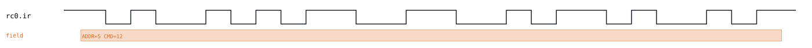
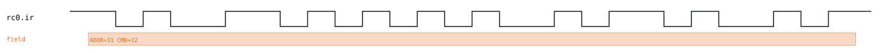
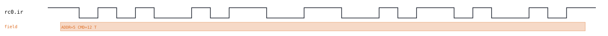
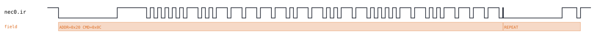
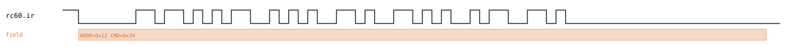

# IR remote-control family

Back to [usage overview](../USAGE.md).

## What this is

This page covers three real, still-in-use infrared remote-control
encodings: **RC-5** (Philips, used across European consumer electronics),
**NEC** (the most common encoding in cheap/generic remotes worldwide —
TVs, air conditioners, LED controllers), and **RC-6** (Philips' successor
to RC-5, used in some set-top boxes and Media Center-era PC remotes).
Every real IR receiver module (TSOP38xx and similar) already demodulates
the 36-38kHz carrier for you and hands the decoder a plain on/off
envelope, so that's exactly what this tool generates: one logic line per
protocol (`sig("ir")`, **active-low** — idle is logic 1, "carrier on" is
logic 0), with no sub-carrier waveform involved at all. The output is a
diagram (SVG) and/or a capture file (`.sr`/`.vcd`) you can open in
PulseView, sigrok-cli, or GTKWave as if a logic analyzer had actually
probed a receiver's output pin.

Each protocol is its own standalone transport (`ir_rc5`, `ir_nec`,
`ir_rc6`) — none of them stack on another node the way I2C/SPI/1-Wire
device protocols do, because a real IR remote button-press *is* the
bottom of the stack. A small shared helper, `_ir_pulse.py`, holds the two
primitives genuinely common to more than one of them: `mark_space()` (one
mark-then-space pulse — NEC's core building block) and `biphase_bit()`
(one Manchester/biphase bit — RC-5 and RC-6's shared building block,
though see the RC-6 recipe below for a polarity wrinkle), plus
`ensure_idle_gap()` (a mandatory small idle period before a new frame —
see "Two frames, zero gap" below). Frame assembly — start bits, mode
bits, address/command layout, bit order — stays in each protocol's own
file; that's where the three genuinely diverge.

## Quick start

```bash
.venv/bin/python -m protowavegen --config examples/ir_rc5_basic.json
```

This runs `examples/ir_rc5_basic.json` (shown in full in the appendix
below) and writes `output/ir_rc5_basic.svg`/`.sr`/`.vcd` — one RC-5 frame
simulating a remote sending address `5`, command `12`, with the toggle
bit clear:



`examples/ir_nec_basic.json` and `examples/ir_rc6_basic.json` work the
same way for the other two protocols — see their own recipes below.

## What you can customize

Without touching the JSON at all, the CLI can change, on all three
protocols:
- **The address** (which remote/device is being simulated) — via `--set`.
- **The toggle bit** (RC-5/RC-6; flipped by a real remote each time a
  button is freshly pressed, to let a receiver tell a held button from a
  fresh press) — via `--set`.
- **RC-6's mode field** — via `--set`, though only `0` is accepted (see
  below).

One thing the CLI genuinely can't reach on any of the three, for a subtle
reason worth understanding up front: **the command code.** See the
"command hits a wall" recipe below before assuming it behaves like
`address`.

Two things always need a JSON edit, covered at the end of the recipes
section: RC-5's `extended` addressing mode, and adding/removing/reordering
operations.

## Recipes — customizing via the CLI

### RC-5: changing the address

`address` is a plain scalar field on RC-5's `send` operation, so `--set`
reaches it directly — simulating the same button press from a different
remote/device address:

```bash
.venv/bin/python -m protowavegen --config examples/ir_rc5_basic.json --format svg \
    --set "rc0:0:address=0x1F"
```



### RC-5: flipping the toggle bit

`toggle` is a plain boolean field, reachable the same way:

```bash
.venv/bin/python -m protowavegen --config examples/ir_rc5_basic.json --format svg \
    --set "rc0:0:toggle=true"
```

Look closely at the second bit-cell in the waveform and the field label
— it now reads `ADDR=5 CMD=12 T`, and the toggle bit's own edge has moved
to the opposite half of its cell:



### Command hits a wall

Given `address` and `toggle` both work via `--set`, it's natural to
expect `command` does too. It doesn't:

```
$ .venv/bin/python -m protowavegen --config examples/ir_rc5_basic.json --set "rc0:0:command=20"
ValueError: --set: 'command' is a payload (byte-array) field, not a scalar — use
--data-hex/--data-string/--data-int/--data-bin/--data-bits/--data-file instead
```

The reason is a naming collision, not anything IR-specific: `protowavegen`
keeps one field-name set (`_PAYLOAD_FIELDS` in `config.py`) shared across
*every* protocol to recognize byte-array payload fields for `--data-*`'s
auto-detect, and `"command"` is in it — needed because DALI's own
`send_command` operation genuinely does treat its `command` field as a
`datatype`-controlled byte payload. `--set` refuses any field in that set
unconditionally, with no per-protocol exception, so RC-5/NEC/RC-6's
`command` gets caught by the same name even though here it's just a plain
integer 0-63 (or 0-127 in RC-5 extended mode).

Trying the `--data-*` flags it just pointed at doesn't work either,
because none of the three `send()` methods actually has a `datatype`
parameter for `command` — every `--data-*` flag unconditionally tries to
set one:

```
$ .venv/bin/python -m protowavegen --config examples/ir_rc5_basic.json --data-int "rc0:0:command:20"
ValueError: --data-*: IrRc5.send() has no datatype parameter for field 'command' (expected 'command_datatype' or 'datatype')
```

Same story, same error shape, on NEC and RC-6 (`IrNec.send()`/
`IrRc6.send()` in place of `IrRc5.send()`). So changing which button is
being simulated genuinely requires a JSON edit:

```diff
       { "op": "send", "address": 5, "command": 12, "toggle": false }
-      { "op": "send", "address": 5, "command": 12, "toggle": false }
+      { "op": "send", "address": 5, "command": 20, "toggle": false }
```

### NEC: changing the address

NEC's config has two operations (`send` then `send_repeat`), so — unlike
a config with only one candidate operation — `--set` needs the full
`protocol_id:op_index:field=value` target; there's no auto-detect for
`--set` the way `--data-target` sometimes offers one for payload flags:

```bash
.venv/bin/python -m protowavegen --config examples/ir_nec_basic.json --format svg \
    --set "nec0:0:address=0x20"
```

NEC's address is sent as two bytes (the address, then its bitwise
complement, for the receiver's own error-checking) — both update
correctly since the complement is computed from whatever `address`
actually is, not hardcoded from the JSON:



`command` hits the exact same wall documented above
(`ValueError: --set: 'command' is a payload (byte-array) field...` on
`nec0:0:command`) — the fix is the same JSON edit, changing the `send`
operation's `"command"` value directly.

### RC-6: flipping the toggle bit

RC-6's toggle bit is worth its own demonstration because — unlike RC-5's
— it's **double-width** in the waveform (see the appendix for why):

```bash
.venv/bin/python -m protowavegen --config examples/ir_rc6_basic.json --format svg \
    --set "rc60:0:toggle=false"
```

Compare the toggle-bit cell's width against the regular address/command
bits around it in both captures — it's twice as wide either way, just
inverted:



`address` works via `--set` here too (`--set "rc60:0:address=0x20"`); `mode`
also technically accepts `--set` (`--set "rc60:0:mode=0"`), but the only
legal value is `0` — see "When you still need to edit the JSON" below.
`command` hits the identical wall as RC-5/NEC.

### When you still need to edit the JSON

A few things are constructor-level or otherwise outside what `--set`/
`--data-*` can reach:

- **`command`**, on all three protocols — see above.
- **RC-5's `extended` flag** (`send(..., extended=True)`) switches to
  7-bit commands by repurposing the second start bit — it's a plain
  boolean field, so in principle `--set "rc0:0:extended=true"` *would*
  reach it (it's not a payload-field name collision like `command`'s),
  but doing so without also raising `command` above 63 has no visible
  effect on the waveform, so it's easiest to just edit both together in
  the JSON:
  ```diff
  -      { "op": "send", "address": 5, "command": 12, "toggle": false }
  +      { "op": "send", "address": 5, "command": 100, "toggle": false, "extended": true }
  ```
- **RC-6's `mode`** only accepts `0` (standard frame shape) — any other
  value raises `ValueError: only mode 0 (standard) is implemented` at
  generation time, from the JSON or from `--set` alike, since modes 6A/6B
  (short/long addressing variants) aren't implemented.
- **Adding, removing, or reordering operations** — e.g. NEC's
  `send_repeat` (a real remote's held-button repeat frame: a shorter
  leader, no address/command bits at all) — always needs a JSON edit;
  `--set`/`--data-*` only ever change one field's *value* on an operation
  that's already there.

---

## Appendix — operations reference

### Two frames, zero gap

All three protocols call `ensure_idle_gap()` before every frame's first
edge. This isn't just realism (a real remote never transmits perfectly
back-to-back) — without it, two frames sent with literally zero gap put a
rise and an immediate fall at the *same* sample, which sigrok's edge-based
decoders silently misinterpret as no edge having happened at all, dropping
the frame boundary entirely. `IrNec.send_repeat()` benefits from this
directly when chained after a `send()` with no idle in between.

### RC-5 — `type: "ir_rc5"`

`ir_rc5.py`. 889us half-bit (1.78ms full bit), 14-bit biphase frame — 2
start bits (always 1; the second is the complement of command bit 6 in
extended mode), 1 toggle bit, 5 address bits, 6 command bits, all
MSB-first.

Operations: `send(address, command, toggle=False, extended=False)`. None
take `datatype` (`command` isn't `--data-*`-reachable — see the recipes
above). `address` fits 5 bits (0-31); `command` fits 6 bits (0-63), or 7
bits (0-127) when `extended=True`.

```json
{
  "samplerate": 1000000,
  "protocols": [
    {
      "id": "rc0", "type": "ir_rc5",
      "operations": [
        { "op": "send", "address": 5, "command": 12, "toggle": false }
      ]
    }
  ],
  "outputs": [
    { "type": "svg", "path": "output/ir_rc5_basic.svg" },
    { "type": "sigrok", "path": "output/ir_rc5_basic.sr" },
    { "type": "vcd", "path": "output/ir_rc5_basic.vcd" }
  ]
}
```

### NEC — `type: "ir_nec"`

`ir_nec.py`. Pulse-distance encoding: each bit is a fixed 562.5us mark
followed by a space whose width selects the value (562.5us = 0, 1687.5us
= 1) — sigrok's decoder measures mark+space edge-to-edge distance, so
mark width alone never carries the bit. Classic 8-bit form only: address,
its bitwise complement, command, its complement, all LSB-first, then a
stop-bit mark closing out the last bit's timing measurement. The decoder
hard-rejects a frame whose address doesn't complement-check against
`~address`, so extended 16-bit addressing isn't supported.

Operations: `send(address, command)`, `send_repeat()` (shorter leader —
9ms mark + 2.25ms space instead of the normal 9ms + 4.5ms — no data bits
at all, closed by the same stop-bit mark; models a real remote's
held-button repeat frame). Neither takes `datatype`. `address`/`command`
each fit a full byte (0-255).

```json
{
  "samplerate": 1000000,
  "protocols": [
    {
      "id": "nec0", "type": "ir_nec",
      "operations": [
        { "op": "send", "address": 0, "command": 12 },
        { "op": "send_repeat" }
      ]
    }
  ],
  "outputs": [
    { "type": "svg", "path": "output/ir_nec_basic.svg" },
    { "type": "sigrok", "path": "output/ir_nec_basic.sr" },
    { "type": "vcd", "path": "output/ir_nec_basic.vcd" }
  ]
}
```

### RC-6 — `type: "ir_rc6"` (mode 0 only)

`ir_rc6.py`. Philips RC-6: 444.5us half-bit, a distinctive leader (a
6-half-bit mark followed by a 2-half-bit space, not a plain biphase bit),
then 1 start bit (always 1), 3 mode bits (mode 0 = standard frame shape),
1 **double-width** toggle bit, 8 address bits, 8 command bits, all
MSB-first. Modes 6A/6B (short/long addressing variants) aren't
implemented — `mode` other than `0` raises `ValueError` at generation
time.

Every bit after the leader uses the *opposite* sense from
`biphase_bit()`'s RC-5 convention — confirmed empirically against
sigrok's decoder: a real start bit=1 must produce a falling edge exactly
at the leader's 2-half-bit mark, which only happens if its own first half
is low, not high. The decoder's `auto`-polarity mode then self-adapts
every later bit's recovered value consistently from whatever sense the
sync bit exhibited, so inverting every bit uniformly still decodes to the
correct logical values. A 20-half-bit trailing idle gap is also required
— the decoder only emits its address/command summary once it sees a
long-enough run with no further edge.

Operations: `send(mode=0, address=0, command=0, toggle=False)`. None take
`datatype`. `address`/`command` each fit a full byte (0-255).

```json
{
  "samplerate": 1000000,
  "protocols": [
    {
      "id": "rc60", "type": "ir_rc6",
      "operations": [
        { "op": "send", "address": 18, "command": 52, "toggle": true }
      ]
    }
  ],
  "outputs": [
    { "type": "svg", "path": "output/ir_rc6_basic.svg" },
    { "type": "sigrok", "path": "output/ir_rc6_basic.sr" },
    { "type": "vcd", "path": "output/ir_rc6_basic.vcd" }
  ]
}
```
