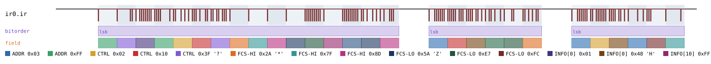
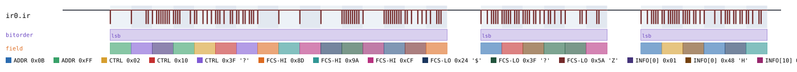
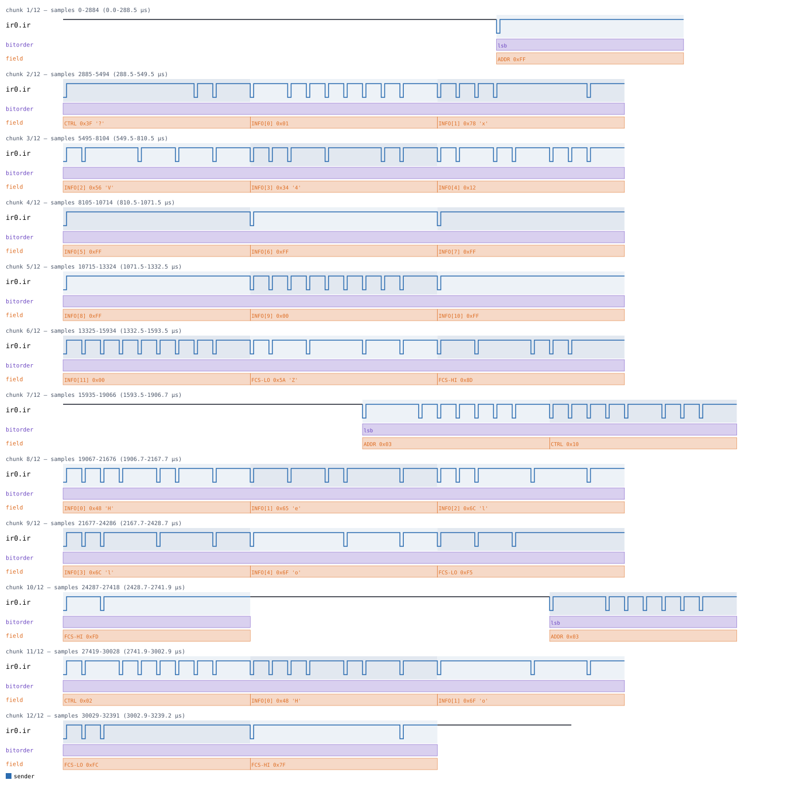
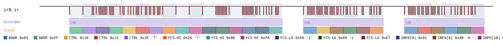

# IrDA

Back to [usage overview](../USAGE.md).

## What this is

IrDA (Infrared Data Association) is the short-range, line-of-sight
infrared data link that used to be built into laptops, PDAs, phones, and
printers before Bluetooth/Wi-Fi took over — the little dark window you'd
line two devices up against to beam a file across. This page models its
**SIR** physical layer (Serial InfraRed, up to 115.2kbit/s — the common
case; the faster MIR/FIR modes use different encodings and aren't
implemented) carrying real **IrLAP** link-layer frames on top: device
addressing, frame sequence numbers, and a genuine CRC-16 checksum, the
same as a real IrDA stack would produce. This is not the same thing as a
TV/AC remote control — those (RC-5, NEC, RC-6, all also in this tool) are
one-shot command pulses with no addressing or link-layer framing; IrDA is
a genuine bidirectional serial data link.

The output is a diagram (SVG) and/or a capture file (`.sr`/`.vcd`) you can
open in PulseView, sigrok-cli, or GTKWave as if a logic analyzer had
actually probed the demodulated IR receiver output.

The signal (`ir`) is active-low, matching every real IR receiver module:
idle (no light) reads as logic 1, and a light pulse reads as logic 0. A
SIR bit cell encodes a `0` as a brief pulse (3/16 of the bit period) at
the *start* of the cell, and a `1` as no pulse for the whole cell — exactly
UART's own polarity (start bit low, idle/stop high), so each byte is
framed the same way a UART byte is: 1 start bit, 8 data bits LSB-first, 1
stop bit, no parity.

sigrok has no IrDA decoder at any layer, so this protocol's correctness is
checked two independent ways instead of the usual single sigrok
round-trip: a custom sigrok decoder written for this project, and a real,
independently-written dissector — `tshark`'s own `irlap` — fed a
synthetic pcap built to match. Both are asserted to agree on the same
decoded address/control/payload values. See the appendix for detail.

## Quick start

```bash
.venv/bin/python -m protowavegen --config examples/irda_basic.json
```

This runs `examples/irda_basic.json` (shown in full in the appendix below)
and writes `output/irda_basic.svg`/`.sr`/`.vcd` — a broadcast XID
(discovery) frame, then two I-frames ("Hi" and "Ho") addressed to device
`0x01`:



The example sends **three** frames back-to-back, not one, and that's
deliberate: IrLAP has no explicit end-of-frame marker at the SIR
byte-stream level (unlike synchronous HDLC's `0x7E` flag byte) — a real
receiver infers "frame's over" purely from a long-enough silence, and this
tool's own custom decoder does the same. The gap this tool always leaves
before/after the real activity in a capture (2% idle margin) isn't quite
long enough for the decoder's own frame-end timeout, but the protocol's
guaranteed 16-bit-period gap *between* frames comfortably is — so a
second frame's mere presence flushes the decode of the first. Sending a
single isolated frame doesn't reliably decode; sending two or more does.

## What you can customize

Without touching the JSON at all, the CLI can change:
- **Which device a frame is addressed to** (`address` on `send_i_frame`/
  `send_xid`) — via `--set`.
- **The data being sent** (`info` on `send_i_frame`) — via
  `--data-hex`/`--data-string`/`--data-int`/etc.
- **Frame sequence numbers and the Poll/Final flag** (`ns`/`nr`/`final`) —
  also plain scalars, reachable via `--set`.
- **The baud rate** (`baudrate`) is a constructor param, not an operation
  field, so it needs a JSON edit (see below).

## Recipes — customizing via the CLI

### Changing which device a frame targets

`address` is a plain field on `send_i_frame`/`send_xid` (not a constructor
param — a real IrLAP station can address any device it's discovered), so
`--set` reaches it directly. This overrides both I-frames' address from
`0x01` to `0x05` — simulating the exact same conversation with a different
device on the far end:

```bash
.venv/bin/python -m protowavegen --config examples/irda_basic.json --format svg \
    --set "ir0:1:address=5" --set "ir0:2:address=5"
```



### Changing the payload

`send_i_frame`'s `info` field takes the usual datatype treatment. Since
the example config has two I-frames (both carrying `info`), an untargeted
`--data-string` is rejected as ambiguous, listing both candidates so the
right one can be copied straight into the command:

```
$ .venv/bin/python -m protowavegen --config examples/irda_basic.json --data-string "Hey"
ValueError: multiple data-carrying operations found (ir0:1:info (op=send_i_frame), ir0:2:info (op=send_i_frame)); specify which one with --data-target protocol_id:op_index[:field]
```

Targeting the first I-frame explicitly works fine:

```bash
.venv/bin/python -m protowavegen --config examples/irda_basic.json --format svg \
    --data-string "ir0:1:Hello"
```



### Changing the Poll/Final flag

`final` is a plain boolean scalar operation field on every `send_frame`-
family method — flip the example's second I-frame (sent with
`"final": false` in the JSON) to `true`:

```bash
.venv/bin/python -m protowavegen --config examples/irda_basic.json --format svg \
    --set "ir0:2:final=true"
```

The Control byte's P/F bit (and its `CTRL` field annotation) changes
accordingly:



`ns`/`nr` (the N(S)/N(R) sequence numbers baked into the same Control
byte) are reachable the same way, e.g. `--set "ir0:2:ns=3"`.

### The `command` field: use `--set`, not `--data-*`

Every `send_frame`-family method also takes a `command` parameter (the
Address byte's C/R bit — `True` for a command frame, `False` for a
response). It looks exactly as scalar as `final` above, but it collides
with `protowavegen`'s own global "this field name is a byte-array payload
somewhere" list (the same list that makes `data`/`info`/`bits` etc.
recognizable to `--data-*` across every protocol) — `command` happens to
be on it too, for unrelated protocols (DALI) that really do use that name
for a byte-array field. `--data-*` correctly refuses it:

```
$ .venv/bin/python -m protowavegen --config examples/irda_basic.json --data-int "ir0:1:command:0"
ValueError: --data-target: IrdaBus.send_i_frame()'s 'command' is a boolean flag, not a payload
field -- use --set ir0:1:command=true|false instead
```

`--set` is the right tool, same as `final`/`ns`/`nr` above:

```bash
.venv/bin/python -m protowavegen --config examples/irda_basic.json --format svg \
    --set "ir0:1:command=false"
```

### When you still need to edit the JSON

`baudrate` is a constructor param, not an operation field — there's no
operation for `--set` to target it on, confirmed by the actual error:

```
$ .venv/bin/python -m protowavegen --config examples/irda_basic.json --set "ir0:0:baudrate=9600"
ValueError: --set: IrdaBus.send_xid() has no parameter 'baudrate' (real parameters: ['address', 'command', 'dest_address', 'discovery_flags', 'driver', 'final', 'slot', 'source_address', 'version'])
```

Changing the link speed means editing the config directly:

```diff
-      "params": { "baudrate": 115200 },
+      "params": { "baudrate": 9600 },
```

Similarly, the generic `send_frame` primitive's own `control` byte isn't
exposed as a settable field on `send_i_frame`/`send_xid` (they compute it
from `ns`/`nr`/the frame type instead) — confirmed the same way:

```
$ .venv/bin/python -m protowavegen --config examples/irda_basic.json --set "ir0:1:control=0x02"
ValueError: --set: IrdaBus.send_i_frame() has no parameter 'control' (real parameters: ['address', 'command', 'datatype', 'driver', 'final', 'info', 'nr', 'ns'])
```

Using `send_frame` directly (with a hand-built `control` byte) instead of
`send_i_frame`/`send_xid` is a JSON-level choice — adding or replacing an
operation entirely is always outside what `--set`/`--data-*` can do.

---

## Appendix — operations reference

`type: "irda"` — `IrdaBus`, `protocols/irda.py`. One signal, `ir`
(active-low). SIR physical encoding only (up to 115.2kbit/s); MIR/FIR not
implemented.

### Constructor params

```json
"params": { "baudrate": 115200 }
```

- `baudrate` — SIR bit rate (default `115200`).

### Physical layer (SIR)

A logic `0` is a brief infrared light pulse (nominally 3/16 of the bit
period, at the *start* of the bit cell); a logic `1` is no pulse for the
whole cell. That "0 is pulsed" convention is exactly UART's own polarity
(start bit = 0, idle/stop = 1), so byte framing is UART-shaped: 1 start
bit (always 0), 8 data bits LSB-first, 1 stop bit (always 1), no parity.

### IrLAP framing

Every frame is Address (1 byte) + Control (1 byte) + optional Information
+ FCS (2 bytes, LSB first). There's no explicit end-of-frame delimiter at
the SIR byte-stream level (unlike synchronous HDLC's `0x7E` flags) — real
receivers infer frame boundaries from silence between frames, the same
idle-timeout shape this repo already uses for LIN/Modbus RTU. `IrdaBus`
enforces a minimum 16-bit-period gap before every `send_frame`/
`send_i_frame`/`send_xid` call for exactly this reason.

- **Address**: bit 0 = C/R (`command=True`/`False`), bits 1-7 = a 7-bit
  connection address (0x7F is the broadcast address used for discovery).
- **Control**: bit 0 = 0 selects an I-frame (bits 1-3 = N(S), bit 4 = P/F,
  bits 5-7 = N(R)); bits 0-1 = `11` selects a U-frame (bit 4 = P/F, the
  rest select the command/response type — XID's is `0x2F`).
- **FCS**: CRC-16/X-25 (`checksums.crc16_x25` — polynomial 0x1021/reflected
  0x8408, init 0xFFFF, final complement) over Address+Control+Information,
  transmitted LSB byte first. Verified against the Linux kernel's own
  (now-removed) IrDA stack's magic-residue self-check value
  (`GOOD_FCS = 0xf0b8`).

### Operations

- **`send_frame`** — `address`, `control`, `info=None`, `datatype="bytes"`,
  `command=True`, `final=True`, `driver=None`. The generic primitive —
  `control` must **not** set bit 4 (the P/F bit) directly; pass `final=`
  instead.
- **`send_i_frame`** — `address`, `ns`, `nr`, `info`, `datatype="bytes"`,
  `command=True`, `final=True`, `driver=None`. An I-frame (data-carrying),
  building the Control byte's N(S)/N(R)/frame-type bits automatically.
- **`send_xid`** — `address=0x7F`, `source_address`,
  `dest_address=0xFFFFFFFF`, `discovery_flags=0`, `slot=0xFF`,
  `version=0x00`, `command=True`, `final=True`, `driver=None`. An XID
  (eXchange station IDentification) command frame — the U-frame IrLAP
  devices broadcast to discover each other. Chosen over SNRM/UA connection
  setup because its Information field (Format Identifier, Source/
  Destination Device Address, Discovery Flags, Slot Number, Version
  Number — all little-endian) is fully public and simple to get exactly
  right.

`info`/`datatype` follow this codebase's usual floating-marker convention
(`decode_payload_with_floating`, `tristate=False` — IrDA is a single-
transmitter-at-a-time link with no protocol-defined pull, same reasoning
as `dali.py`/the IR remote-control family). See
[the datatype/floating-marker guide](../USAGE.md#the-floating-bit-marker-system-lhz).

### Validation

sigrok has no IrDA decoder at any layer (confirmed: listed as a
0%-complete future candidate on sigrok's own decoder wiki), so this
protocol is validated by two independent oracles instead of the usual
single sigrok round-trip:

1. **A custom sigrok decoder** written for this project,
   `tests/custom_decoders/irda/pd.py` — a real `sigrokdecode.Decoder`
   reassembling SIR bits into bytes and parsing Address/Control/Info/FCS,
   loaded via `SIGROKDECODE_DIR` (confirmed to *add* to, not replace,
   sigrok's system decoder search path). See
   `tests/test_sigrok_roundtrip.py::test_irda_roundtrips_through_custom_sigrok_decoder`.
2. **`tshark`'s real `irlap` dissector**, fed a synthetic classic-pcap file
   (`tests/_irda_pcap.py::build_irda_pcap`, link-layer type 144 —
   `LINKTYPE_LINUX_IRDA` — with a 16-byte Linux "cooked" SLL pseudo-header
   per frame). See
   `tests/test_sigrok_roundtrip.py::test_irda_cross_validates_against_wireshark_irlap_dissector`,
   which asserts both tools agree on the same address/control/payload
   values from the same encoded frame.

A real Linux IrDA capture only ever sees a frame *after* the driver has
already validated and stripped its trailing FCS (the same reason a
captured Ethernet frame usually has none either) — confirmed empirically
while building the pcap helper: feeding `tshark` the 2 real FCS bytes too
makes it misparse them as extra IrLMP payload content. So the pcap side
carries Address+Control+Information only; the `.sr` side (and the custom
decoder validating it) still carries a real FCS on the wire, since a real
transmitter always sends one.

### Example — `examples/irda_basic.json`

```json
{
  "samplerate": 10000000,
  "protocols": [
    {
      "id": "ir0", "type": "irda",
      "params": { "baudrate": 115200 },
      "operations": [
        { "op": "send_xid", "source_address": 305419896 },
        { "op": "send_i_frame", "address": 1, "ns": 0, "nr": 0, "info": "Hi", "datatype": "text" },
        { "op": "send_i_frame", "address": 1, "ns": 1, "nr": 0, "info": "Ho", "datatype": "text", "final": false }
      ]
    }
  ],
  "outputs": [
    { "type": "svg", "path": "output/irda_basic.svg" },
    { "type": "sigrok", "path": "output/irda_basic.sr" },
    { "type": "vcd", "path": "output/irda_basic.vcd" }
  ]
}
```
