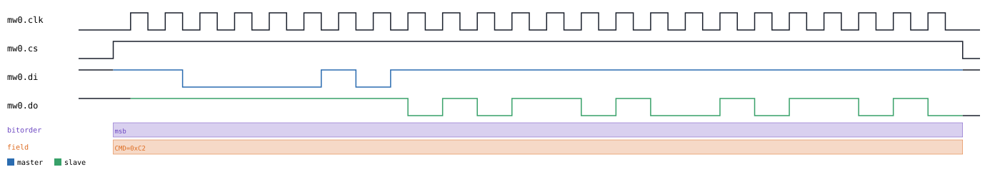
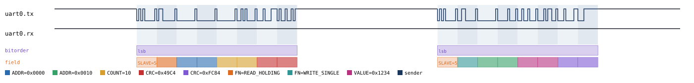
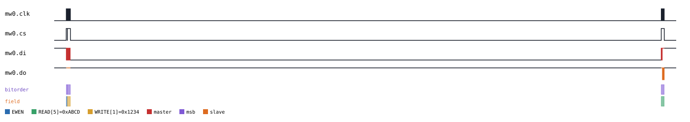
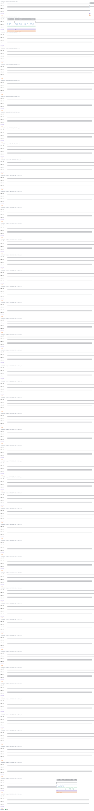

# Microwire

Back to [usage overview](../USAGE.md).

## What this is

Microwire is National Semiconductor's 3-wire synchronous serial bus —
`clk`, `cs`, `di` (master-to-slave), `do` (slave-to-master) — best known
as the interface on small serial EEPROMs (the 93xx family: 93C46,
93C56, 93C66, ...) and a handful of older serial DACs/ADCs. It looks a
lot like SPI at a glance, and it *is* a close cousin, but two details
are genuinely different and worth knowing before you read a Microwire
capture as if it were SPI:

- **`cs` is active-high** — the opposite of SPI's usual active-low
  convention. A `1` on `cs` means the slave is selected.
- **There are no CPOL/CPHA mode variants.** Microwire has exactly one
  fixed timing: the clock idles low, `di` changes on the falling edge, and
  `do` changes on the rising edge — a slave samples `di` on the rising
  edge, a master samples `do` on the falling edge. SPI's four mode
  combinations don't exist here.

This page generates realistic Microwire timing diagrams — a raw
bit-banged transfer, plus a 93xx-series EEPROM stacked on top of the same
bus — without any real hardware. The output is a diagram (SVG) and/or a
capture file (`.sr`/`.vcd`) you can open in PulseView, sigrok-cli, or
GTKWave as if a logic analyzer had actually probed the bus.

`di`/`do` are plain `DIGITAL` signals, not tri-state — real Microwire
parts don't define a bus pull the way I2C/1-Wire do, so a floating bit on
either line always needs an explicit `l`/`h` resolution; `z` is a hard
error here (see
[the floating-bit marker guide](../USAGE.md#the-floating-bit-marker-system-lhz)).

## Quick start

```bash
.venv/bin/python -m protowavegen --config examples/microwire_basic.json
```

This runs `examples/microwire_basic.json` (shown in full below) and writes
`output/microwire_basic.svg`/`.sr`/`.vcd` — a master clocking out an
8-bit command (`11000010` = `0xC2`) on `di`, then reading 16 bits back on
`do` (`0x5A5A`):



## What you can customize

Without touching the JSON at all, the CLI can change:
- **The bits sent and the bits read back** (`mosi_bits`/`read_bits` on
  `transfer`) — via `--data-bits` (or the other `--data-*` flags with
  `datatype: "bytes"`/`"hex"`/etc., though `transfer` is normally used
  with the flat bit-string `"bits"` datatype since Microwire's
  opcode+address fields aren't byte-multiples).
- **The bus clock speed** (`clock_hz`) — this is a constructor param, not
  an operation field, so it needs a JSON edit (see below).
- **The per-transfer display label** (`labels`) — technically not a
  payload field, but see the caveat below before reaching for `--set` on
  it.

## Recipes — customizing via the CLI

### Changing the payload bits

`mosi_bits`/`read_bits` are payload fields, so `--data-bits` reaches them
directly with the target syntax `protocol_id:op_index:field:BITS`. Mark
two bits of the command as floating (Microwire has no defined pull, so
this needs explicit `h`/`l`, not `z`):

```bash
.venv/bin/python -m protowavegen --config examples/microwire_basic.json --format svg \
    --data-bits "mw0:0:mosi_bits:1100hh10"
```

The two middle bits of the command byte are now shown as floating-high
instead of a driven `0` — useful for representing a real "don't care" bit
position in a datasheet's opcode table:



### The `labels` field is not a safe `--set` target

`labels` isn't a byte-array payload field, so `--set` doesn't reject it
outright — but it *is* a `list[str]` in the JSON, and `--set` only ever
writes a single coerced scalar (int/float/bool/string). Trying it produces
no error, but silently corrupts the display:

```bash
.venv/bin/python -m protowavegen --config examples/microwire_basic.json --format svg \
    --set "mw0:0:labels=CMD=0xFF"
```

This runs and exits `0`, but `transfer()`'s code picks the label via
`labels[0]` — and `labels[0]` of the *string* `"CMD=0xFF"` (not a list
containing that string) is just its first character, `"C"`. The SVG's
field annotation silently renders `"C"` instead of the intended label,
with no warning anywhere. **Don't use `--set` on `labels`** — edit the
JSON's `"labels": [...]` array directly instead, the same as any other
list-shaped field.

### When you still need to edit the JSON

`clock_hz` is a constructor `param`, not a per-operation field — there's
no operation to target, so `--set`/`--data-*` can't reach it (confirmed:
`--set "mw0:0:clock_hz=500000"` fails with `MicrowireBus.transfer() has
no parameter 'clock_hz'`). Change the bus speed by editing the config
directly:

```diff
-      "params": { "clock_hz": 1000000 },
+      "params": { "clock_hz": 500000 },
```

then re-run the same command. The same applies to adding/removing
operations entirely, or changing which protocols are in the scenario.

```json
{
  "samplerate": 10000000,
  "protocols": [
    {
      "id": "mw0",
      "type": "microwire",
      "params": { "clock_hz": 1000000 },
      "operations": [
        {
          "op": "transfer",
          "mosi_bits": "11000010",
          "read_bits": "0101101001011010",
          "datatype": "bits",
          "labels": ["CMD=0xC2"]
        }
      ]
    }
  ],
  "outputs": [
    { "type": "svg", "path": "output/microwire_basic.svg" },
    { "type": "sigrok", "path": "output/microwire_basic.sr" },
    { "type": "vcd", "path": "output/microwire_basic.vcd" }
  ]
}
```

---

## Stacked devices

### 93xx-series EEPROM — `type: "microwire_93xx"`

93xx-series Microwire EEPROM (93C46-style — the classic small serial
EEPROM found on all kinds of older embedded boards for calibration data
and small config blobs). Needs `"stack_on": "<microwire node id>"`.

```bash
.venv/bin/python -m protowavegen --config examples/microwire_93xx_basic.json
```

This writes `0x1234` to address `1`, then reads back `0xABCD` from
address `5` (`write` auto-issues `EWEN`, erase/write enable, first since
the device hasn't been enabled yet):



### Changing the address and value

`address` and `value` are plain scalar fields on `read`/`write` (not byte
arrays — a single EEPROM word, not a payload), so `--set` reaches them
directly:

```bash
.venv/bin/python -m protowavegen --config examples/microwire_93xx_basic.json --format svg \
    --set "ee0:0:address=10" --set "ee0:1:address=10" --set "ee0:1:value=0xBEEF"
```

Both operations now target address `10` instead of `1`/`5`, and the read
comes back `0xBEEF` instead of `0xABCD` — simulating a different word in
the same EEPROM without editing the file:



### When you still need to edit the JSON

`addr_bits` (6/8/9 — the specific part's address width) and
`busy_delay_us` are both constructor `params`, fixed for the whole
device, not per-operation fields. Trying `--set` on them fails the same
clear way any typo'd/wrong-scope field does:

```
$ .venv/bin/python -m protowavegen --config examples/microwire_93xx_basic.json --format svg --set "ee0:1:addr_bits=8"
ValueError: --set: Microwire93xxEeprom.read() has no parameter 'addr_bits' (real parameters: ['address', 'value'])
```

Switch to a wider-address part (e.g. a 93C56 with 8-bit addressing) by
editing the config directly:

```diff
-      "id": "ee0", "type": "microwire_93xx", "stack_on": "mw0", "params": { "addr_bits": 6 },
+      "id": "ee0", "type": "microwire_93xx", "stack_on": "mw0", "params": { "addr_bits": 8 },
```

then re-run the same command.

```json
{
  "samplerate": 10000000,
  "protocols": [
    { "id": "mw0", "type": "microwire", "params": { "clock_hz": 1000000 }, "operations": [] },
    {
      "id": "ee0", "type": "microwire_93xx", "stack_on": "mw0", "params": { "addr_bits": 6 },
      "operations": [
        { "op": "write", "address": 1, "value": 4660 },
        { "op": "read", "address": 5, "value": 43981 }
      ]
    }
  ],
  "outputs": [
    { "type": "svg", "path": "output/microwire_93xx_basic.svg" },
    { "type": "sigrok", "path": "output/microwire_93xx_basic.sr" },
    { "type": "vcd", "path": "output/microwire_93xx_basic.vcd" }
  ]
}
```

---

## Full operations reference

### Microwire — `type: "microwire"` (`MicrowireBus`, `protocols/microwire.py`)

`params`:
- `clock_hz` (required).

Operations:
- **`transfer`** — `mosi_bits`, `read_bits=None`, `datatype="bytes"`,
  `labels=None`. `mosi_bits`/`read_bits` are a plain `list[int]` (each
  element 0/1, default) or, with `datatype="bits"`, a flat
  `0`/`1`/`l/L`/`h/H`/`z/Z` string — no byte-alignment requirement, since
  Microwire's opcode+address bit strings aren't byte-multiples. Clocks
  `len(mosi_bits)` bits out on `di` (MSB-first), then `read_bits` more
  cycles reading back whatever's supplied on `do`.

### 93xx-series EEPROM — `type: "microwire_93xx"` (`Microwire93xxEeprom`, `protocols/microwire_93xx.py`)

`params`: `addr_bits` (`6`, `8`, or `9`, default `6` — fixed at
construction, matches the specific part's address width),
`busy_delay_us` (default `5000`).

Operations: `ewen()` (erase/write enable), `ewds()` (erase/write disable),
`read(address, value)`, `write(address, value)` (auto-issues `ewen` first
if not already enabled). None take `datatype` — all plain ints.
