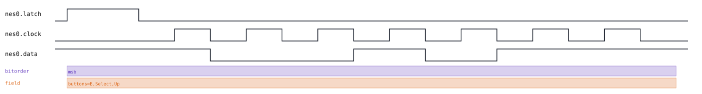
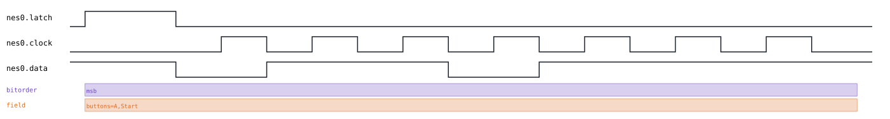

# NES gamepad

Back to [usage overview](../USAGE.md).

## What this is

The NES controller is a dead-simple shift-register peripheral: inside the
pad is a 4021 8-bit parallel-load shift register. The console pulses
**LATCH** high to snapshot the state of all 8 buttons in parallel, then
clocks them out one at a time on **DATA** — one bit per **CLOCK** pulse,
active-low (`0` means the button is pressed, `1` means released). The very
first bit (button A) is already valid the instant LATCH falls, before any
clock pulse happens at all; each subsequent CLOCK rising edge shifts the
next bit onto DATA. Bit order is fixed by the hardware: A, B, Select,
Start, Up, Down, Left, Right.

This page generates that exact three-wire capture — LATCH, CLOCK, DATA —
without a real controller or console, as SVG and/or a capture file
(`.sr`/`.vcd`) you can open in PulseView, sigrok-cli, or GTKWave as if a
logic analyzer had actually probed the wires between the console and the
pad.

It's deliberately **not** built on this tool's generic `SpiBus`, even
though "shift a byte out on a clock" sounds SPI-shaped. Real NES timing is
two independently-timed pulses (LATCH, then a train of CLOCK pulses) with
no chip-select-per-transfer concept and no continuous clock — so
`nes_gamepad.py` is its own small transport with one clock-and-shift
primitive, rather than forcing SPI's CS-bracketed-transfer model onto
hardware that doesn't have one. It's also single-controller only — no
daisy-chained second pad (the NES Four Score multitap) support — and there
is no shared/contested line to track here (unlike I2C or 1-Wire), so
signals are plain `DIGITAL` levels with no driver-tracking annotations.

## Quick start

```bash
.venv/bin/python -m protowavegen --config examples/nes_gamepad_basic.json
```

This runs `examples/nes_gamepad_basic.json` (shown in full in the appendix
below) and writes `output/nes_gamepad_basic.svg`/`.sr`/`.vcd` — a single
LATCH pulse followed by 8 CLOCK pulses, with A and Start held pressed and
every other button released:


## What you can customize

There are exactly two things worth changing on this protocol, and — unlike
every other protocol page in this repo — **neither one is reachable from
the CLI**. Both need a JSON edit:

- **Which buttons are pressed** — the entire button state is one
  `buttons: {"Name": true/false, ...}` dictionary passed to a single
  `read_buttons` operation, not individual boolean kwargs. `--set` only
  ever assigns a scalar (int/float/bool/string) to one named parameter, so
  there's no way to hand it a whole dict of button states, and the
  dictionary's individual keys (`"A"`, `"Up"`, ...) aren't parameters of
  `read_buttons` at all, just entries inside its one `buttons` parameter —
  see the recipe below for exactly what happens if you try anyway.
- **The LATCH/CLOCK pulse widths** (`latch_us`, `clock_us`) — these are
  constructor `params`, like most other protocols' bus-timing knobs, so
  they're JSON-edit-only by this tool's usual convention.

## Recipes — customizing via the CLI

### Why `--set` can't reach the buttons (and what happens if you try)

It's tempting to reach for `--set nes0:0:A=true` the way you'd reach for
`--set i2c0:0:address=0x50` on another protocol's page — but `read_buttons`
has exactly one real parameter, `buttons`, and `A` isn't it:

```
$ .venv/bin/python -m protowavegen --config examples/nes_gamepad_basic.json --set "nes0:0:A=true"
ValueError: --set: NesGamepad.read_buttons() has no parameter 'A' (real parameters: ['buttons'])
```

That error is the same clean, guarded message every other protocol page
shows for a typo'd field — genuinely helpful. Targeting the real parameter
name instead, though, uncovers a rougher edge: `--set`'s value parser only
ever produces a scalar (int, float, bool, or string — see
[Overriding any other field from the CLI](../USAGE.md#overriding-any-other-field-from-the-cli)),
so `buttons` ends up set to the literal string `"B"` instead of a
dictionary, and `read_buttons()` crashes with a raw, unguarded Python
error instead of a clean `ValueError` when it tries to call `.get()` on it:

```
$ .venv/bin/python -m protowavegen --config examples/nes_gamepad_basic.json --set "nes0:0:buttons=B"
  File "protocols/nes_gamepad.py", line 45, in read_buttons
    bits = [0 if buttons.get(name, False) else 1 for name in _BUTTON_ORDER]  # active-low
                 ^^^^^^^^^^^
AttributeError: 'str' object has no attribute 'get'
```

`--data-*` doesn't help either — `buttons` isn't one of the fixed
byte-array payload field names those flags recognize
(`data`/`values`/`mosi`/... — see `_PAYLOAD_FIELDS` in `config.py`), so
auto-detect finds nothing to target at all:

```
$ .venv/bin/python -m protowavegen --config examples/nes_gamepad_basic.json --data-int "1,2"
ValueError: no data-carrying operation found to target; specify --data-target
```

Bottom line: this protocol has no CLI-reachable field at all, on either
mechanism. Everything below is a JSON edit.

### Changing which buttons are pressed

Edit the `buttons` dict directly in the operation — any subset of
`A`/`B`/`Select`/`Start`/`Up`/`Down`/`Left`/`Right`; omitted keys default
to not-pressed:

```diff
-        { "op": "read_buttons", "buttons": { "A": true, "Start": true } }
+        { "op": "read_buttons", "buttons": { "Up": true, "B": true, "Select": true } }
```

```bash
.venv/bin/python -m protowavegen --config examples/nes_gamepad_basic.json --format svg
```



The DATA line's bit pattern and the field annotation both follow the new
button set automatically — nothing else in the file needs to change.

### Changing the LATCH/CLOCK pulse widths

`latch_us`/`clock_us` (defaults `12`/`6`, in microseconds) are constructor
`params`, not operation fields, so they live at the protocol-node level
rather than inside `operations`:

```diff
-      "id": "nes0", "type": "nes_gamepad",
+      "id": "nes0", "type": "nes_gamepad", "params": { "latch_us": 24, "clock_us": 12 },
```

```bash
.venv/bin/python -m protowavegen --config examples/nes_gamepad_basic.json --format svg
```

Doubling both stretches every LATCH and CLOCK pulse to twice its baseline
width, visibly widening each pulse in the capture:



---

## Appendix — operations reference

`type: "nes_gamepad"` — `NesGamepad`, `protocols/nes_gamepad.py`.

`params`: `latch_us` (default `12`), `clock_us` (default `6`).

Operations:
- **`read_buttons`** — `buttons: dict[str, bool]` (any subset of
  `A`/`B`/`Select`/`Start`/`Up`/`Down`/`Left`/`Right`; omitted keys default
  to not-pressed). **No `datatype`/floating-marker support at all** — a
  fixed named-boolean structure, deliberately excluded from the
  floating-marker system since "not driven" has no natural meaning for a
  button-pressed boolean the way it does for a data byte.

```json
{
  "samplerate": 1000000,
  "protocols": [
    {
      "id": "nes0",
      "type": "nes_gamepad",
      "operations": [
        { "op": "read_buttons", "buttons": { "A": true, "Start": true } }
      ]
    }
  ],
  "outputs": [
    { "type": "svg", "path": "output/nes_gamepad_basic.svg" },
    { "type": "sigrok", "path": "output/nes_gamepad_basic.sr" },
    { "type": "vcd", "path": "output/nes_gamepad_basic.vcd" }
  ]
}
```
