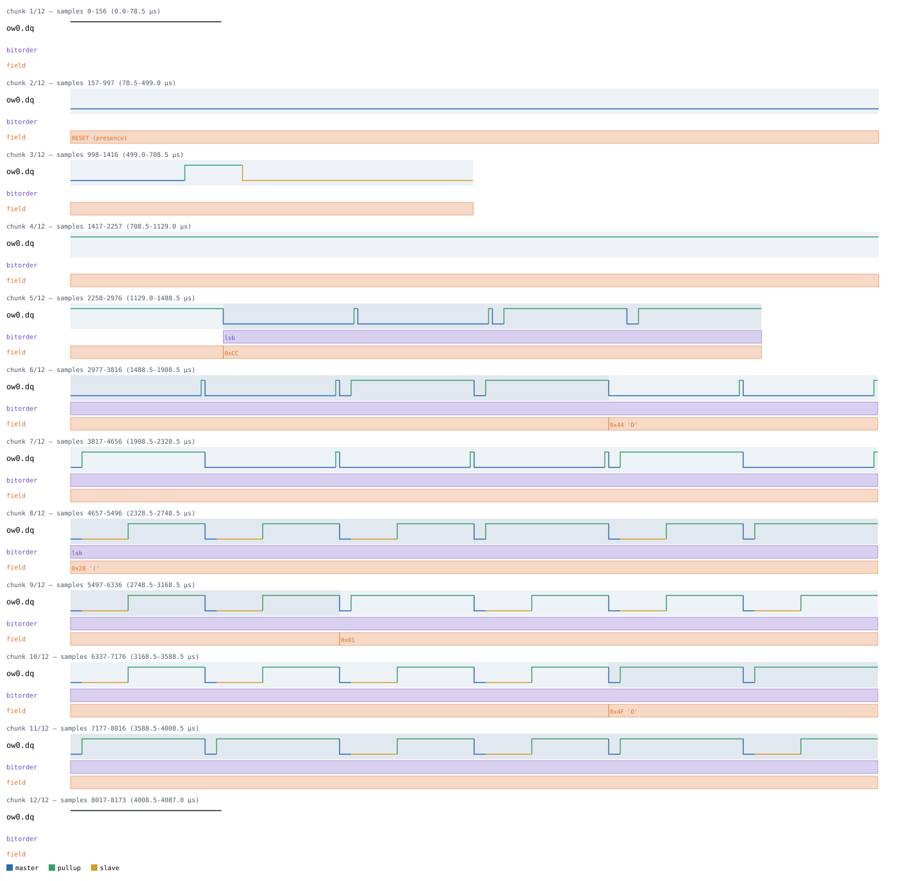
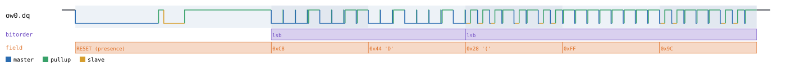
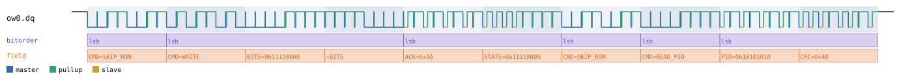
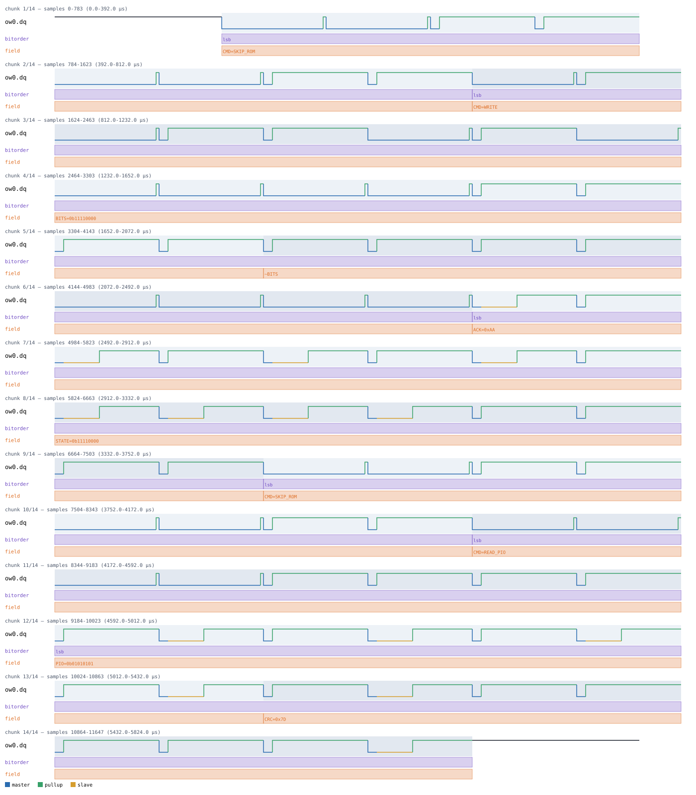
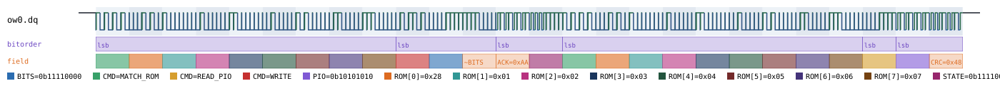
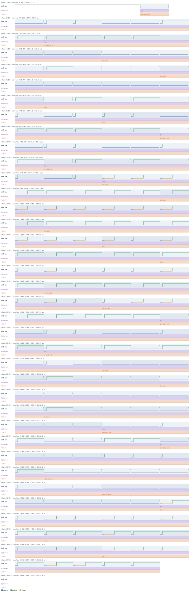

# 1-Wire

Back to [usage overview](../USAGE.md).

## What this is

1-Wire is Dallas/Maxim's single-signal bus: one open-drain data line
(`dq`, plus ground) carries both power-signaling and data to and from a
whole family of small addressable chips — thermometers, EEPROMs, GPIO
switches — using nothing but timed low pulses. Every device on the bus
carries a unique factory-burned 64-bit ROM ID, so a master can either
talk to "whatever's on the bus" (Skip ROM, fine when there's only one
device) or address one specific chip by its ROM ID on a multi-drop bus
(Match ROM).

This page generates realistic 1-Wire timing diagrams — a bare master
issuing reset/write/read against the raw bus, plus three real Dallas/Maxim
parts stacked on top of it: the **DS2408** (8-channel addressable switch),
the **DS243x** family (e.g. DS2433, a 1-Wire EEPROM), and the **DS28EA00**
(a DS18B20-family digital thermometer) — without any real hardware. The
output is a diagram (SVG) and/or a capture file (`.sr`/`.vcd`) you can open
in PulseView, sigrok-cli, or GTKWave as if a logic analyzer had actually
probed the bus.

`dq` is open-drain (`SignalKind.TRISTATE`): a logic-1 level in the diagram
always means "the pull-up resistor is holding the line high, nobody's
driving it," never a chip actively driving high — same convention as I2C's
SDA/SCL. This matters if you ever hand-write a floating-bit payload — see
[the datatype/floating-marker guide](../USAGE.md#the-floating-bit-marker-system-lhz);
`z`/`Z` markers auto-resolve high here since `dq` has a defined pull.

## Quick start

```bash
.venv/bin/python -m protowavegen --config examples/onewire_basic.json
```

This runs `examples/onewire_basic.json` (shown in full in the appendix
below) and writes `output/onewire_basic.svg`/`.sr`/`.vcd` — a reset (with a
presence pulse), a 2-byte write, then a 3-byte synthesized read:



## What you can customize

Without touching the JSON at all, the CLI can change:
- **The bytes written or read back** (`data` on the raw bus's `write`/
  `read`) — via `--data-hex`/`--data-string`/`--data-int`/etc.
- On the stacked devices below, most **scalar payload values** — a PIO
  logic-state byte, a memory address, a temperature reading — via `--set`,
  though (see the DS2408 recipe below) not every scalar-looking field
  turns out to be reachable that way.
- **Which device on the bus is addressed** (`rom_id`, shared by every
  stacked device) is a constructor param, not an operation field, so
  switching between Skip ROM and Match ROM needs a JSON edit (see below).

## Recipes — customizing via the CLI

### Changing the write/read payload

The raw bus's `write` and `read` both take a `data` byte list, and a
config with more than one data-carrying operation needs the inline
`protocol_id:op_index:` prefix to disambiguate which one a flag targets
(see [Chaining multiple overrides](../USAGE.md#chaining-multiple-overrides-in-one-invocation)) —
without it, `protowavegen` refuses to guess:

```
$ .venv/bin/python -m protowavegen --config examples/onewire_basic.json --data-hex "281234"
ValueError: multiple data-carrying operations found (ow0:1:data (op=write), ow0:2:data (op=read));
specify which one with --data-target protocol_id:op_index[:field]
```

Targeting each operation explicitly works fine — this changes the write's
payload and the synthesized read-back bytes in one invocation:

```bash
.venv/bin/python -m protowavegen --config examples/onewire_basic.json --format svg \
    --data-int "ow0:1:200,68" --data-hex "ow0:2:28ff9c"
```



### When you still need to edit the JSON

The raw `OneWireBus` itself has no constructor params at all (standard-
speed slot/reset timing is fixed), so there's nothing to demonstrate a
JSON-only edit on at the bus level — but every stacked device below takes
a `rom_id` constructor param for Match-ROM addressing, and that's exactly
this case: it's not an operation field, so `--set`/`--data-*` can't reach
it. See the DS2408 recipe below for a worked example.

---

## Stacked devices

Every device below needs `"stack_on": "<onewire node id>"` and must be
declared after that 1-Wire node in the `protocols` list. They all share a
`"rom_id": [byte, ...]` constructor param (an 8-byte Match-ROM address for
a multi-drop bus) — omit it for Skip-ROM, the default, which addresses
"whichever single device is on the bus" and is what every example config
below uses out of the box.

### DS2408 — `type: "ds2408"`

Dallas DS2408, a 1-Wire 8-channel addressable switch. `write_pio` sets the
8 output bits; `read_pio` reads back an 8-bit logic-state byte plus a real
1-Wire CRC-8 (`checksums.crc8_1wire`) computed over what was actually sent.

```bash
.venv/bin/python -m protowavegen --config examples/ds2408_basic.json
```



`read_pio`'s `state` byte is a plain scalar operation field, so `--set`
reaches it directly — and because the CRC is computed at generation time
from whatever `state` actually is, the CRC byte in the diagram updates
correctly too, not a stale leftover from the JSON:

```bash
.venv/bin/python -m protowavegen --config examples/ds2408_basic.json --format svg \
    --set "ds0:1:state=0x55"
```



`write_pio`'s `bits` field, despite looking just as scalar, is **not**
reachable from the CLI at all — worth knowing since it's easy to assume it
behaves like `state` above. `--set` refuses it because the name `bits`
happens to be one of the field names `protowavegen` treats as a payload
(byte-array) field everywhere, regardless of what a specific operation
actually does with it:

```
$ .venv/bin/python -m protowavegen --config examples/ds2408_basic.json --set "ds0:0:bits=0x0F"
ValueError: --set: 'bits' is a payload (byte-array) field, not a scalar — use
--data-hex/--data-string/--data-int/--data-bin/--data-bits/--data-file instead
```

But the `--data-*` flags it just pointed at don't work either, because
`write_pio()` has no `datatype` parameter at all (it's a plain int, not a
list under a datatype) — every `--data-*` flag unconditionally tries to
set one:

```
$ .venv/bin/python -m protowavegen --config examples/ds2408_basic.json --data-int "ds0:0:bits:15"
ValueError: --data-*: Ds2408.write_pio() has no datatype parameter for field 'bits' (expected 'bits_datatype' or 'datatype')
```

So changing `write_pio`'s `bits` genuinely requires a JSON edit:

```diff
-        { "op": "write_pio", "bits": 240 },
+        { "op": "write_pio", "bits": 15 },
```

The other JSON-only case here is `rom_id` — switching this device from
Skip ROM to Match ROM addressing:

```diff
       { "id": "ow0", "type": "onewire", "operations": [] },
       {
-        "id": "ds0", "type": "ds2408", "stack_on": "ow0",
+        "id": "ds0", "type": "ds2408", "stack_on": "ow0", "params": { "rom_id": [40, 1, 2, 3, 4, 5, 6, 7] },
         "operations": [
```

Running that produces a `CMD=MATCH_ROM` byte followed by the 8 ROM-ID
bytes in place of the single `CMD=SKIP_ROM` byte, ahead of every function
command:



Operations: `read_pio(state)`, `write_pio(bits)`. Neither takes
`datatype`.

```json
{
  "samplerate": 2000000,
  "protocols": [
    { "id": "ow0", "type": "onewire", "operations": [] },
    {
      "id": "ds0", "type": "ds2408", "stack_on": "ow0",
      "operations": [
        { "op": "write_pio", "bits": 240 },
        { "op": "read_pio", "state": 170 }
      ]
    }
  ],
  "outputs": [
    { "type": "svg", "path": "output/ds2408_basic.svg" },
    { "type": "sigrok", "path": "output/ds2408_basic.sr" },
    { "type": "vcd", "path": "output/ds2408_basic.vcd" }
  ]
}
```

### DS243x — `type: "ds243x"`

A 1-Wire EEPROM (e.g. DS2433). `write_memory` reproduces the real
3-transaction sequence a real driver uses — Write Scratchpad, then a
Read Scratchpad readback (with a CRC16 over the scratchpad contents, using
the same polynomial as Modbus's as a stand-in for the real part's
checksum), then Copy Scratchpad to commit. `read_memory` is the simpler
direct path: a `0xF0` Read Memory command, address, then data straight
back — no scratchpad involved.

```bash
.venv/bin/python -m protowavegen --config examples/ds243x_basic.json
```


`read_memory`'s `data` is a real payload field (and, unlike
`write_memory`'s, forwarded to the bus unmixed with any other bytes, so it
gets full floating-marker support too — see the general guide linked
above):

```bash
.venv/bin/python -m protowavegen --config examples/ds243x_basic.json --format svg \
    --data-hex "ee0:1:aabbcc"
```



`address` (on both `write_memory` and `read_memory`) is a plain scalar
operation field, reachable via `--set` the same way DS2408's `state` was
above, e.g. `--set "ee0:1:address=0x40"`. `write_memory`'s own `data` is
also a real payload field, reachable via `--data-hex`/etc. too — but
unlike `read_memory`'s, it does **not** support floating-bit markers, since
those bytes get folded into the scratchpad's CRC16 before transmission and
there's no meaningful "floating" CRC input.

`rom_id` is the same JSON-only constructor param as DS2408's — see that
recipe above; it works identically here.

Operations: `write_memory(address, data, datatype="bytes")`,
`read_memory(address, data, datatype="bytes")`.

```json
{
  "samplerate": 2000000,
  "protocols": [
    { "id": "ow0", "type": "onewire", "operations": [] },
    {
      "id": "ee0", "type": "ds243x", "stack_on": "ow0",
      "operations": [
        { "op": "write_memory", "address": 16, "data": [170, 187] },
        { "op": "read_memory", "address": 32, "data": [1, 2, 3] }
      ]
    }
  ],
  "outputs": [
    { "type": "svg", "path": "output/ds243x_basic.svg" },
    { "type": "sigrok", "path": "output/ds243x_basic.sr" },
    { "type": "vcd", "path": "output/ds243x_basic.vcd" }
  ]
}
```

### DS28EA00 — `type: "ds28ea00"`

A DS18B20-family digital thermometer (only the temperature-conversion path
is modeled here, not the sequence-detect/PIO features real DS28EA00 parts
also have). `read_temperature` issues `0x44` Convert T, waits out a
conversion delay (external-power mode — DQ just idles high), then `0xBE`
Read Scratchpad, returning 9 bytes (temperature lo/hi, TH, TL, config, 3
reserved `0xFF` bytes, CRC8) encoding the temperature in the DS18B20's
12-bit fixed-point format (0.0625C per LSB).

```bash
.venv/bin/python -m protowavegen --config examples/ds28ea00_basic.json
```

`celsius` is a plain scalar operation field, so `--set` changes the
synthesized reading directly — the CRC8 is recomputed from the encoded
temperature bytes, same as DS2408's `state` above:

```bash
.venv/bin/python -m protowavegen --config examples/ds28ea00_basic.json --format svg \
    --set "temp0:0:celsius=-10.5"
```

`th`/`tl`/`config` (the alarm-threshold and configuration scratchpad
bytes) are reachable the same way. `conversion_delay_us`, though, is a
constructor param (defaulting to 750000us / 750ms, typical worst-case for
12-bit resolution — the example config shortens it to keep the generated
capture small) — `--set` can't reach it, and says so plainly when tried:

```
$ .venv/bin/python -m protowavegen --config examples/ds28ea00_basic.json --set "temp0:0:conversion_delay_us=5000"
ValueError: --set: Ds28ea00.read_temperature() has no parameter 'conversion_delay_us' (real parameters: ['celsius', 'config', 'th', 'tl'])
```

Changing it means editing the JSON directly:

```diff
-      "id": "temp0", "type": "ds28ea00", "stack_on": "ow0", "params": { "conversion_delay_us": 1000 },
+      "id": "temp0", "type": "ds28ea00", "stack_on": "ow0", "params": { "conversion_delay_us": 5000 },
```

`rom_id` is, again, the same JSON-only constructor param covered under
DS2408 above.

`params`: `conversion_delay_us` (default `750000`).

Operations: `read_temperature(celsius, th=0, tl=0, config=0x7F)`,
`write_scratchpad(th, tl, config)`. Neither takes `datatype`.

```json
{
  "samplerate": 2000000,
  "protocols": [
    { "id": "ow0", "type": "onewire", "operations": [] },
    {
      "id": "temp0", "type": "ds28ea00", "stack_on": "ow0", "params": { "conversion_delay_us": 1000 },
      "operations": [
        { "op": "read_temperature", "celsius": 23.5 }
      ]
    }
  ],
  "outputs": [
    { "type": "svg", "path": "output/ds28ea00_basic.svg" },
    { "type": "sigrok", "path": "output/ds28ea00_basic.sr" },
    { "type": "vcd", "path": "output/ds28ea00_basic.vcd" }
  ]
}
```

---

## Appendix — operations reference

### 1-Wire — `type: "onewire"`

`OneWireBus`, `protocols/onewire.py`. No timing constructor params —
standard-speed slot/reset timing is fixed.

- **`reset`** — `presence=True`. No payload.
- **`write`** — `data`, `datatype="bytes"`, `labels=None`. Full
  floating-marker support, LSB-first (matching the 1-Wire spec's
  ROM/function-command bit order).
- **`read`** — `data`, `datatype="bytes"`, `labels=None`. `data` is the
  synthesized response the target sends back.

```json
{
  "samplerate": 2000000,
  "protocols": [
    {
      "id": "ow0",
      "type": "onewire",
      "operations": [
        { "op": "reset" },
        { "op": "write", "data": [204, 68] },
        { "op": "read", "data": [40, 1, 79] }
      ]
    }
  ],
  "outputs": [
    { "type": "svg", "path": "output/onewire_basic.svg" },
    { "type": "sigrok", "path": "output/onewire_basic.sr" },
    { "type": "vcd", "path": "output/onewire_basic.vcd" }
  ]
}
```

### ROM addressing (`onewire_rom.py`)

Shared by every device stacked on `OneWireBus`: Skip ROM (`0xCC`,
single-device bus) when the device's `rom_id` param is unset, or Match ROM
(`0x55` + the 8-byte `rom_id`) otherwise. Every device's own operation
methods call this prelude first.

### Timing constants (standard speed, fixed, no overdrive mode)

- Reset: master drives DQ low 480us, releases; if `presence=True` the
  target asserts a presence pulse 30us later, held 120us, followed by a
  500us recovery window.
- Each bit is a 70us slot the master initiates by pulling DQ low: a
  write-1 or read slot is a short 6us low pulse then release; a write-0
  slot holds DQ low for most of the slot, releasing for a brief 2us
  recovery window right at the end — real masters always start a slot with
  a fresh falling edge, so even two back-to-back 0 bits need a momentary
  release between them. A read-0 is modeled as the device taking over the
  low pulse from the master and holding it (30us) well past the ~15us
  point a real master samples at, before releasing.
- `write()`/`read()` send/receive whole bytes LSB-first.

These constants were cross-checked against sigrok's own `onewire_link`
decoder (its exact min/max thresholds per phase) rather than picked from
memory alone — the presence-pulse delay and the read-0 hold time both
deliberately sit with margin inside that decoder's classification windows
rather than at their edges, since a value sitting exactly on a threshold
is one sample-quantization error away from being misclassified.
