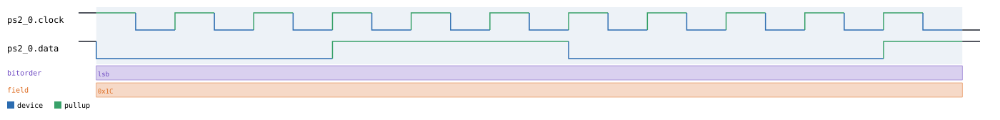
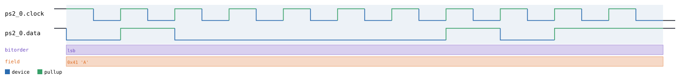
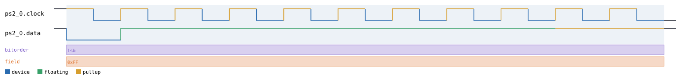
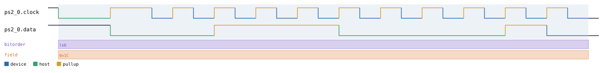

# PS/2

Back to [usage overview](../USAGE.md).

## What this is

PS/2 is the two-wire interface used by classic PS/2 keyboards and mice:
one `clock` line and one `data` line, both open-collector (pulled high by
a resistor, same electrical convention as I2C's SDA/SCL — a logic-1 level
always means "the pull-up is holding the line high," never a chip actively
driving high). Either side of the link can drive the bus, but not both at
once:

- **Device -> host** (`send_from_device`) is the normal case — the
  keyboard/mouse itself generates the clock and shifts out an 11-bit frame
  (start bit, 8 data bits LSB-first, odd parity, stop bit) whenever it has
  something to report, e.g. a scan code.
- **Host -> device** (`send_to_host`) is how the host sends a command
  (set LEDs, set sample rate, etc.): the host first holds `clock` low
  itself (the "inhibit" state, forcing the device to wait), then pulls
  `data` low as its own start bit and releases the clock — the *device*
  still generates the remaining clock pulses for the rest of the frame,
  and finishes by driving one extra ACK bit low itself.

This page generates realistic PS/2 timing diagrams for both directions
without any real hardware. The output is a diagram (SVG) and/or a capture
file (`.sr`/`.vcd`) you can open in PulseView, sigrok-cli, or GTKWave as if
a logic analyzer had actually probed the bus.

## Quick start

```bash
.venv/bin/python -m protowavegen --config examples/ps2_basic.json
```

This runs `examples/ps2_basic.json` (shown in full in the appendix below)
and writes `output/ps2_basic.svg`/`.sr`/`.vcd` — a single device-to-host
frame carrying the byte `28` (`0x1C`, the Scan Code Set 2 make code for the
`A` key):



If you want to decode this capture with sigrok-cli's own `ps2` decoder
(`sigrok-cli -i output/ps2_basic.sr -P ps2:clk=ps2_0.clock:data=ps2_0.data`),
be aware that decoder has a real off-by-one: it only emits a frame's
decoded word once it sees a *12th* falling clock edge, but a genuine PS/2
frame is exactly 11 bits, so a single isolated frame like this example
never flushes through it. The fix isn't anything wrong with the generated
waveform — it's sending a second frame right after the first, whose own
first falling edge acts as the trigger that flushes the first frame's
decode (the project's own test suite does exactly this; see
`tests/test_sigrok_roundtrip.py`). This example intentionally stays a
single frame for clarity; add a second `send_from_device` operation to the
JSON if you want to see it decode cleanly through sigrok-cli yourself.

## What you can customize

Without touching the JSON at all, the CLI can change:
- **The byte value being sent** (`byte`, on either `send_from_device` or
  `send_to_host`) — via `--data-hex`/`--data-string`/`--data-bin` (see the
  limitation below for why `--data-int`/`--data-file` don't work here).
- **Which bits of that byte are "floating"** rather than a driven `0`/`1`
  — via the same flags' `l`/`h`/`z` marker alphabet; `z` resolves high
  here since both `clock` and `data` are open-collector pull-up signals.

Two things are **not** reachable from the CLI at all:
- **Direction** (device-to-host vs. host-to-device) is a choice of *which
  operation* appears in the JSON (`send_from_device` vs. `send_to_host`),
  not a field on an operation — there's nothing for `--set` to flip.
- **`clock_hz`/`inhibit_us`** are constructor `params`, not operation
  fields, so they need a JSON edit too.

## Recipes — customizing via the CLI

### Changing the byte value

The example has exactly one data-carrying operation, so the target
auto-detects — no `protocol_id:op_index` prefix needed, though adding it
(`ps2_0:0:`) is harmless and makes the intent explicit:

```bash
.venv/bin/python -m protowavegen --config examples/ps2_basic.json --format svg \
    --data-hex "ps2_0:0:41"
```

This changes the transmitted byte from `0x1C` to `0x41` (`'A'` in ASCII —
`format_byte()` renders the printable character alongside the hex value
whenever there is one):



### Marking the byte as floating

Since `clock`/`data` are both open-collector with a defined pull-up, `z`
resolves silently to a driven-high bit rather than erroring the way it
would on a push-pull bus like SPI:

```bash
.venv/bin/python -m protowavegen --config examples/ps2_basic.json --format svg \
    --data-hex "ps2_0:0:zz"
```

Every data bit in the byte comes out high (`0xFF`), and the `driver`
annotation track shows those bit positions as "floating" instead of a
concrete party driving them — useful for representing "nobody's actually
asserting this bit, the pull-up is just doing its job":



### A real CLI limitation: `--data-int`/`--data-file` don't work here

`byte` looks like an ordinary payload field, and `--data-hex`/
`--data-string`/`--data-bin` all work on it fine (as above) — but
`--data-int` and `--data-file` genuinely crash:

```
$ .venv/bin/python -m protowavegen --config examples/ps2_basic.json --format svg \
    --data-int "ps2_0:0:65"
Traceback (most recent call last):
  ...
  File ".../protowavegen/protocols/ps2.py", line 96, in send_from_device
    bits = [0, *bits_of_byte(byte, "lsb"), self._odd_parity(byte), 1]
  File ".../protowavegen/protocols/base.py", line 100, in bits_of_byte
    if not (0 <= byte <= 0xFF):
TypeError: '<=' not supported between instances of 'int' and 'list'
```

The reason: PS/2's `byte` field is a single scalar byte, not a `list[int]`
payload — `Ps2Bus`'s operations call `resolve_single_byte()`, which (for
the default `datatype="bytes"`) expects a bare `int`. But `--data-int` and
`--data-file` always build a `list[int]` (`_parse_data_int()`/
`_load_data_file()` in `config.py`) and store it under `datatype="bytes"`
unconditionally, regardless of what shape the target field actually wants.
`--data-hex`/`--data-string`/`--data-bin` avoid this because they route
through `decode_payload_with_floating()`, which `resolve_single_byte()`
handles specially (it decodes the string and requires the result collapse
to exactly one byte) rather than assuming a list. Until that's fixed,
stick to `--data-hex`/`--data-string`/`--data-bin` for PS/2's `byte` field.

### When you still need to edit the JSON

**Direction** isn't an operation field, so there's no `--set` target for
it — switching a frame from device-to-host to host-to-device means
changing which operation the JSON calls:

```diff
       "operations": [
-        { "op": "send_from_device", "byte": 28 }
+        { "op": "send_to_host", "byte": 28 }
       ]
```

Running that produces the host's inhibit-then-release sequence up front,
followed by the device generating the rest of the clock pulses and its own
trailing ACK bit — a visibly different shape from the baseline capture
above:



`clock_hz`/`inhibit_us` are the other JSON-only case — both are
constructor `params` (representative fixed timing, not tied to one real
device), so there's no operation to `--set` them on either:

```diff
-      "id": "ps2_0", "type": "ps2",
+      "id": "ps2_0", "type": "ps2", "params": { "clock_hz": 12500, "inhibit_us": 250 },
```

---

## Appendix — operations reference

`type: "ps2"` — `Ps2Bus`, `protocols/ps2.py`. Both `clock` and `data` are
`SignalKind.TRISTATE`, tracked via `DriverTracker` the same way I2C/1-Wire/
Wiegand are: `"device"` drives clock+data during a normal device-to-host
frame and the ACK bit during a host-to-device frame; `"host"` drives the
inhibit/request-to-send sequence; `"pullup"` whenever released.

### Constructor params

```json
"params": { "clock_hz": 12500, "inhibit_us": 100 }
```

- `clock_hz` (default `12500`) — the device-generated clock rate.
- `inhibit_us` (default `100`) — how long the host holds `clock` low
  before starting a host-to-device frame.

Both are representative timing, not tied to one specific real device.

### Operations

- **`send_from_device`** — `byte`, `datatype="bytes"`. `byte` is a plain
  int (default) or, with a `"text"`/`"hex"`/`"bin"` `datatype`, a
  single-byte payload via `resolve_single_byte()` — the floating-marker
  alphabet (`l`/`h`/`z`) applies, with `z` resolving high on both signals.
  11 bits total: start(0), 8 data bits LSB-first, odd parity, stop(1).
- **`send_to_host`** — same `byte`/`datatype` shape. The host holds
  `clock` low for `inhibit_us`, pulls `data` low as its start bit, then
  releases `clock`; the device generates the remaining clock pulses for
  data+parity+stop and drives a final ACK bit low itself.

Neither operation has any scalar field beyond `byte`/`datatype` — there's
no address, mode flag, or similar to reach with `--set`.

### Example — `examples/ps2_basic.json`

```json
{
  "samplerate": 1000000,
  "protocols": [
    {
      "id": "ps2_0",
      "type": "ps2",
      "operations": [
        { "op": "send_from_device", "byte": 28 }
      ]
    }
  ],
  "outputs": [
    { "type": "svg", "path": "output/ps2_basic.svg" },
    { "type": "sigrok", "path": "output/ps2_basic.sr" },
    { "type": "vcd", "path": "output/ps2_basic.vcd" }
  ]
}
```
