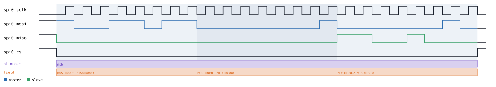
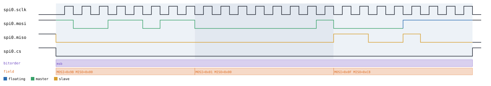
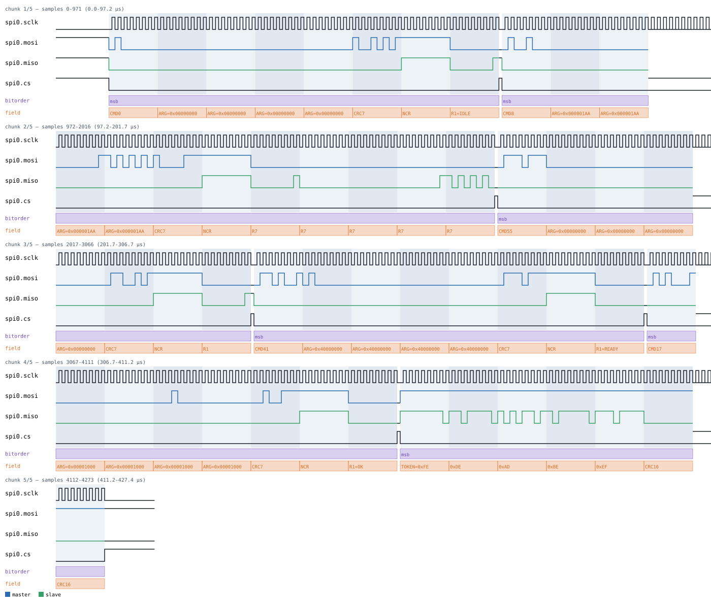
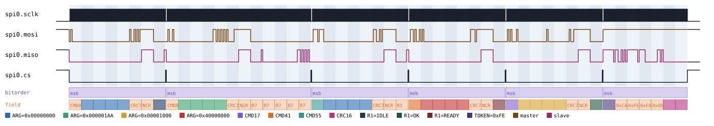
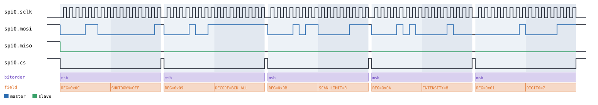

# SPI / QSPI / OctoSPI

Back to [usage overview](../USAGE.md).

## What this is

SPI (Serial Peripheral Interface) is the four-wire bus (SCLK clock, MOSI/
MISO data, CS chip-select) used everywhere in embedded electronics to talk
to flash chips, displays, SD cards, ADCs/DACs, and sensors at speeds I2C
can't reach. This page generates realistic SPI timing diagrams — a
generic full-duplex bus transfer, plus five specific real-world devices
stacked on top of the same bus — without any real hardware. The same
class also covers QSPI (4 parallel data lines) and OctoSPI (8 lines); the
only real difference from classic SPI is how many bits a clock edge
carries. The output is a diagram (SVG) and/or a capture file
(`.sr`/`.vcd`) you can open in PulseView, sigrok-cli, or GTKWave as if a
logic analyzer had actually probed the bus.

Unlike I2C's open-drain SDA/SCL, SPI is push-pull — every line has exactly
one driver at a time and no pull-up defines an idle level. This matters if
you ever hand-write a floating-bit payload: the `z`/`Z` "resolve to the
protocol's pull" marker is a **hard error** on any SPI line, since there's
no pull to resolve against — use `l`/`h` explicitly instead (see
[the datatype/floating-marker guide](../USAGE.md#the-floating-bit-marker-system-lhz)).

## Quick start

```bash
.venv/bin/python -m protowavegen --config examples/spi_mode0.json
```

This runs `examples/spi_mode0.json` and writes `output/spi_mode0.svg`/
`.sr`/`.vcd` — one 3-byte full-duplex transfer, mode 0, MSB-first:



## What you can customize

Without touching the JSON at all, the CLI can change:
- **The bytes shifted out (MOSI) and back (MISO)** on the raw `transfer`
  operation, and the equivalent payload field on every stacked device
  below (a JEDEC flash's `read` data, an SD card's block contents, a SPI
  flash's `page_program` data, ...) — via `--data-hex`/`--data-string`/
  `--data-int`/etc.
- **Scalar fields on a stacked device's operations** — an SD card's block
  `address`, a JEDEC flash's read `address`, a MAX7219 digit `position`/
  `value` or its startup `intensity` — via `--set`.
- **The bus electrical parameters** (`clock_hz`, `mode` i.e. CPOL/CPHA,
  `bit_order`, `width`) — these are constructor params, not operation
  fields, so they need a JSON edit (see below).

## Recipes — customizing via the CLI

### Changing the payload

`mosi`/`miso` share one `datatype` and must stay the same length (one
shared clock drives both directions at once), so overriding one while
leaving the other at its original length means overriding the other to
match. This also demonstrates marking part of a MOSI byte as floating —
SPI has no defined pull, so it needs the explicit `h` marker rather than
`z`:

```bash
.venv/bin/python -m protowavegen --config examples/spi_mode0.json --format svg \
    --data-hex "spi0:0:mosi:9b010h" --data-hex "spi0:0:miso:0000c8"
```

This changes the transfer's MOSI bytes from `[155, 1, 2]` to `0x9B, 0x01,
0x0F` (last nibble floating high) and MISO from `[0, 0, 200]` to `0x00,
0x00, 0xC8` — useful for checking how a diagram looks with different bus
traffic without hand-editing the file:



### When you still need to edit the JSON

`clock_hz`, `mode` (CPOL/CPHA), `bit_order`, and `width` are all
constructor `params` on the SPI bus node itself, not per-operation
fields — there's no operation to target, so `--set`/`--data-*` can't reach
them. Switching to mode 3 (idle-high clock, trailing-edge sample) means
editing the config directly:

```diff
-      "params": { "clock_hz": 1000000, "width": 1, "mode": 0, "bit_order": "msb" },
+      "params": { "clock_hz": 1000000, "width": 1, "mode": 3, "bit_order": "msb" },
```

then re-run the same command. The same applies to switching `width` to
`4`/`8` for QSPI/OctoSPI (which also switches which operation you use —
`wide_transfer` instead of `transfer`), or to adding/removing operations
entirely.

---

## Stacked devices

Every device below needs `"stack_on": "<spi node id>"` and must be
declared after that SPI node in the `protocols` list; all five require the
transport to be `width=1` (classic SPI) — their command phases are always
single-line even where a real chip variant supports dual/quad I/O reads.
A mandatory minimum CS-deasserted recovery gap is inserted before every
transfer automatically (both by the raw bus and every device below): two
back-to-back transfers with zero gap between them are electrically
indistinguishable from one continuous, over-long transfer to a real
decoder, so this can't be turned off.

### SD card, SPI mode — `type: "sd_spi"`

An SD card in SPI mode (v1 command scope): `init()` runs the real
`CMD0`/`CMD8`/`CMD55`+`ACMD41` power-up handshake, and `read_block()` runs
`CMD17` READ_SINGLE_BLOCK followed by a `0xFE` data-start token, the block
contents, and a 2-byte CRC16 placeholder. Every command byte gets a real
CRC-7 checksum (`checksums.crc7_sd`), computed over the actual command
bytes.

```bash
.venv/bin/python -m protowavegen --config examples/sd_spi_basic.json
```



`address` on `read_block` is a plain scalar field, so `--set` retargets
which block gets read — simulating the same read against a different
address on the card without hand-editing the file:

```bash
.venv/bin/python -m protowavegen --config examples/sd_spi_basic.json --format svg \
    --set "sd0:1:address=0x2000"
```


The block's data is a real payload field (`read_block`'s `data`, already
using the `"hex"` datatype in the example config), so it takes the usual
`--data-*` treatment:

```bash
.venv/bin/python -m protowavegen --config examples/sd_spi_basic.json --format svg \
    --data-hex "sd0:1:data:cafef00d"
```



`data` supports floating markers the same way JEDEC CFI's `read` does
(see below) — it's the MISO payload folded in between a fixed start token
and a fixed CRC16 placeholder, so `l`/`h` still work, `z` still doesn't
(no pull on SPI).

Not modeled: `CMD9`/`CMD10` (CSD/CID), the write path (`CMD24`), and the
SDHC-vs-SDSC byte/block addressing distinction (byte addresses assumed).

```json
{
  "samplerate": 10000000,
  "protocols": [
    { "id": "spi0", "type": "spi", "params": { "clock_hz": 1000000, "width": 1, "mode": 0 }, "operations": [] },
    {
      "id": "sd0", "type": "sd_spi", "stack_on": "spi0",
      "operations": [
        { "op": "init" },
        { "op": "read_block", "address": 4096, "data": "deadbeef", "datatype": "hex" }
      ]
    }
  ],
  "outputs": [
    { "type": "svg", "path": "output/sd_spi_basic.svg" },
    { "type": "sigrok", "path": "output/sd_spi_basic.sr" },
    { "type": "vcd", "path": "output/sd_spi_basic.vcd" }
  ]
}
```

### MAX7219 — `type: "max7219"`

Maxim MAX7219 8-digit LED display driver. Each command (shutdown control,
decode-mode, scan-limit, intensity, and one write per digit) is its own
16-bit word — a separate `transfer()` call underneath, since this chip
latches on every word rather than once per burst. Doesn't model
daisy-chaining multiple MAX7219s — single device only.

```bash
.venv/bin/python -m protowavegen --config examples/max7219_basic.json
```



`init`'s `intensity` and `set_digit`'s `position`/`value` are all plain
scalars, so `--set` reaches any of them directly — here targeting a
different digit position with a different value:

```bash
.venv/bin/python -m protowavegen --config examples/max7219_basic.json --format svg \
    --set "disp0:1:position=3" --set "disp0:1:value=9"
```


Operations: `init(intensity=8)`, `set_digit(position, value)`. Neither
takes `datatype` — there's no byte-array payload here, every field is a
scalar.

```json
{
  "samplerate": 10000000,
  "protocols": [
    { "id": "spi0", "type": "spi", "params": { "clock_hz": 1000000, "width": 1, "mode": 0 }, "operations": [] },
    {
      "id": "disp0", "type": "max7219", "stack_on": "spi0",
      "operations": [
        { "op": "init", "intensity": 8 },
        { "op": "set_digit", "position": 0, "value": 7 }
      ]
    }
  ],
  "outputs": [
    { "type": "svg", "path": "output/max7219_basic.svg" },
    { "type": "sigrok", "path": "output/max7219_basic.sr" },
    { "type": "vcd", "path": "output/max7219_basic.vcd" }
  ]
}
```

### JEDEC CFI — `type: "jedec_cfi"`

A JEDEC manufacturer-ID query (`RDID`, opcode `0x9F`) plus a standard
SPI-NOR `READ` (opcode `0x03`). Only these two commands are implemented —
not the full CFI/SFDP parameter-table walk (that would mean decoding
dozens of well-known offsets, out of scope here).

```bash
.venv/bin/python -m protowavegen --config examples/jedec_cfi_basic.json
```

`read`'s `address` is a plain scalar (`--set "cfi0:1:address=0x1000"`
works the same way as SD-SPI's block address above); its `data` is a real
payload field with the same floating-marker support as SD-SPI's block
data:

```bash
.venv/bin/python -m protowavegen --config examples/jedec_cfi_basic.json --format svg \
    --data-hex "cfi0:1:data:cafeh00d"
```

`read_jedec_id`'s `manufacturer_id`/`memory_type`/`capacity` are all plain
scalars too, reachable via `--set` the same way.

```json
{
  "samplerate": 8000000,
  "protocols": [
    {
      "id": "spi0",
      "type": "spi",
      "params": { "clock_hz": 1000000, "width": 1, "mode": 0 },
      "operations": []
    },
    {
      "id": "cfi0",
      "type": "jedec_cfi",
      "stack_on": "spi0",
      "operations": [
        { "op": "read_jedec_id", "manufacturer_id": 239, "memory_type": 64, "capacity": 24 },
        { "op": "read", "address": 4660, "data": [222, 173, 190, 239] }
      ]
    }
  ],
  "outputs": [
    { "type": "svg", "path": "output/jedec_cfi_basic.svg" },
    { "type": "sigrok", "path": "output/jedec_cfi_basic.sr" },
    { "type": "vcd", "path": "output/jedec_cfi_basic.vcd" }
  ]
}
```

### SPI flash/EEPROM — `type: "spiflash"`

A generic SPI-NOR flash (`xx25` family, matching sigrok's own `spiflash`
decoder — decode with e.g. `spiflash:chip=winbond_w25q80dv`): the standard
opcode set — `write_enable()`/`write_disable()`, `read_status(value)`/
`write_status(value)`, `read(address, data)`/`fast_read(address, data)`
(the latter adds one dummy byte), `page_program(address, data)` (the
first *write-direction*/MOSI-side floating-marker case in this repo —
same technique other protocols use on MISO), `sector_erase(address)`
(must be 4096-byte aligned), `chip_erase()`. No WIP-bit polling and no
write-enable-latch state tracking — this is a synthesis tool, not a
hardware timing simulator (sigrok's own decoder only *warns*, doesn't
reject, when `WREN` looks missing before a write/erase). For
manufacturer-ID queries, stack a separate `jedec_cfi` node on the same
`SpiBus` instance instead — nothing prevents two stacked protocols sharing
one transport.

```bash
.venv/bin/python -m protowavegen --config examples/spiflash_basic.json
```

Every `address` field (`read`/`fast_read`/`page_program`/`sector_erase`)
is a plain scalar, reachable via `--set` (e.g.
`--set "flash0:5:address=0x2000"` retargets the `read` at operation index
5 in the example config); every `data` field is a real payload field,
reachable via `--data-*` the same way as JEDEC CFI's `read` above.

```json
{
  "samplerate": 10000000,
  "protocols": [
    { "id": "spi0", "type": "spi", "params": { "clock_hz": 1000000, "width": 1, "mode": 0 }, "operations": [] },
    {
      "id": "flash0", "type": "spiflash", "stack_on": "spi0",
      "operations": [
        { "op": "write_enable" },
        { "op": "page_program", "address": 4096, "data": [222, 173, 190, 239] },
        { "op": "write_enable" },
        { "op": "sector_erase", "address": 4096 },
        { "op": "read_status", "value": 0 },
        { "op": "read", "address": 4096, "data": [222, 173, 190, 239] },
        { "op": "write_enable" },
        { "op": "chip_erase" }
      ]
    }
  ],
  "outputs": [
    { "type": "svg", "path": "output/spiflash_basic.svg" },
    { "type": "sigrok", "path": "output/spiflash_basic.sr" },
    { "type": "vcd", "path": "output/spiflash_basic.vcd" }
  ]
}
```

### 7-segment shift register — `type: "seven_segment"`

A generic 74HC595-style serial-in/parallel-out shift register driving
7-segment digits — SER/SRCLK map straight onto SPI's MOSI/SCLK, plus one
extra `latch` pin for the RCLK strobe (this chip has no CS-as-frame-bracket
concept, so the SPI bus's own CS line is left unused). One byte per digit,
MSB-first = `dp,g,f,e,d,c,b,a` (a common but not universal convention). No
common-anode inversion and no multiplexed/scanned-display timing (static
latch only).

```bash
.venv/bin/python -m protowavegen --config examples/seven_segment_basic.json
```

`set_digit_values`'s `values` field takes decimal digit values (`0`-`9`,
internally mapped to segment patterns) as a plain list — like Nunchuk's
`joystick`/`accel` on the I2C page, it has no `datatype` kwarg of its own,
so neither `--set` (it's list-shaped, not scalar) nor `--data-*` (no
datatype to target) reaches it; changing the digits means a JSON edit. The
lower-level `set_digits(patterns, datatype="bytes")` operation *is*
`--data-*`-reachable, if you switch the JSON to send raw segment-pattern
bytes directly instead of decimal digit values.

```json
{
  "samplerate": 10000000,
  "protocols": [
    { "id": "spi0", "type": "spi", "params": { "clock_hz": 1000000, "width": 1, "mode": 0 }, "operations": [] },
    {
      "id": "seg0", "type": "seven_segment", "stack_on": "spi0",
      "operations": [
        { "op": "set_digit_values", "values": [4, 2] }
      ]
    }
  ],
  "outputs": [
    { "type": "svg", "path": "output/seven_segment_basic.svg" },
    { "type": "sigrok", "path": "output/seven_segment_basic.sr" },
    { "type": "vcd", "path": "output/seven_segment_basic.vcd" }
  ]
}
```

---

## Full operations reference

`type: "spi"` — `SpiBus`, `protocols/spi.py`. One class for classic SPI
(`width=1`), QSPI (`width=4`), or OctoSPI (`width=8`) — the only real
difference is how many parallel data lines a clock edge carries.
Push-pull bus (unlike I2C), so `mosi`/`miso`/`ioN` are plain `DIGITAL` —
`z`/`Z` floating markers always need `l`/`h` used explicitly instead,
since there's no protocol-defined pull to auto-resolve against.

### Constructor params

```json
"params": { "clock_hz": 1000000, "width": 1, "mode": 0, "bit_order": "msb", "cs_active_low": true }
```

- `clock_hz` (required).
- `width` — `1` (SPI, default), `4` (QSPI), or `8` (OctoSPI).
- `mode` — `0`-`3`, standard CPOL/CPHA convention.
- `bit_order` — `"msb"` (default) or `"lsb"`.
- `cs_active_low` — `true` (default) or `false`.

### Operations

- **`transfer`** — `width=1` only. `mosi=None`, `miso=None`,
  `datatype="bytes"` (shared by both fields), `labels=None`. Full
  floating-marker support on both `mosi` and `miso` independently.
- **`wide_transfer`** — `width>1` only. `data`, `direction="write"|"read"`,
  `datatype="bytes"`. Full floating-marker support.

A mandatory minimum CS-deasserted recovery gap precedes every `transfer`/
`wide_transfer` call — without it, two back-to-back calls are
electrically indistinguishable from one continuous, over-long transfer to
a real decoder.

### JEDEC CFI — `jedec_cfi.py`

Operations: `read_jedec_id(manufacturer_id, memory_type, capacity)` (no
`datatype`), `read(address, data, datatype="bytes")` — full floating-marker
support on `data` (it's the MISO payload, folded in after the fixed
opcode/address bytes and rendered to `bin` under the hood so it can carry
`l`/`h`/`z` markers through that concatenation).

### MAX7219 — `max7219.py`

Operations: `init(intensity=8)`, `set_digit(position, value)`. Neither
takes `datatype`.

### SD card, SPI mode — `sd_spi.py`

Operations: `init()` (no `datatype`), `read_block(address, data, datatype="bytes")`
— full floating-marker support on `data` (same technique as JEDEC CFI's
`read`: it's the MISO payload folded in between a fixed start token and a
fixed CRC16 placeholder). This is the one example in the repo already
demonstrating the `"hex"` datatype.

### SPI flash/EEPROM — `spiflash.py`

Operations: `write_enable()`, `write_disable()` (no `datatype`),
`read_status(value)`, `write_status(value)`, `read(address, data,
datatype="bytes")`, `fast_read(address, data, datatype="bytes")` (like
`read` plus one dummy byte), `page_program(address, data,
datatype="bytes")` (the first *write-direction*/MOSI-side floating-marker
case in this repo — same `render_as_bin` technique other protocols use on
MISO), `sector_erase(address)` (must be 4096-byte aligned), `chip_erase()`.
No WIP-bit polling and no write-enable-latch state tracking — this is a
synthesis tool, not a hardware timing simulator (sigrok's own decoder only
*warns*, doesn't reject, when `WREN` looks missing before a write/erase).
For manufacturer-ID queries, stack a separate `jedec_cfi` node on the same
`SpiBus` instance instead — nothing prevents two stacked protocols sharing
one transport.

### 7-segment shift register — `seven_segment.py`

Generic 74HC595-style serial-in/parallel-out shift register driving
7-segment digits (one extra `latch` pin beyond plain SPI).

Operations: `set_digits(patterns)` (raw segment-pattern bytes),
`set_digit_values(values)` (decimal digit values, encoded internally).
Neither takes `datatype`.
