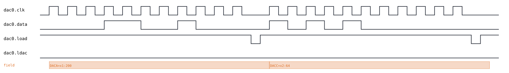
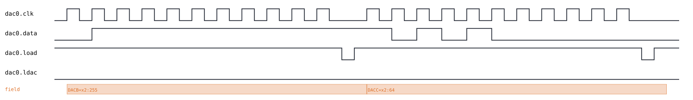
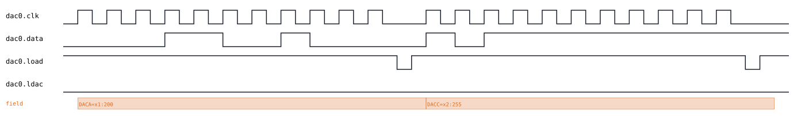

# TLC5620

Back to [usage overview](../USAGE.md).

## What this is

The Texas Instruments TLC5620 is a quad 8-bit DAC used to set four
independent analog output levels — volume/brightness/reference-voltage
type controls — from a microcontroller that has no built-in DAC. It has no
address, no command set, and no clock/data protocol in the SPI/I2C sense:
just a 3-wire shift-register interface (`clk`, `data`, `load`) that a
master bit-bangs to shift in which of the 4 DAC outputs to update, whether
that channel runs at x1 or x2 gain, and the 8-bit value to set it to.

This page generates a realistic TLC5620 timing diagram — a master
selecting a channel, a gain, and a value, then latching it in — without
any real hardware. The output is a diagram (SVG) and/or a capture file
(`.sr`/`.vcd`) you can open in PulseView, sigrok-cli, or GTKWave as if a
logic analyzer had actually probed the bus.

Data shifts into the DAC on `clk`'s *falling* edge, MSB-first, as a fixed
11-bit frame: 2 bits pick which of the 4 DACs to update (0-3 -> A-D), 1 bit
picks the gain (0 -> x1, 1 -> x2), and 8 bits carry the output value. A
falling edge on `load` then latches that frame into the selected DAC's
output register — nothing on the analog output actually changes until
`load` falls. `ldac` (a separate pin some real designs use to hold several
channels' updates and apply them all at once) is tied permanently low
here, so every `set_channel()` call takes effect immediately on its own
`load` pulse rather than waiting for a combined update.

## Quick start

```bash
.venv/bin/python -m protowavegen --config examples/tlc5620_basic.json
```

This runs `examples/tlc5620_basic.json` (shown in full in the appendix
below) and writes `output/tlc5620_basic.svg`/`.sr`/`.vcd` — channel A set
to x1 gain, value `200`, then channel C set to x2 gain, value `64`:



## What you can customize

Without touching the JSON at all, the CLI can change, on either
`set_channel` call:
- **Which of the 4 DAC channels is being set** (`channel`, 0-3 for A-D).
- **The gain** (`gain`, 1 or 2, i.e. x1 or x2).
- **The output value** (`value`, 0-255).

All three are plain scalar fields on the operation itself — none of them
are a byte-array "payload" field, so `--data-hex`/`--data-string`/
`--data-int`/etc. (the flags used on I2C/SPI/UART's byte-list fields) do
not apply anywhere in this config; `--set` is the only override mechanism
TLC5620 needs or supports (see the recipes below, and the "no payload
field" error further down). The bus's shift-clock rate (`clock_hz`) is a
constructor param, not an operation field — see "When you still need to
edit the JSON" below.

## Recipes — customizing via the CLI

### Retargeting a call to a different channel, gain, and value

`channel`, `gain`, and `value` are all plain scalar fields on
`set_channel`, so `--set` reaches any of them directly, chained in one
invocation the same way `--data-*` flags chain (see
[Chaining multiple overrides](../USAGE.md#chaining-multiple-overrides-in-one-invocation)).
This retargets the first call from channel A/x1/200 to channel B/x2/255:

```bash
.venv/bin/python -m protowavegen --config examples/tlc5620_basic.json --format svg \
    --set "dac0:0:channel=1" --set "dac0:0:value=255" --set "dac0:0:gain=2"
```



The DAC-select and gain bits in the shifted frame change accordingly, and
the field annotation now reads `DACB=x2:255` instead of `DACA=x1:200` —
the labels aren't just cosmetic, they reflect the actual bits shifted in.

### Changing just the output value on one call

A narrower version of the same thing — bump channel C's value to its
maximum (`255`) without touching its channel or gain, by targeting only
the second operation (`dac0:1`):

```bash
.venv/bin/python -m protowavegen --config examples/tlc5620_basic.json --format svg \
    --set "dac0:1:value=255"
```



`set_channel` still validates the value even when it arrives via `--set`,
not just when it's typed directly into the JSON — trying to push it out of
the 8-bit range fails the same way either way:

```
$ .venv/bin/python -m protowavegen --config examples/tlc5620_basic.json --set "dac0:0:value=300"
ValueError: value 300 does not fit in 8 bits
```

### There is no payload (byte-array) field here at all

Unlike I2C/SPI/UART, `set_channel` has no `data`/`mosi`/`values`-style
byte-list field and no `datatype` parameter — `channel`, `gain`, and
`value` are all individually-scalar. So every `--data-*` flag, even with
an explicit target, refuses outright:

```
$ .venv/bin/python -m protowavegen --config examples/tlc5620_basic.json --data-int "dac0:0:value:99"
ValueError: --data-target: operation dac0:0 has no payload field; specify one explicitly, one of ['DALI_ADDRESS', 'answer', 'bits', 'byte', 'card_number', 'command', 'data', 'facility_code', 'in_data', 'info', 'miso', 'mosi', 'mosi_bits', 'out_data', 'patterns', 'read_bits', 'read_data', 'setup_data', 'values', 'write_data']
```

and with no target at all, auto-detect finds nothing to guess either:

```
$ .venv/bin/python -m protowavegen --config examples/tlc5620_basic.json --data-int "99"
ValueError: no data-carrying operation found to target; specify --data-target
```

This isn't a bug or a gap — `value` genuinely is a single 0-255 integer,
not bytes, so `--set "dac0:0:value=99"` is the correct (and only-needed)
way to change it.

### When you still need to edit the JSON

`clock_hz` (the shift-clock rate) is a constructor `params` field, not an
operation field — there's no operation to `--set` it on:

```
$ .venv/bin/python -m protowavegen --config examples/tlc5620_basic.json --set "dac0:0:clock_hz=2000000"
ValueError: --set: Tlc5620.set_channel() has no parameter 'clock_hz' (real parameters: ['channel', 'gain', 'value'])
```

Changing it means editing the config directly:

```diff
-      "id": "dac0", "type": "tlc5620", "params": { "clock_hz": 1000000 },
+      "id": "dac0", "type": "tlc5620", "params": { "clock_hz": 2000000 },
```

The same applies to adding/removing `set_channel` calls entirely, or
changing which protocols are in the scenario.

---

## Appendix — operations reference

### TLC5620 — `type: "tlc5620"`

`Tlc5620`, `protocols/tlc5620.py`. Mirrors `MicrowireBus`'s own
`_clock_bit` shape internally, but is not built on `SpiBus` or
`MicrowireBus` — there's no chip-select or mode-variant complexity to a
plain shift register, so it's its own standalone `TransportProtocol`.

`params`: `clock_hz` (required) — the shift-clock rate.

Operations:
- **`set_channel`** — `channel` (0-3, DAC A-D), `gain` (1 or 2, i.e. x1 or
  x2), `value` (0-255). No `datatype` (all three fields are scalar, not
  byte-array). Out-of-range values raise `ValueError` at generation time,
  whether they came from the JSON or from a `--set` override.

```json
{
  "samplerate": 10000000,
  "protocols": [
    {
      "id": "dac0", "type": "tlc5620", "params": { "clock_hz": 1000000 },
      "operations": [
        { "op": "set_channel", "channel": 0, "gain": 1, "value": 200 },
        { "op": "set_channel", "channel": 2, "gain": 2, "value": 64 }
      ]
    }
  ],
  "outputs": [
    { "type": "svg", "path": "output/tlc5620_basic.svg" },
    { "type": "sigrok", "path": "output/tlc5620_basic.sr" },
    { "type": "vcd", "path": "output/tlc5620_basic.vcd" }
  ]
}
```
