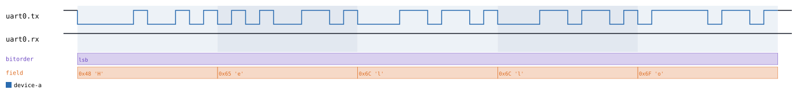
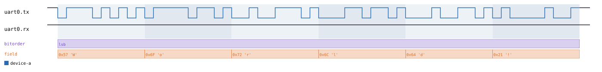
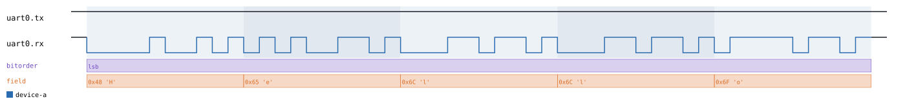
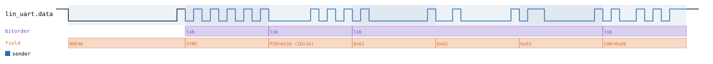
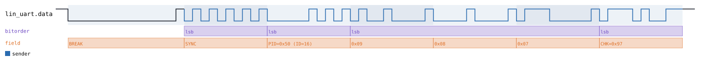
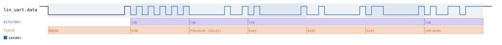
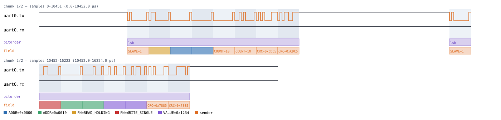

# UART

Back to [usage overview](../USAGE.md).

## What this is

UART (Universal Asynchronous Receiver/Transmitter) is the plain
asynchronous serial link found on nearly every microcontroller: a start
bit, LSB-first data bits, an optional parity bit, and one or more stop
bits, with no shared clock line at all — both ends just agree on a baud
rate up front. This page also covers three real-world protocols that
reuse UART's byte framing and stack their own meaning on top of it: **LIN**
(automotive body-control bus), **Modbus RTU** (industrial fieldbus), and
**DMX512** (stage-lighting control). `protowavegen` generates realistic
timing diagrams for all four without any real hardware — a diagram (SVG)
and/or a capture file (`.sr`/`.vcd`) you can open in PulseView, sigrok-cli,
or GTKWave as if a logic analyzer had actually probed the wire.

UART's lines are push-pull, not open-drain — unlike I2C/1-Wire, a level of
0 or 1 always means someone is actively driving it, never "released to a
pull-up."

## Quick start

```bash
.venv/bin/python -m protowavegen --config examples/uart_basic.json
```

This writes `output/uart_basic.svg`/`.sr`/`.vcd` — one device (`"device-a"`)
sending the ASCII text `"Hello"` at 9600 baud, 8 data bits, no parity, 1
stop bit, full duplex:



## What you can customize

Without touching the JSON at all, the CLI can change:
- **The bytes actually sent** (`data` on `send`) — via `--data-hex`/
  `--data-string`/`--data-int`/etc.
- **Which line carries the transmission** (`channel`: `"tx"` or `"rx"` in
  full duplex, `"data"` in half duplex) — via `--set`.
- **The driver label** shown in the annotation legend (`driver`) — via
  `--set`; cosmetic only, it doesn't change the waveform's timing.
- **Baud rate, data bits, parity, stop bits, duplex mode, flow control** —
  all constructor `params` on the UART node itself, not operation fields,
  so changing any of these needs a JSON edit (see below).

## Recipes — customizing via the CLI

### Changing the payload

```bash
.venv/bin/python -m protowavegen --config examples/uart_basic.json --format svg \
    --data-string "World!"
```

This replaces the transmitted text `"Hello"` with `"World!"` — a longer
string, so the frame count grows from 5 bytes to 6:



### Redirecting the transmission to a different line

`channel` is a plain field on `send` itself (not a constructor param —
which physical line a given `send()` call uses can differ transaction by
transaction), so `--set` reaches it directly:

```bash
.venv/bin/python -m protowavegen --config examples/uart_basic.json --format svg \
    --set uart0:0:channel=rx
```

The same "Hello" transmission now happens on `uart0.rx` instead of
`uart0.tx` — useful for simulating the *other* direction of a full-duplex
link without touching the JSON:



### When you still need to edit the JSON

`baudrate` (along with `data_bits`, `parity`, `stop_bits`, `duplex`, and
`flow_control`) is a constructor `params` field, not a per-operation one —
there's no operation to target, so `--set`/`--data-*` can't reach it.
Confirmed directly against the tool:

```
$ .venv/bin/python -m protowavegen --config examples/uart_basic.json --set uart0:0:baudrate=19200
ValueError: --set: UartTransport.send() has no parameter 'baudrate' (real parameters: ['channel', 'data', 'datatype', 'driver', 'inter_byte_gap_bits', 'labels', 'pre_delay_bits'])
```

Changing the baud rate means editing the config directly:

```diff
-      "params": { "baudrate": 9600, "data_bits": 8, "parity": "none", "stop_bits": 1, "duplex": "full" },
+      "params": { "baudrate": 19200, "data_bits": 8, "parity": "none", "stop_bits": 1, "duplex": "full" },
```

then re-run the same command. The same applies to switching to half
duplex, adding parity, or adding/removing operations entirely.

---

## Stacked devices

Every device below needs `"stack_on": "<uart node id>"` and must be
declared after that UART node in the `protocols` list. Because these
protocols reuse UART's own byte-by-byte framing, the UART node's own
`baudrate`/`data_bits`/`parity`/`stop_bits`/`duplex` are still exactly as
JSON-edit-only as they are for plain UART above — none of that changes
just because a device is stacked on top.

### LIN — `type: "lin"`

Automotive LIN bus: a break field (a raw line-level hold, not a UART byte)
followed by a sync byte (`0x55`), a protected frame ID, 0-8 data bytes, and
a checksum — all sent as ordinary UART bytes over a **single shared wire**,
which is why the underlying UART node must be configured
`"duplex": "half"`.

```bash
.venv/bin/python -m protowavegen --config examples/lin_basic.json
```



**Changing the payload** — `data` is a real payload field, so it takes the
usual `--data-*` treatment. The checksum is recomputed over whatever bytes
actually end up on the wire, not left stale:

```bash
.venv/bin/python -m protowavegen --config examples/lin_basic.json --format svg \
    --data-int "9,8,7"
```



**Changing the frame ID** — `frame_id` is a plain scalar field on
`send_frame`, so `--set` reaches it directly. This also changes the
protected-ID byte on the wire (LIN's parity-bit formula depends on the raw
ID), visible in the PID field's label:

```bash
.venv/bin/python -m protowavegen --config examples/lin_basic.json --format svg \
    --set lin0:0:frame_id=32
```



`checksum` (`"classic"` or `"enhanced"`) is also a plain scalar and
equally reachable via `--set` (e.g. `--set lin0:0:checksum=classic`) —
worth knowing if you need to match an older LIN 1.x node. Structural
changes — switching the underlying UART node back to full duplex, or
changing its baud rate — still need a JSON edit, same as plain UART above
(and LIN's own constructor validates `duplex="half"` at build time, so a
JSON edit that removes it fails loudly rather than silently).

### Modbus RTU — `type: "modbus_rtu"`

Byte-oriented UART framing with its own slave-address/function-code/
real-CRC16 layer (`checksums.crc16_modbus`, low byte first on the wire),
bracketed by silence on both sides. Only function codes `0x03` (Read
Holding Registers) and `0x06` (Write Single Register) are modeled.

```bash
.venv/bin/python -m protowavegen --config examples/modbus_rtu_basic.json
```



Neither operation has a byte-array payload field at all — `slave`,
`start_addr`, `count`, `addr`, and `value` are all individual scalar
fields, not a `data`-style list — so `--data-*` genuinely doesn't apply
here. Confirmed directly:

```
$ .venv/bin/python -m protowavegen --config examples/modbus_rtu_basic.json --format svg --data-int "1,2,3"
ValueError: no data-carrying operation found to target; specify --data-target
```

**Changing the slave address** — since every field on these operations is
a plain scalar, `--set` reaches all of them. Retargeting both operations
at slave `5` instead of `1`:

```bash
.venv/bin/python -m protowavegen --config examples/modbus_rtu_basic.json --format svg \
    --set modbus0:0:slave=5 --set modbus0:1:slave=5
```


The same applies to `start_addr`/`count` (which registers the read
targets, and how many) and `addr`/`value` (which register the write
targets, and what it writes) — e.g. `--set modbus0:0:start_addr=0x64
--set modbus0:0:count=4` to read 4 registers starting at `0x0064` instead.

`silence_char_times` (the inter-frame silence threshold, in
character-times) is a constructor param on the `modbus_rtu` node itself,
so changing it needs a JSON edit:

```diff
-      "id": "modbus0", "type": "modbus_rtu", "stack_on": "uart0",
+      "id": "modbus0", "type": "modbus_rtu", "stack_on": "uart0", "params": { "silence_char_times": 2 },
```

### DMX512 — `type: "dmx512"`

Stage-lighting control: a break + mark-after-break (both raw line-level
holds, same shape as LIN's break field) followed by a start code (`0x00`
for standard dimmer data) and up to 512 channel bytes — unidirectional,
controller to device.

```bash
.venv/bin/python -m protowavegen --config examples/dmx512_basic.json
```

`send_frame`'s `channels` field is *always* a plain int list — unlike
every other payload field in this codebase, it has no `datatype` param at
all, so it isn't in the CLI's recognized payload-field set and `--data-*`
can't reach it either:

```
$ .venv/bin/python -m protowavegen --config examples/dmx512_basic.json --format svg --data-int "1,2,3"
ValueError: no data-carrying operation found to target; specify --data-target
```

Changing the channel values means editing the JSON's `channels` list
directly. `start_code`, on the other hand, *is* a plain scalar and is
reachable via `--set` (e.g. `--set dmx0:0:start_code=17` to simulate a
non-standard start code) — confirmed to run cleanly, just without a
visibly different waveform shape worth a dedicated image (the start code
is only the first of several identically-timed bytes).

---

## Reference

Full constructor-parameter and operation signatures for all four
protocols, preserved from the original code-reference version of this
page.

### UART — `type: "uart"`

`UartTransport`, `protocols/uart.py`.

```json
"params": {
  "baudrate": 9600, "data_bits": 8, "parity": "none",
  "stop_bits": 1, "duplex": "full", "flow_control": "none"
}
```

- `baudrate` (required).
- `data_bits` — `5`-`9` (default `8`).
- `parity` — `"none"` (default), `"even"`, `"odd"`, `"mark"`, `"space"`.
- `stop_bits` — `1` (default), `1.5`, or `2`.
- `duplex` — `"full"` (default, independent `tx`/`rx`) or `"half"`
  (shared `data` line — **required** by LIN).
- `flow_control` — `"none"` (default) or `"rts_cts"` (adds `rts`/`cts`
  lines, modeled as a short assert/release bracket around the frame — not
  a full flow-control state machine).

Operations:
- **`send`** — `channel="tx"` (or `"rx"`, or `"data"` in half duplex),
  `data`, `datatype="bytes"`, `driver=None` (an explicit label for the
  `"driver"` annotation track — needed in half duplex to say who's
  talking), `pre_delay_bits=0`, `inter_byte_gap_bits=0`, `labels=None`.

Push-pull — not wired for floating markers today (`send()` uses plain
`decode_payload`, no `"bin"` datatype, no `DriverTracker`-driven pull
behavior beyond labeling who's talking).

```json
{
  "samplerate": 1000000,
  "protocols": [
    {
      "id": "uart0",
      "type": "uart",
      "params": { "baudrate": 9600, "data_bits": 8, "parity": "none", "stop_bits": 1, "duplex": "full" },
      "operations": [
        { "op": "send", "channel": "tx", "data": "Hello", "datatype": "text", "driver": "device-a" }
      ]
    }
  ],
  "outputs": [
    { "type": "svg", "path": "output/uart_basic.svg" },
    { "type": "sigrok", "path": "output/uart_basic.sr" },
    { "type": "vcd", "path": "output/uart_basic.vcd" }
  ]
}
```

### LIN — `type: "lin"`

`lin.py`. LIN stacks on `UartTransport` (`transport`, which must be
configured `duplex="half"`): sync/PID/data/checksum are all just normal
UART bytes (`transport.send()`), given custom `labels` so they show LIN's
own meaning instead of plain hex. Only the break field needs anything
special — it's a raw line-level hold, not a UART byte (no valid start bit
would fit inside 13 dominant bit-times).

Frame: break (>=13 low bit-times + >=1 high delimiter bit-time), sync byte
(`0x55`), protected ID (6-bit frame ID + 2 parity bits per the LIN 2.x
formula), 0-8 data bytes, checksum (classic: complement of the
end-around-carry sum of the data bytes; enhanced: same but the sum also
includes the protected ID byte).

Operations: `send_frame(frame_id, data, datatype="bytes",
checksum="enhanced"|"classic")` — plain-decode only (no `"bin"`, no
floating markers).

```json
{
  "samplerate": 1000000,
  "protocols": [
    {
      "id": "lin_uart",
      "type": "uart",
      "params": { "baudrate": 19200, "duplex": "half" },
      "operations": []
    },
    {
      "id": "lin0",
      "type": "lin",
      "stack_on": "lin_uart",
      "operations": [
        { "op": "send_frame", "frame_id": 16, "data": [1, 2, 3], "checksum": "enhanced" }
      ]
    }
  ],
  "outputs": [
    { "type": "svg", "path": "output/lin_basic.svg" },
    { "type": "sigrok", "path": "output/lin_basic.sr" },
    { "type": "vcd", "path": "output/lin_basic.vcd" }
  ]
}
```

### Modbus RTU — `type: "modbus_rtu"`

`modbus_rtu.py`. Byte-oriented UART framing with its own
address/function-code/real-CRC16 layer (`checksums.crc16_modbus`).

`params`: `silence_char_times` (default `3.5`, the inter-frame silence
threshold in character-times).

Operations: `read_holding_registers(slave, start_addr, count)`,
`write_single_register(slave, addr, value)`. **Neither takes `datatype`**
— there is no byte-array payload field on either operation.

Frame: 1-byte slave address + 1-byte function code + data + 2-byte CRC16
(low byte first on the wire), bracketed by >=3.5-character-time silence on
both sides.

```json
{
  "samplerate": 1000000,
  "protocols": [
    { "id": "uart0", "type": "uart", "params": { "baudrate": 19200 }, "operations": [] },
    {
      "id": "modbus0", "type": "modbus_rtu", "stack_on": "uart0",
      "operations": [
        { "op": "read_holding_registers", "slave": 1, "start_addr": 0, "count": 10 },
        { "op": "write_single_register", "slave": 1, "addr": 16, "value": 4660 }
      ]
    }
  ],
  "outputs": [
    { "type": "svg", "path": "output/modbus_rtu_basic.svg" },
    { "type": "sigrok", "path": "output/modbus_rtu_basic.sr" },
    { "type": "vcd", "path": "output/modbus_rtu_basic.vcd" }
  ]
}
```

### DMX512 — `type: "dmx512"`

`dmx512.py`. Lighting-control protocol: break + mark-after-break +
channel bytes, same shape as LIN's framing. The underlying UART node
should be configured 250000 baud, 8 data bits, no parity, 2 stop bits,
**`"duplex": "full"`**.

`params`: `break_us` (default `100`), `mab_us` (default `12`,
mark-after-break).

Operations: `send_frame(channels, start_code=0)` — `channels` is always a
plain int list, **no `datatype` param at all**. Only the standard `0x00`
dimmer start code is modeled — no RDM (the bidirectional extension,
alternate start codes).

```json
{
  "samplerate": 4000000,
  "protocols": [
    { "id": "uart0", "type": "uart", "params": { "baudrate": 250000, "data_bits": 8, "parity": "none", "stop_bits": 2 }, "operations": [] },
    {
      "id": "dmx0", "type": "dmx512", "stack_on": "uart0",
      "operations": [
        { "op": "send_frame", "channels": [10, 20, 30, 255] }
      ]
    }
  ],
  "outputs": [
    { "type": "svg", "path": "output/dmx512_basic.svg" },
    { "type": "sigrok", "path": "output/dmx512_basic.sr" },
    { "type": "vcd", "path": "output/dmx512_basic.vcd" }
  ]
}
```
