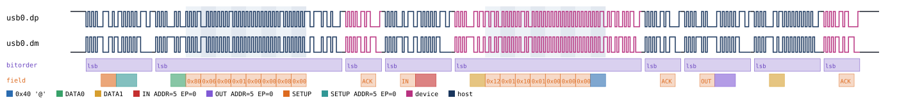
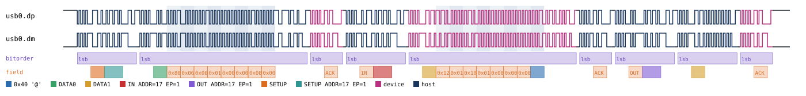
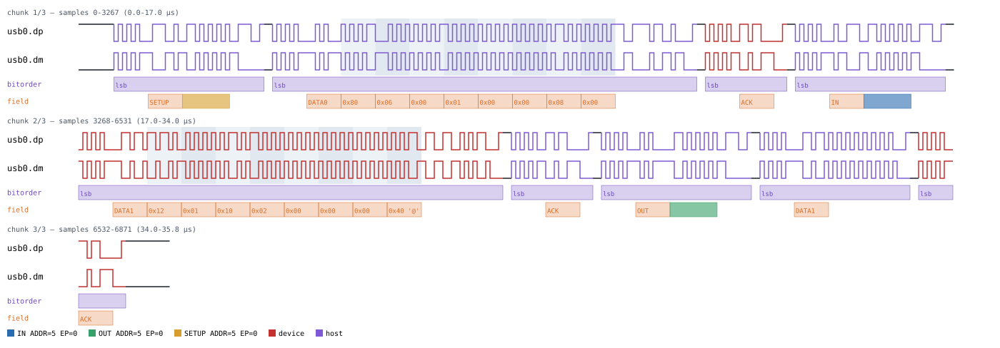
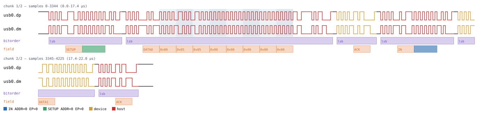

# USB (Full-Speed)

Back to [usage overview](../USAGE.md).

## What this is

USB Full-Speed (12 Mbit/s) is the "classic" USB signaling most low- and
medium-speed peripherals used before USB 3.x: a differential pair, D+/D-,
carrying NRZI-encoded, bit-stuffed data between a host and a device. This
page generates a realistic **control transfer** — the three-stage
Setup/Data/Status exchange every USB device uses for enumeration and
configuration (`GET_DESCRIPTOR`, `SET_ADDRESS`, `SET_CONFIGURATION`, and
every USB device class's own vendor/class requests) — without any real
hardware. The output is a diagram (SVG) and/or a capture file (`.sr`/
`.vcd`) you can open in PulseView, sigrok-cli, or GTKWave as if a logic
analyzer had actually probed D+/D-.

This page only models **control transfers**. Real USB also has bulk,
interrupt, and isochronous transfers, none of which have a Setup or Status
stage — those are out of this page's own high-level `control_transfer`
operation, but the lower-level packet primitives it's built from
(`token`, `data_packet`, `handshake`) stay independently callable and are
exactly what the four USB device-class pages listed at the bottom of this
page use to build bulk-only transfers on top. Also out of scope: SPLIT
packets (a hub sitting between a full/high-speed host and a low-speed
device) and High-Speed (480 Mbit/s) signaling — Full-Speed only.

D+/D- are plain push-pull `DIGITAL` signals, not open-drain like I2C or
1-Wire — a real USB transceiver actively drives both J and K states — so
there's no "protocol-defined pull" for a floating bit to resolve through:
a floating payload bit needs `l`/`h` (low/high) explicit, `z` alone is a
hard error here (same convention as CAN/SPI/Microwire). See
[the datatype/floating-marker guide](../USAGE.md#the-floating-bit-marker-system-lhz).

Validated against sigrok's real 3-decoder stack (`usb_signalling` ->
`usb_packet` -> `usb_request`) — no custom decoder needed for this layer.

## Quick start

```bash
.venv/bin/python -m protowavegen --config examples/usb_basic.json
```

This runs `examples/usb_basic.json` (shown in full in the appendix below)
and writes `output/usb_basic.svg`/`.sr`/`.vcd` — a GET_DESCRIPTOR-shaped
control transfer to device address `5`, endpoint `0`: the SETUP stage asks
for the first 8 bytes of the device descriptor, the IN data stage returns
them, and the Status stage (OUT direction, since the Data stage was IN)
closes the transfer:



You can hand the generated `.sr` to sigrok's own real USB decoder stack
and see the same transfer it read back out (channel names/options come
from `sigrok-cli --show -P usb_signalling` — Full-Speed must be passed
explicitly, since that decoder's own default is `automatic`):

```bash
sigrok-cli -i output/usb_basic.sr \
    -P usb_signalling:dp=usb0.dp:dm=usb0.dm:signalling=full-speed,usb_packet,usb_request \
    -A usb_request
```

```
usb_request-1: SETUP in: [ 80 06 00 01 00 00 08 00 ][ 12 01 10 01 00 00 00 40 ] : ACK
```

## What you can customize

Without touching the JSON at all, the CLI can change:
- **The device address and endpoint** (`address`/`endpoint` on
  `control_transfer`) — simulate the exact same request/response landing
  on a different device or endpoint, via `--set`.
- **The SETUP/data-stage payload bytes** (`setup_data`, `in_data`,
  `out_data`) — via `--data-hex`/`--data-string`/`--data-int`/etc.

There are no constructor `params` at all for this transport (Full-Speed's
12 Mbit/s bit rate is fixed, not configurable in this v1) — every change
that's reachable from the CLI goes through the single `control_transfer`
operation's own fields. What isn't reachable from the CLI is the
*structure* of the transfer itself — whether there's a Data stage at all,
and if so which direction it runs — since that's determined by which of
`in_data`/`out_data` are present in the JSON, not by a field's value; see
the JSON-edit recipe below.

## Recipes — customizing via the CLI

### Changing the target device and endpoint

`address` and `endpoint` are plain fields on `control_transfer` itself
(not constructor params) — every transfer can target a different device
and endpoint, so `--set` reaches both directly. This is the USB
equivalent of I2C's "change the target address" or CAN's "change the
arbitration identifier": same transfer content, different device claiming
to receive it:

```bash
.venv/bin/python -m protowavegen --config examples/usb_basic.json --format svg \
    --output-dir docs/protocols/images/usb \
    --set "usb0:0:address=0x11" --set "usb0:0:endpoint=1"
```

Every token in the transfer (SETUP, IN, and the Status stage's OUT) now
carries address `17` (`0x11`), endpoint `1` instead of address `5`,
endpoint `0` — confirmed by decoding the result through sigrok's
`usb_packet` decoder, which reports `SETUP ADDR 17 EP 1`, `IN ADDR 17 EP
1`, and `OUT ADDR 17 EP 1` for the three tokens in this one transfer:



### Changing the payload

`setup_data`, `in_data`, and `out_data` all take the usual `--data-*`
treatment. Because `examples/usb_basic.json`'s one `control_transfer`
operation carries *two* payload fields at once (`setup_data` and
`in_data`), an untargeted `--data-hex` is ambiguous and says so rather
than guessing:

```
$ .venv/bin/python -m protowavegen --config examples/usb_basic.json --data-hex 1201100200000040
ValueError: multiple data-carrying operations found (usb0:0:setup_data (op=control_transfer), usb0:0:in_data (op=control_transfer)); specify which one with --data-target protocol_id:op_index[:field]
```

Naming the field with `--data-target` resolves it. This changes the
returned device descriptor's `bcdUSB` field (bytes 3-4, little-endian)
from `0x0110` to `0x0210` — simulating the same device reporting USB 2.10
compliance instead of 1.10 in its GET_DESCRIPTOR reply:

```bash
.venv/bin/python -m protowavegen --config examples/usb_basic.json --format svg \
    --output-dir docs/protocols/images/usb \
    --data-hex 1201100200000040 --data-target usb0:0:in_data
```



### When you still need to edit the JSON

Whether a control transfer has a Data stage — and which direction it
runs — isn't a field value, it's determined by which keys
(`in_data`/`out_data`, or neither) are present in the operation's JSON at
all, so there's no `--set`/`--data-*` flag that can change it. A
zero-length-data-stage request like `SET_ADDRESS` needs a JSON edit that
simply omits both:

```diff
 {
   "op": "control_transfer",
-  "address": 5,
+  "address": 0,
   "endpoint": 0,
-  "setup_data": [128, 6, 0, 1, 0, 0, 8, 0],
-  "in_data": [18, 1, 16, 1, 0, 0, 0, 64]
+  "setup_data": [0, 5, 5, 0, 0, 0, 0, 0]
 }
```

(`setup_data` here is a real `SET_ADDRESS` request: `bmRequestType=0x00`
host-to-device standard, `bRequest=5`, `wValue=5` the new address being
assigned, `wIndex`/`wLength` both `0`.) Re-running against this edited
config produces a Setup stage with no Data stage at all — just the
Status stage's zero-length DATA1 — confirmed by decoding it through
sigrok, which reports an empty data payload: `SETUP out: [ 00 05 05 00 00
00 00 00 ][ ] : ACK`:



The same applies to adding/removing operations entirely, or changing
which protocols are in the scenario.

---

## Device classes built on this

Four `StackedProtocol` device classes model real USB peripherals on top
of this transport (`"stack_on": "<usb node id>"`) — each is its own doc
page:

- [USB HID](usb_hid.md) — a minimal Human Interface Device: a relative-
  mouse report plus HID/REPORT descriptor requests.
- [USB CDC/ACM](usb_cdc.md) — the virtual-serial-port class: line-coding/
  control-line-state requests plus outbound bulk data.
- [USB Mass Storage](usb_msc.md) — Bulk-Only Transport with a narrow SCSI
  command subset (block reads/writes).
- [USB DFU](usb_dfu.md) — Device Firmware Upgrade class requests
  (download/upload/status), entirely control-transfer-based.

---

## Appendix — operations reference

`type: "usb"` — `UsbBus`, `protocols/usb.py`. Raw USB Full-Speed
(12 Mbit/s) electrical/packet layer only: SYNC field, PID(+complement),
NRZI encoding, 6-consecutive-1s bit-stuffing, CRC5 (tokens)/CRC16 (data),
EOP. Two plain `DIGITAL` signals, `dp`/`dm` (D+/D-) — push-pull, not
open-drain, so `z`/`Z` on a payload field needs `l`/`h` used explicitly
(same convention as CAN/SPI/Microwire).

v1 scope is control transfers only: SETUP/IN/OUT tokens, DATA0/DATA1,
ACK/NAK/STALL handshakes. No application-layer device modeling
(HID/CDC/Mass-Storage/DFU are the separate `StackedProtocol` layer listed
above, built on top of this the way LIN stacks on `UartTransport`). No
SPLIT packets, no High-Speed (480 Mbit/s) signaling — Full-Speed only.

### Constructor params

```json
"params": {}
```

No constructor params — Full-Speed's 12 Mbit/s bit rate is fixed, not
configurable in this v1.

### Operations

- **`token`** — `pid` (`"OUT"`/`"IN"`/`"SETUP"`), `address` (0-127),
  `endpoint` (0-15), `driver="host"` (tokens are always host-originated).
  SYNC + PID + 7-bit ADDR + 4-bit EP + CRC5 + EOP.
- **`data_packet`** — `pid` (`"DATA0"`/`"DATA1"`), `data=None`,
  `datatype="bytes"`, `driver` (required — device drives an IN transfer's
  data, host drives OUT/SETUP's). SYNC + PID + 0-1024 payload bytes +
  CRC16 + EOP. Floating-marker capable (`l`/`h`, not `z`).
- **`handshake`** — `pid` (`"ACK"`/`"NAK"`/`"STALL"`), `driver` (required).
  SYNC + PID + EOP only — no CRC field at all.
- **`control_transfer`** — the full 3-stage control transfer: `address`,
  `endpoint`, `setup_data` (exactly 8 bytes: bmRequestType, bRequest,
  wValue, wIndex, wLength) with `setup_data_datatype="bytes"`, then at
  most one of `in_data`/`out_data` (with their own
  `in_data_datatype`/`out_data_datatype`) for an optional Data stage, then
  an automatic Status stage (a zero-length DATA1 in the *opposite*
  direction from the Data stage — or `IN` when neither `in_data` nor
  `out_data` was given, matching every real zero-length-data-stage
  request such as SET_ADDRESS/SET_CONFIGURATION). Every stage's handshake
  is a plain ACK — this generates the single-attempt, everything-ACKs
  happy path, the same convention `CanBus.send` already uses for not
  modeling bus contention.

`token`/`data_packet`/`handshake` stay independently callable (as their
own JSON `op` entries, or from a stacked protocol's Python code) for
bulk/interrupt transactions, which have no Setup/Status stages and sit
outside `control_transfer`'s scope — this is exactly what the four device
classes above do.

### Example — `examples/usb_basic.json`

A GET_DESCRIPTOR-shaped control transfer: SETUP requests the first 8
bytes of the device descriptor, the IN data stage returns them, and the
Status stage (OUT direction, since the Data stage was IN) closes the
transfer.

```json
{
  "samplerate": 192000000,
  "protocols": [
    {
      "id": "usb0",
      "type": "usb",
      "operations": [
        {
          "op": "control_transfer",
          "address": 5,
          "endpoint": 0,
          "setup_data": [128, 6, 0, 1, 0, 0, 8, 0],
          "in_data": [18, 1, 16, 1, 0, 0, 0, 64]
        }
      ]
    }
  ],
  "outputs": [
    { "type": "svg", "path": "output/usb_basic.svg" },
    { "type": "sigrok", "path": "output/usb_basic.sr" },
    { "type": "vcd", "path": "output/usb_basic.vcd" }
  ]
}
```
