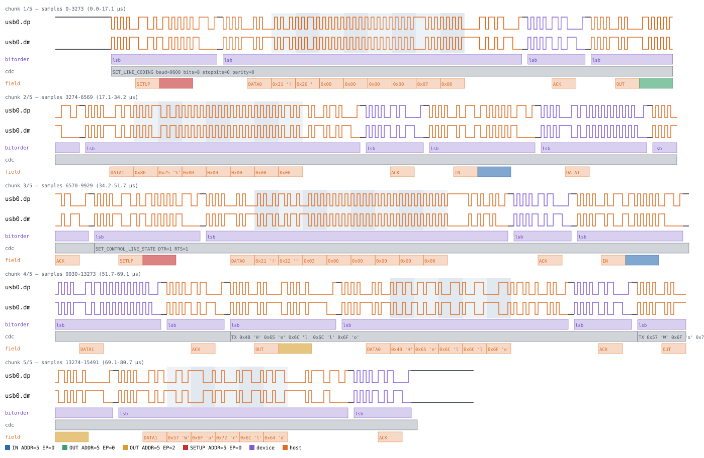
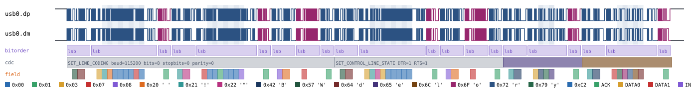

# USB CDC/ACM

Back to [usage overview](../USAGE.md).

## What this is

USB CDC/ACM is the "virtual COM port" USB device class — the one that
makes a microcontroller, modem, or debug probe show up on a host as
`/dev/ttyACM0` or `COMx` instead of needing a dedicated driver. A CDC/ACM
device exposes a control interface (for line settings and modem-control
signals) and a data interface (for the actual serial bytes), both riding
on top of ordinary USB transfers.

This page generates realistic CDC/ACM timing diagrams — a host configuring
the virtual serial port's line coding (baud/parity/stop bits), asserting
DTR/RTS, then sending data — stacked on this tool's own USB Full-Speed
transport (`type: "usb"`, see [usb.md](usb.md) for the electrical/packet
layer both USB device-class pages here build on). The output is a diagram
(SVG) and/or a capture file (`.sr`/`.vcd`) you can open in PulseView,
sigrok-cli, or GTKWave as if a logic analyzer had actually probed the bus.

**Scope is deliberately narrow**, matching this project's "real but
narrow" precedent elsewhere (`spiflash.py`, `rtc8564.py`): only the two
class requests a host actually uses to bring up a virtual serial port
(`SET_LINE_CODING`, `SET_CONTROL_LINE_STATE`) plus outbound bulk data on
the data interface are modeled. Not modeled: the notification endpoint
(interrupt IN `SERIAL_STATE`, device-to-host), `GET_LINE_CODING`,
`SEND_BREAK`, or multi-interface descriptors — CDC's usual two-interface
split (one control, one data) is collapsed here to a single `interface`
number reused for both, since this tool has no USB configuration-
descriptor concept to assign real interface numbers from.

## Quick start

```bash
.venv/bin/python -m protowavegen --config examples/usb_cdc_basic.json
```

This runs `examples/usb_cdc_basic.json` (shown in full in the appendix
below) and writes `output/usb_cdc_basic.svg`/`.sr`/`.vcd` — a host setting
115200-8N1 line coding, asserting DTR+RTS, then sending two bulk OUT
transfers ("Hello", then "World"):


## What you can customize

Without touching the JSON at all, the CLI can change:
- **The line coding** — `baud`, `data_bits`, `stop_bits`, `parity` on
  `set_line_coding` — via `--set`.
- **DTR/RTS** — `dtr`/`rts` on `set_control_line_state` — via `--set`.
- **The bytes sent** — `data` on each `send_data` call — via
  `--data-hex`/`--data-string`/`--data-int`/etc.
- **The USB device address / endpoint numbers** (`address`, `endpoint`,
  `interface`) on any operation — also plain scalar operation fields,
  reachable via `--set` the same way.

There is no constructor-level configuration to fall back to here at
all: `UsbCdcAcm` takes nothing beyond `stack_on` — every field this device
exposes is a live per-operation field, so (unlike I2C's `clock_hz` or
1-Wire's `rom_id`) there's no "JSON-edit-only" case to demonstrate for
this protocol. Restructuring the operations list itself (adding/removing
a call) is still JSON-only, as it is everywhere in this tool.

## Recipes — customizing via the CLI

### Changing the line coding (a different baud rate)

`set_line_coding` is operation `0` in the example config. `baud` is a
plain scalar field, so `--set` reaches it directly — no need to touch the
JSON to see how the diagram looks at a different serial speed:

```bash
.venv/bin/python -m protowavegen --config examples/usb_cdc_basic.json --format svg \
    --output-dir docs/protocols/images/usb_cdc/ --set "usb_cdc0:0:baud=9600"
```

The `"cdc"` annotation lane's `SET_LINE_CODING` summary now reads
`baud=9600` instead of `baud=115200` (and the actual 7-byte Line Coding
structure sent on the wire encodes the new value too, little-endian
`dwDTERate` — this isn't just a label change):

Before:


After:



`data_bits`, `stop_bits`, and `parity` are reachable the same way (e.g.
`--set "usb_cdc0:0:parity=2"` for even parity), and `set_control_line_state`'s
`dtr`/`rts` booleans take `true`/`false` — confirmed with
`--set "usb_cdc0:1:dtr=false"`, which flips the annotation to `DTR=0 RTS=1`.

### Changing the data sent

`send_data`'s `data` is a payload field, so it takes the usual `--data-*`
treatment. The example config calls `send_data` twice (operations `2` and
`3`), so an untargeted flag is rejected as ambiguous rather than guessing
which one you meant:

```
$ .venv/bin/python -m protowavegen --config examples/usb_cdc_basic.json --data-string "Bye"
ValueError: multiple data-carrying operations found (usb_cdc0:2:data (op=send_data), usb_cdc0:3:data (op=send_data));
specify which one with --data-target protocol_id:op_index[:field]
```

Targeting the first `send_data` call explicitly works fine, and changes
only that transfer's payload — the second ("World") is untouched:

```bash
.venv/bin/python -m protowavegen --config examples/usb_cdc_basic.json --format svg \
    --output-dir docs/protocols/images/usb_cdc/ --data-string "usb_cdc0:2:Bye"
```

Before:


After:



The `"cdc"` lane's `TX` summary confirms it: `TX 0x42 'B' 0x79 'y' 0x65 'e'`
followed by the unchanged `TX 0x57 'W' 0x6F 'o' 0x72 'r' 0x6C 'l' 0x64 'd'`.

---

## Appendix — operations reference

`type: "usb_cdc"` — `UsbCdcAcm`, `protocols/usb_cdc.py`, stacked on
`UsbBus` (`stack_on: "<usb node id>"`).

### Constructor params

None beyond `stack_on` — `UsbCdcAcm` has no configuration of its own; it
reuses whatever `UsbBus` node it's stacked on.

### Operations

- **`set_line_coding`** — `address`, `endpoint=0`, `interface=0`, `baud`
  (required), `data_bits=8`, `stop_bits=0`, `parity=0`. CDC class request
  `SET_LINE_CODING` (`bRequest=0x20`, `bmRequestType=0x21`): a 7-byte Line
  Coding structure (`dwDTERate` little-endian, `bCharFormat`,
  `bParityType`, `bDataBits`) sent as the control transfer's OUT data
  stage. `stop_bits`/`parity` are the raw CDC codes, passed through
  unvalidated (stop: 0=1, 1=1.5, 2=2 bits; parity: 0=none, 1=odd, 2=even,
  3=mark, 4=space) — same "carry the bits, don't behaviorally simulate
  them" precedent `rtc8564.py` uses for its VL/century flag bits.
- **`set_control_line_state`** — `address`, `endpoint=0`, `interface=0`,
  `dtr=True`, `rts=True`. CDC class request `SET_CONTROL_LINE_STATE`
  (`bRequest=0x22`): `wValue` bit 0 = DTR, bit 1 = RTS, zero-length data
  stage.
- **`send_data`** — `address`, `endpoint=2`, `data`, `datatype="bytes"`.
  Bulk OUT data transfer — not a control transfer: a bare OUT token + one
  DATA packet + ACK, using `UsbBus.token`/`data_packet`/`handshake`
  directly. `UsbCdcAcm` tracks its own per-instance DATA0/DATA1 toggle,
  starting at DATA0 and flipping on every call (`UsbBus` itself has no
  notion of toggle state). `data` has full `datatype` support (`"bytes"`
  the default int-array form, `"text"`, `"hex"`) via the same
  `decode_payload()`/`--data-hex`/`--data-string`/`--data-int` machinery
  every other protocol's payload fields use.

Every operation's underlying `UsbBus` packets (SETUP/OUT/IN tokens,
DATA0/DATA1, ACK handshakes) already carry their own detailed `"field"`
annotations (PID name, ADDR/EP, each data byte). `UsbCdcAcm` adds a
human-readable, whole-operation summary on its own `"cdc"` annotation
track instead of layering a second `"field"` annotation over the same
span — see `usb_cdc.py`'s own module docstring for why (avoiding a
same-track overlapping-range annotation, which paints over itself in the
SVG).

```json
{
  "samplerate": 192000000,
  "protocols": [
    { "id": "usb0", "type": "usb", "operations": [] },
    {
      "id": "usb_cdc0", "type": "usb_cdc", "stack_on": "usb0",
      "operations": [
        { "op": "set_line_coding", "address": 5, "baud": 115200, "data_bits": 8, "stop_bits": 0, "parity": 0 },
        { "op": "set_control_line_state", "address": 5, "dtr": true, "rts": true },
        { "op": "send_data", "address": 5, "data": "Hello", "datatype": "text" },
        { "op": "send_data", "address": 5, "data": "World", "datatype": "text" }
      ]
    }
  ],
  "outputs": [
    { "type": "svg", "path": "output/usb_cdc_basic.svg" },
    { "type": "sigrok", "path": "output/usb_cdc_basic.sr" },
    { "type": "vcd", "path": "output/usb_cdc_basic.vcd" }
  ]
}
```

### Validating with sigrok-cli directly

No mainline sigrok decoder exists for USB CDC (only
`usb_packet`/`usb_request`/`usb_signalling`/`usb_power_delivery` ship
under `/usr/share/libsigrokdecode/decoders/`), so this bus is validated
against a custom, self-authored decoder (single-oracle tier, per
CLAUDE.md's oracle-tier writeup — a second, independent oracle for a
narrow USB application-layer protocol like this one isn't worth building),
vendored under `tests/custom_decoders/usb_cdc/` and exercised by
`tests/test_sigrok_roundtrip.py`'s
`test_usb_cdc_roundtrips_through_custom_sigrok_decoder`. It stacks on top
of the mainline `usb_packet` decoder's own `OUTPUT_PYTHON` stream — the
same PD-stacking mechanism sigrok's own `usb_request` uses on top of
`usb_packet`.

To decode a generated `.sr` file with the custom decoder yourself (not
part of the system `sigrok-cli` install):

```bash
SIGROKDECODE_DIR=tests/custom_decoders sigrok-cli \
    -i output/usb_cdc_basic.sr \
    -P "usb_signalling:dp=usb0.dp:dm=usb0.dm:signalling=full-speed,usb_packet,usb_cdc" \
    -A usb_cdc
```

Actual output against the baseline capture above:

```
usb_cdc-1: baud=115200 format=1 parity=None bits=8
usb_cdc-1: DTR=1 RTS=1
usb_cdc-1: data: 0x48 'H' 0x65 'e' 0x6C 'l' 0x6C 'l' 0x6F 'o'
usb_cdc-1: data: 0x57 'W' 0x6F 'o' 0x72 'r' 0x6C 'l' 0x64 'd'
```
