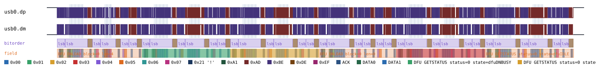
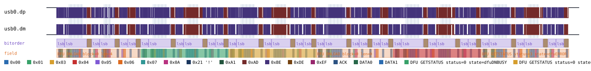
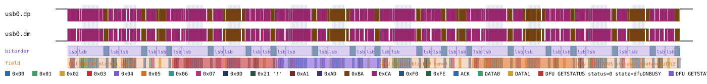

# USB DFU

Back to [usage overview](../USAGE.md).

## What this is

USB DFU (Device Firmware Upgrade) is the USB-IF class real bootloaders use
to flash new firmware over USB: a host tool (`dfu-util` and similar) talks
to a device sitting in its DFU-mode interface and pushes firmware down in
fixed-size blocks, polling the device's status after each one. The whole
exchange is driven by a state machine defined in the DFU 1.1 spec —
`dfuIDLE` (ready for a new download), `dfuDNBUSY` (device is busy
programming a block just received, don't ask again yet), `dfuDNLOAD-IDLE`
(ready for the next block or the end-of-download signal), `dfuMANIFEST`
(device is installing/activating what it just received), and so on down
to `dfuERROR` (something went wrong; the host has to read back a status
code to find out what) — eleven states in total, listed in full in the
appendix below.

This page generates realistic DFU timing diagrams — download a firmware
block, poll status, signal end-of-download, poll status again through
manifestation back to idle — without any real hardware or bootloader.
DFU has no bulk/interrupt endpoints of its own: every DFU request is a USB
*control* transfer, so this protocol stacks entirely on the raw USB
Full-Speed transport (`type: "usb"` — see [usb.md](usb.md)) and never
touches anything but `UsbBus.control_transfer`. The output is a diagram
(SVG) and/or a capture file (`.sr`/`.vcd`) you can open in PulseView,
sigrok-cli, or GTKWave as if a logic analyzer had actually probed D+/D-
during a real firmware update.

Scope is deliberately narrow: no vendor DFU extensions (ST's DfuSe and
similar), no runtime-vs-DFU-mode enumeration/descriptor switching modeled,
and every transfer is the single-attempt, everything-ACKs happy path (no
NAK/retry). `DFU_DNLOAD`, `DFU_UPLOAD`, `DFU_GETSTATUS`, and `DFU_ABORT`
are implemented; `DFU_DETACH`/`DFU_CLRSTATUS`/`DFU_GETSTATE` are not (rare
in a synthesized-timing-diagram use case).

## Quick start

```bash
.venv/bin/python -m protowavegen --config examples/usb_dfu_basic.json
```

This runs `examples/usb_dfu_basic.json` (shown in full in the appendix
below) and writes `output/usb_dfu_basic.svg`/`.sr`/`.vcd` — a real-ish DFU
download flow: send one 4-byte firmware block, poll status through
busy/idle, send the empty "download complete" `DNLOAD`, then poll status
through manifest back to idle:



## What you can customize

Without touching the JSON at all, the CLI can change:
- **The firmware block content sent in a `dnload`** (or read back in an
  `upload`), and **which block number it is** — both are plain operation
  fields, via `--data-*`/`--set`.
- **The status/state a `get_status` call reports** — simulate the device
  at any point in the DFU state machine, including an error, without
  changing anything about the transfer shape itself — via `--set`.
- **The device address and interface number** targeted by every request
  (`address`/`interface`) — also plain operation fields, via `--set`.

There's nothing constructor-level to edit here at all: `usb_dfu` itself
takes no `params` beyond `stack_on`, and the underlying `usb` transport it
stacks on has none either (Full-Speed's bit rate is fixed). Every knob on
this page is reachable from the CLI — the only reason to hand-edit the
JSON is to add, remove, or reorder operations entirely.

## Recipes — customizing via the CLI

### Simulating an error state

`get_status`'s `status` and `state` are both plain scalar operation
fields, so `--set` reaches them directly — useful for seeing what an
*abnormal* point in the state machine looks like without writing a whole
new scenario. The baseline's last `get_status` (operation index `5`)
reports a clean return to `dfuIDLE`; overriding it to `errWRITE` (DFU
status code `3`) and `dfuERROR` (state `10`) instead shows the device
stuck in the error state a real host would have to recover from with
`DFU_CLRSTATUS`:

```bash
.venv/bin/python -m protowavegen --config examples/usb_dfu_basic.json --format svg --format sigrok \
    --set "usb_dfu0:5:status=3" --set "usb_dfu0:5:state=10" \
    --output-dir docs/protocols/images/usb_dfu/
```



Decoding both captures confirms the change reaches the actual status
block bytes on the wire, not just the SVG label. Baseline (from the Quick
start run above, still sitting in `output/usb_dfu_basic.sr`) ends in a
clean `dfuIDLE`:

```bash
SIGROKDECODE_DIR=tests/custom_decoders sigrok-cli -i output/usb_dfu_basic.sr \
    -P usb_signalling:dp=usb0.dp:dm=usb0.dm:signalling=full-speed,usb_packet,usb_dfu -A usb_dfu | tail -1
```
```
usb_dfu-1: Status: 0 State: dfuIDLE
```

The overridden run's `.sr` (`docs/protocols/images/usb_dfu/capture.sr`,
produced by the command above) decodes to the error state instead — a
real, independent decoder confirming the wire bytes actually changed, not
just the SVG label:

```bash
SIGROKDECODE_DIR=tests/custom_decoders sigrok-cli -i docs/protocols/images/usb_dfu/capture.sr \
    -P usb_signalling:dp=usb0.dp:dm=usb0.dm:signalling=full-speed,usb_packet,usb_dfu -A usb_dfu | tail -1
```
```
usb_dfu-1: Status: 3 State: dfuERROR
```

Any `bStatus` value 1-15 and any of the 11 real `bState` values works the
same way — see the appendix table for the full list of both.

### Overriding the firmware block being downloaded

`dnload`'s `data` is a real payload field (`datatype="bytes"` by default),
reachable with the usual `--data-*` flags, and its `block_num` is a plain
scalar reachable with `--set` — combine both to simulate downloading a
*different* block with different content instead of the demo's block `0`:

```bash
.venv/bin/python -m protowavegen --config examples/usb_dfu_basic.json --format svg \
    --set "usb_dfu0:0:block_num=1" --data-hex "usb_dfu0:0:cafef00dbaad" \
    --output-dir docs/protocols/images/usb_dfu/
```



The `--data-hex` flag needed the explicit `usb_dfu0:0:` target prefix here
— this config has *two* `dnload` calls (the real block and the empty
end-of-download one), so leaving the target off is refused rather than
guessed at:

```
$ .venv/bin/python -m protowavegen --config examples/usb_dfu_basic.json --data-hex "cafe"
ValueError: multiple data-carrying operations found (usb_dfu0:0:data (op=dnload), usb_dfu0:3:data (op=dnload));
specify which one with --data-target protocol_id:op_index[:field]
```

(See [Chaining multiple overrides](../USAGE.md#chaining-multiple-overrides-in-one-invocation)
for the general `protocol_id:op_index:field` targeting syntax used above.)

Note that the empty end-of-download `dnload` (operation index `3`,
`block_num=0, data=[]`) is not just "no data" — it's a real, meaningful
DFU wire signal (a genuine zero-length OUT `DATA1` packet, not a skipped
Data stage). Targeting `--data-hex`/`--set` at that operation instead
would change what "end of download" looks like, not just its payload, so
the recipe above deliberately targets the *first* `dnload` (index `0`)
instead.

---

## Appendix — operations reference

`type: "usb_dfu"` — `UsbDfu`, `protocols/usb_dfu.py`. Stacked on `UsbBus`
(`type: "usb"`, `stack_on: "<usb node id>"`). DFU is entirely
control-transfer-based, so every operation here goes through
`UsbBus.control_transfer` exclusively.

No mainline sigrok decoder exists for DFU at any layer (confirmed:
`usb_packet`/`usb_request`/`usb_signalling`/`usb_power_delivery` are the
only USB-family decoders libsigrokdecode ships), so this bus is validated
against a custom decoder written for this project
(`tests/custom_decoders/usb_dfu/pd.py`), stacked on sigrok's own real
`usb_packet` decoder exactly the way `usb_request` is — single-oracle
tier, exercised by
`tests/test_sigrok_roundtrip.py::test_usb_dfu_roundtrips_through_custom_sigrok_decoder`.

### Constructor params

```json
"params": {}
```

No constructor params of its own — just `stack_on` naming a `usb` node.

### Operations

- **`dnload`** — `address`, `interface=0`, `block_num`, `data`,
  `datatype="bytes"`. `DFU_DNLOAD` (bRequest=1): host sends one firmware
  block. `wValue=block_num`, `wIndex=interface`, `wLength=len(data)`,
  `out_data=data`. **`block_num=0, data=[]`** (an empty list, not omitted)
  is the real DFU wire signal for "download complete" (USB DFU 1.1 section
  6.1.3) — it still produces a genuine zero-length OUT DATA1 packet (a real
  OUT token + empty-payload DATA1 + ACK), not a skipped Data stage.
- **`upload`** — `address`, `interface=0`, `block_num`, `data`,
  `datatype="bytes"`. `DFU_UPLOAD` (bRequest=2): device sends one firmware
  block back. `wValue=block_num`, `wIndex=interface`, `wLength=len(data)`,
  `in_data=data` (the synthesized block content — this tool generates
  diagrams, it doesn't sense real firmware).
- **`get_status`** — `address`, `interface=0`, `status`,
  `poll_timeout_ms=0`, `state`. `DFU_GETSTATUS` (bRequest=3): device
  reports its 6-byte status block (`bStatus`, `bwPollTimeout` 3 bytes LE,
  `bState`, `iString=0`). `state` is one of the 11 real DFU 1.1 state
  values, exposed as module constants:

  | Constant                  | Value | Real state name          |
  |----------------------------|-------|---------------------------|
  | `DFU_APP_IDLE`             | 0     | appIDLE                   |
  | `DFU_APP_DETACH`           | 1     | appDETACH                 |
  | `DFU_IDLE`                 | 2     | dfuIDLE                   |
  | `DFU_DNLOAD_SYNC`          | 3     | dfuDNLOAD-SYNC            |
  | `DFU_DNBUSY`               | 4     | dfuDNBUSY                 |
  | `DFU_DNLOAD_IDLE`          | 5     | dfuDNLOAD-IDLE            |
  | `DFU_MANIFEST_SYNC`        | 6     | dfuMANIFEST-SYNC          |
  | `DFU_MANIFEST`             | 7     | dfuMANIFEST               |
  | `DFU_MANIFEST_WAIT_RESET`  | 8     | dfuMANIFEST-WAIT-RESET    |
  | `DFU_UPLOAD_IDLE`          | 9     | dfuUPLOAD-IDLE            |
  | `DFU_ERROR`                | 10    | dfuERROR                  |

  `status` is the raw `bStatus` byte (0 = OK, 1-15 are the real DFU 1.1
  error codes — e.g. `3` = errWRITE, used in the recipe above — not
  modeled as named constants here, only `state` is).

- **`abort`** — `address`, `interface=0`. `DFU_ABORT` (bRequest=6):
  zero-length-data-stage request (no Data stage at all) that returns the
  device to `dfuIDLE`.

`address`/`interface`/`block_num`/`status`/`poll_timeout_ms`/`state` are
always plain ints — no `datatype` on them. `data` (on `dnload`/`upload`)
uses the plain `bytes`/`text`/`hex` datatype convention
(`decode_payload()`), no floating-marker support — DFU firmware bytes are
always concretely driven, the same convention `lin.py`/`modbus_rtu.py` use
for their own byte-array fields.

Each operation wraps its `control_transfer` call in `builder.frame()` and
adds one summary `field` annotation naming the request and its key fields
(e.g. `"DFU DNLOAD block=0 len=4"`, `"DFU GETSTATUS status=0
state=dfuDNBUSY"`) on top of `UsbBus`'s own per-packet field annotations.

### Example — `examples/usb_dfu_basic.json`

```json
{
  "samplerate": 192000000,
  "protocols": [
    { "id": "usb0", "type": "usb", "operations": [] },
    {
      "id": "usb_dfu0",
      "type": "usb_dfu",
      "stack_on": "usb0",
      "operations": [
        { "op": "dnload", "address": 5, "block_num": 0, "data": [222, 173, 190, 239] },
        { "op": "get_status", "address": 5, "status": 0, "state": 4 },
        { "op": "get_status", "address": 5, "status": 0, "state": 5 },
        { "op": "dnload", "address": 5, "block_num": 0, "data": [] },
        { "op": "get_status", "address": 5, "status": 0, "state": 7 },
        { "op": "get_status", "address": 5, "status": 0, "state": 2 }
      ]
    }
  ],
  "outputs": [
    { "type": "svg", "path": "output/usb_dfu_basic.svg" },
    { "type": "sigrok", "path": "output/usb_dfu_basic.sr" },
    { "type": "vcd", "path": "output/usb_dfu_basic.vcd" }
  ]
}
```

Decode the generated `.sr` through the custom decoder (not part of the
system `sigrok-cli` install, so `SIGROKDECODE_DIR` must point at this
repo's `tests/custom_decoders/`), stacked on sigrok's real `usb_signalling`
+ `usb_packet`:

```bash
SIGROKDECODE_DIR=tests/custom_decoders sigrok-cli -i output/usb_dfu_basic.sr \
    -P usb_signalling:dp=usb0.dp:dm=usb0.dm:signalling=full-speed,usb_packet,usb_dfu \
    -A usb_dfu
```

```
usb_dfu-1: DNLOAD: block=0 len=4
usb_dfu-1: GETSTATUS (interface=0)
usb_dfu-1: Status: 0 State: dfuDNBUSY
usb_dfu-1: GETSTATUS (interface=0)
usb_dfu-1: Status: 0 State: dfuDNLOAD-IDLE
usb_dfu-1: DNLOAD: block=0 len=0
usb_dfu-1: GETSTATUS (interface=0)
usb_dfu-1: Status: 0 State: dfuMANIFEST
usb_dfu-1: GETSTATUS (interface=0)
usb_dfu-1: Status: 0 State: dfuIDLE
```

(Output above was captured directly from a real `sigrok-cli` run against
this example, not hand-written.)
