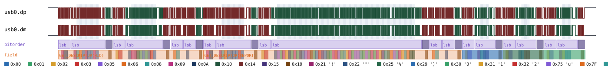
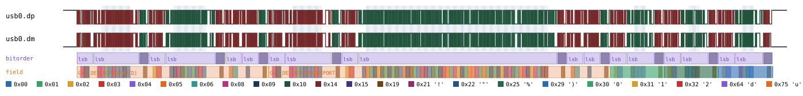
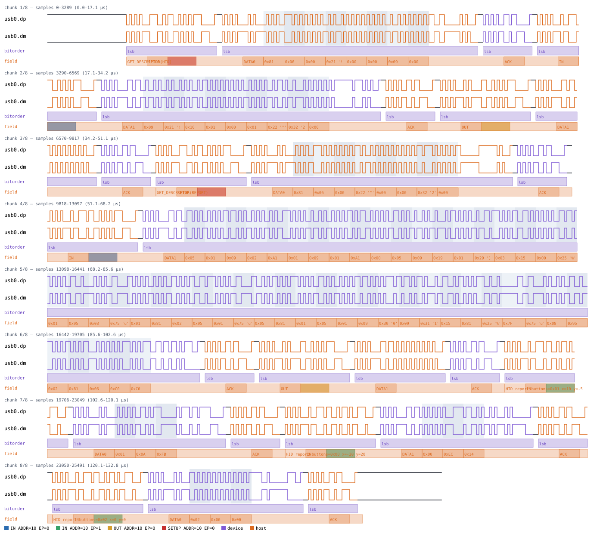

# USB HID

Back to [usage overview](../USAGE.md).

## What this is

USB HID (Human Interface Device) is the class every USB mouse, keyboard,
and gamepad uses: a device describes its own report layout via a HID/
REPORT descriptor, then the host polls it on an interrupt-IN endpoint and
gets back small, fixed-size reports. This page generates a minimal but
realistic HID mouse — the standard "buttons bitmap + signed relative X +
signed relative Y" report shape most USB mice actually use — stacked on
top of this project's [USB Full-Speed transport](usb.md) (`type: "usb"`).
It models `GET_DESCRIPTOR` control transfers for the HID and REPORT
descriptors, plus interrupt-IN mouse reports with a real DATA0/DATA1
toggle, without any real hardware. The output is a diagram (SVG) and/or a
capture file (`.sr`/`.vcd`) you can open in PulseView, sigrok-cli, or
GTKWave as if a logic analyzer had actually probed D+/D-.

Scope is deliberately narrow, the same "real but not exhaustive" precedent
several other stacked devices in this project follow: a fixed 3-byte
relative-mouse report, `GET_DESCRIPTOR` for the HID and REPORT descriptor
types only. Out of scope: real report-descriptor *parsing* (the
synthesized descriptor bytes are realistic but fixed, not driven by a
user-supplied field layout), multiple report IDs, OUT reports,
SET_IDLE/SET_PROTOCOL/SET_REPORT, and boot-protocol negotiation.

No mainline sigrok decoder exists for USB HID, so this is validated
against a self-authored decoder (`tests/custom_decoders/usb_hid/pd.py`)
stacked on sigrok's own mainline `usb_packet` decoder — the electrical and
packet-framing layers underneath are still real, independently
implemented sigrok code; only the HID-specific reassembly (descriptor
requests, interrupt-IN reports) is self-authored. See the repo's
`CLAUDE.md` for the full oracle-tier rationale.

## Quick start

```bash
.venv/bin/python -m protowavegen --config examples/usb_hid_basic.json
```

This runs `examples/usb_hid_basic.json` (shown in full in the appendix
below) and writes `output/usb_hid_basic.svg`/`.sr`/`.vcd` — a device at
USB address `5` answering `GET_DESCRIPTOR(HID)` and
`GET_DESCRIPTOR(REPORT)` on endpoint 0, then three interrupt-IN mouse
reports on endpoint 1 (a click-and-drag, a release-and-move, then a
second click at rest):



## What you can customize

Without touching the JSON at all, the CLI can change:
- **Each mouse report's contents** — the `buttons` bitmap and the signed
  `x`/`y` relative movement on any `send_report` operation — via `--set`.
- **Which USB address a transfer targets** (`address` on any operation,
  and `endpoint` too) — via `--set`.
- **The HID/REPORT descriptor bytes themselves are not reachable at all**
  — they're not JSON fields, they're a fixed `REPORT_DESCRIPTOR` byte
  table hardcoded in `usb_hid.py`'s Python source, so changing them means
  editing that file, not the config (see below).

## Recipes — customizing via the CLI

### Changing a mouse report's buttons/X/Y

`send_report`'s `buttons`, `x`, and `y` are all plain scalar fields (not a
byte-array payload), so `--set` reaches each of them directly. The example
config's operation `2` (the first `send_report` call) starts as
`buttons=1, x=10, y=-5`; overriding all three at once simulates a
different click-and-drag gesture instead:

```bash
.venv/bin/python -m protowavegen --config examples/usb_hid_basic.json --format svg \
    --set "usb_hid0:2:buttons=4" --set "usb_hid0:2:x=100" --set "usb_hid0:2:y=100"
```

The first report's summary annotation now reads
`HID report buttons=0x04 x=100 y=100` — button 3 pressed, both axes
moving in the positive direction — while the other two `send_report`
calls later in the same operations list are untouched:



`x`/`y` two's-complement-wrap into a byte the same way a real signed
8-bit HID logical range does, so e.g. `--set "usb_hid0:3:x=-1"` encodes as
`0xFF`, same as the JSON int form would.

### Changing the target address

Every operation (`get_hid_descriptor`, `get_report_descriptor`,
`send_report`) takes `address` as a plain per-operation field, so `--set`
retargets any of them independently — there's no single bus-wide "device
address" constructor param the way some other transports have. Retargeting
every operation in the example at once simulates the exact same enumerated
device sitting at address `10` instead of `5`:

```bash
.venv/bin/python -m protowavegen --config examples/usb_hid_basic.json --format svg \
    --set "usb_hid0:0:address=10" --set "usb_hid0:1:address=10" \
    --set "usb_hid0:2:address=10" --set "usb_hid0:3:address=10" --set "usb_hid0:4:address=10"
```

Every token annotation (`SETUP ADDR=10 EP=0`, `IN ADDR=10 EP=1`, etc.)
reflects the new address:



`endpoint` is the same kind of plain scalar field and takes the same
treatment, e.g. `--set "usb_hid0:2:endpoint=3"`.

### When you still need to edit the JSON — or the source

Adding, removing, or reordering `send_report`/`get_*_descriptor`
operations is a JSON edit, same as any other protocol here. But the HID
and REPORT descriptor *contents* are a step further than that: they're
not exposed as an operation field at all, so there's no payload to target
with `--data-*` either. Trying anyway gets a clean rejection rather than
a crash — `get_report_descriptor` (operation index `1`) really has no
payload field to aim at:

```
$ .venv/bin/python -m protowavegen --config examples/usb_hid_basic.json --data-hex "usb_hid0:1:aabbcc"
ValueError: --data-target: operation usb_hid0:1 has no payload field; specify one
explicitly, one of [...]
```

The descriptor bytes come from `REPORT_DESCRIPTOR`, a fixed Python
constant near the top of `src/protowavegen/protocols/usb_hid.py` (a
realistic but fixed 3-button relative-mouse layout — Usage Page Generic
Desktop/Mouse, a 3-bit button array padded to a byte, then signed 8-bit
relative X/Y). Simulating a device with a different report layout means
editing that constant in the source, not the JSON config or the CLI.

---

## Appendix — operations reference

`type: "usb_hid"` — `UsbHid`, `protocols/usb_hid.py`. Stacked on `UsbBus`
(`type: "usb"`, see [usb.md](usb.md)) — no constructor params of its own
beyond `stack_on`, since all bit timing comes from the underlying bus:

```json
"stack_on": "usb0"
```

- **`get_hid_descriptor`** — `address`, `endpoint=0`. A `GET_DESCRIPTOR`
  control transfer for the HID descriptor (`bmRequestType=0x81`
  device-to-host/standard/interface, `bRequest=0x06`,
  `wValue=(0x21<<8)`, `wIndex=<endpoint's interface>`, `wLength=9`). The
  synthesized 9-byte descriptor content: `bLength=9`,
  `bDescriptorType=0x21`, `bcdHID=0x0110` (LE), `bCountryCode=0`,
  `bNumDescriptors=1`, `bDescriptorType=0x22` (REPORT),
  `wDescriptorLength` (LE) = the length of the report descriptor below.
- **`get_report_descriptor`** — `address`, `endpoint=0`. Same shape,
  descriptor type `0x22`, returning a fixed, realistic report descriptor
  for a 3-button relative mouse (`UsbHid.REPORT_DESCRIPTOR` in
  `usb_hid.py` — Usage Page Generic Desktop/Mouse, a 3-bit button array
  padded to a byte, then signed 8-bit relative X/Y).
- **`send_report`** — `buttons`, `x`, `y` (all plain ints — `x`/`y` wrap
  two's-complement into a byte, e.g. `x=-5` encodes as `0xFB`), `address`,
  `endpoint=1`. **Not** a control transfer: a raw interrupt-IN transaction
  (`UsbBus.token(pid="IN")` + `data_packet` + `handshake(pid="ACK")`).
  Each `UsbHid` instance tracks its own DATA0/DATA1 toggle across
  successive calls (starts at DATA0, flips every call) — `UsbBus` itself
  has no notion of toggle state, the same division of responsibility
  `I2CDevice`/`OneWireDevice` already use for their own addressing state
  on top of a shared transport.

None of the three operations take a `datatype` field — none of them have
a byte-array payload parameter at all (the descriptor bytes are fixed,
and `send_report`'s `buttons`/`x`/`y` are plain scalar ints, not a list).

Every operation wraps its packet sequence in one summary `field`
annotation spanning the whole logical operation (`"GET_DESCRIPTOR(HID)"`,
`"GET_DESCRIPTOR(REPORT)"`, or `"HID report buttons=0x.. x=.. y=.."`), in
addition to `UsbBus`'s own per-packet/per-byte annotations.

```json
{
  "samplerate": 192000000,
  "protocols": [
    { "id": "usb0", "type": "usb", "operations": [] },
    {
      "id": "usb_hid0", "type": "usb_hid", "stack_on": "usb0",
      "operations": [
        { "op": "get_hid_descriptor", "address": 5, "endpoint": 0 },
        { "op": "get_report_descriptor", "address": 5, "endpoint": 0 },
        { "op": "send_report", "buttons": 1, "x": 10, "y": -5, "address": 5, "endpoint": 1 },
        { "op": "send_report", "buttons": 0, "x": -20, "y": 20, "address": 5, "endpoint": 1 },
        { "op": "send_report", "buttons": 2, "x": 0, "y": 0, "address": 5, "endpoint": 1 }
      ]
    }
  ],
  "outputs": [
    { "type": "svg", "path": "output/usb_hid_basic.svg" },
    { "type": "sigrok", "path": "output/usb_hid_basic.sr" },
    { "type": "vcd", "path": "output/usb_hid_basic.vcd" }
  ]
}
```

Decode the generated `.sr` through the custom decoder (not part of the
system `sigrok-cli` install), stacked on sigrok's own mainline
`usb_signalling`/`usb_packet` decoders:

```bash
SIGROKDECODE_DIR=tests/custom_decoders sigrok-cli -i output/usb_hid_basic.sr \
    -P "usb_signalling:dp=usb0.dp:dm=usb0.dm:signalling=full-speed,usb_packet,usb_hid" \
    -A usb_hid
```

```
usb_hid-1: GET_DESCRIPTOR(HID): 09 21 10 01 00 01 22 32 00
usb_hid-1: GET_DESCRIPTOR(REPORT): 05 01 09 02 A1 01 09 01 A1 00 05 09 19 01 29 03 15 00 25 01 95 03 75 01 81 02 95 01 75 05 81 01 05 01 09 30 09 31 15 81 25 7F 75 08 95 02 81 06 C0 C0
usb_hid-1: buttons=0x01 x=10 y=-5
usb_hid-1: buttons=0x00 x=-20 y=20
usb_hid-1: buttons=0x02 x=0 y=0
```

### A real bug this feature found in `UsbBus` itself

Writing this decoder's unit tests surfaced a genuine pre-existing bug in
`UsbBus._send_packet`'s role-tracking, unrelated to HID specifically:
when USB bit-stuffing inserts a stuffed bit *strictly inside* a single
payload byte's own bit-run (common — any byte whose LSB-first bits
contain an internal run of 6+ consecutive 1s, e.g. `0x7F` or `0xFF`), the
transient `"stuff"` role was treated as a real role transition, causing
that byte's `field`/`unit` annotations to be flushed **twice** with the
same value instead of once. This never corrupted the actual encoded bits
or a real decoder's output (sigrok/this project's own custom decoders
read real wire bits, not annotations), only the diagram-facing annotation
stream — but it was real and would have affected any protocol's payload
bytes hitting that bit pattern, not just HID's. Fixed in `usb.py`'s
`_send_packet` by treating `"stuff"` as transparent to role-transition
bookkeeping (see that method's comment for the full explanation); zero
regressions across the existing `usb`/`usb_hid` test suites, since no
existing test payload happened to contain such a bit pattern before this
feature's synthesized HID report descriptor did.
