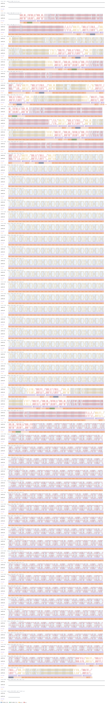
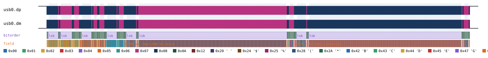
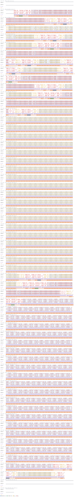

# USB Mass Storage

Back to [usage overview](../USAGE.md).

## What this is

USB Mass Storage (the "MSC" device class) is what makes a flash drive or
SD-card reader show up on a host as an ordinary disk. Underneath, it's
SCSI commands riding over USB: the host wraps a SCSI Command Descriptor
Block in a small header (Bulk-Only Transport, "BOT"), sends it, exchanges
any data, and reads back a status block — no filesystem knowledge
involved at this layer, just block-level SCSI (INQUIRY, READ CAPACITY,
READ/WRITE, TEST UNIT READY).

This page generates realistic USB Mass Storage timing diagrams — a host
identifying the device, checking its capacity, then reading and writing a
disk block — stacked on this tool's own USB Full-Speed transport
(`type: "usb"`, see [usb.md](usb.md) for the electrical/packet layer both
USB device-class pages here build on). The output is a diagram (SVG)
and/or a capture file (`.sr`/`.vcd`) you can open in PulseView,
sigrok-cli, or GTKWave as if a logic analyzer had actually probed the bus.

**Scope is deliberately narrow**, the same "real but narrow" precedent
used elsewhere in this project (`spiflash.py`, `rtc8564.py`): the BOT
CBW→[data]→CSW transaction shape plus five SCSI commands (INQUIRY, READ
CAPACITY(10), READ(10), WRITE(10), TEST UNIT READY). Not modeled: Bulk-
Only Mass Storage Reset or Get-Max-LUN control requests, vendor commands,
multi-LUN devices, or a configurable block size — the logical block size
is a fixed 512 bytes, used only to compute READ(10)/WRITE(10)'s
transfer-length-in-blocks CDB field. The whole data path rides on raw
bulk transfers; unlike CDC's `SET_LINE_CODING`, nothing here uses a
control transfer at all. Every generated command is a happy-path
success — `bCSWStatus` is always 0 (Command Passed); device error
responses aren't modeled.

## Quick start

```bash
.venv/bin/python -m protowavegen --config examples/usb_msc_basic.json
```

This runs `examples/usb_msc_basic.json` (shown in full in the appendix
below) and writes `output/usb_msc_basic.svg`/`.sr`/`.vcd` — a host running
INQUIRY, READ CAPACITY(10), TEST UNIT READY, then reading one 512-byte
block and writing a different one:



## What you can customize

Without touching the JSON at all, the CLI can change:
- **Which logical block is read or written** (`lba` on `scsi_read10`/
  `scsi_write10`) — via `--set`.
- **The block's contents** (`data` on `scsi_read10`/`scsi_write10`) — via
  `--data-hex`/`--data-string`/`--data-int`/etc. (must stay a multiple of
  512 bytes — see below).
- **The reported capacity** (`last_lba`/`block_size` on
  `scsi_read_capacity10`) — via `--set`, both plain scalars.
- **The vendor/product identification string** (`vendor`/`product` on
  `scsi_inquiry`) — also via `--set`: despite looking like they should be
  payload fields, both are confirmed plain ASCII-string scalars in the
  code, not datatype-controlled byte arrays, so `--data-*` isn't the right
  tool for them.
- **The USB device address / endpoint numbers** (`address`,
  `endpoint_out`, `endpoint_in`) on any operation — ordinary scalar
  operation fields too.

There is no constructor-level configuration to fall back to here at
all: `UsbMassStorage` takes nothing beyond `stack_on` and `operations` —
every field this device exposes is a live per-operation field, so
(unlike I2C's `clock_hz` or 1-Wire's `rom_id`) there's no "JSON-edit-only"
case to demonstrate for this protocol. Restructuring the operations list
itself (adding/removing a call) is still JSON-only, as it is everywhere in
this tool.

## Recipes — customizing via the CLI

### Reading/writing a different disk block

`scsi_read10` is operation `3` in the example config, with `lba: 0`. `lba`
is a plain scalar field, so `--set` reaches it directly — no need to touch
the JSON to see the diagram for a different block:

```bash
.venv/bin/python -m protowavegen --config examples/usb_msc_basic.json --format svg \
    --output-dir docs/protocols/images/usb_msc/ --set "msc0:3:lba=1000"
```

The command's summary annotation (on the `"field"` track, over the whole
CBW→data→CSW span) now reads `READ(10) lba=1000 blocks=1` instead of
`READ(10) lba=0 blocks=1` — and the actual big-endian LBA field inside the
CBW's CDB carries the new value too, not just the label:

Before:


After:



The same works on `scsi_write10` (operation `4`, `--set "msc0:4:lba=..."`),
and on `scsi_read_capacity10`'s `last_lba`/`block_size` the same way.

### Changing the block's contents

`scsi_read10`/`scsi_write10`'s `data` is a payload field, but with a rule
neither CDC nor most other protocols enforce: its length must be a
**positive multiple of 512 bytes** (the fixed SCSI block size), since it's
used to compute the CDB's transfer-length-in-blocks field. The example
config already exercises this — its `data` values are 1024 hex characters
(512 bytes) of a repeated 4-byte pattern, not a hand-typed 512-entry int
array.

Both `scsi_read10` and `scsi_write10` carry a `data` field, so an
untargeted flag is rejected as ambiguous:

```
$ .venv/bin/python -m protowavegen --config examples/usb_msc_basic.json --data-hex "1122"
ValueError: multiple data-carrying operations found (msc0:3:data (op=scsi_read10), msc0:4:data (op=scsi_write10));
specify which one with --data-target protocol_id:op_index[:field]
```

Targeting `scsi_read10` explicitly with a full 512-byte (1024 hex digit)
payload of `0x11` bytes works, and changes only that block's data — the
write in the next operation is untouched:

```bash
.venv/bin/python -m protowavegen --config examples/usb_msc_basic.json --format svg \
    --output-dir docs/protocols/images/usb_msc/ \
    --data-hex "msc0:3:$(python3 -c "print('11'*512)")"
```

Before:


After:



A short or misaligned payload is rejected with a clear error rather than
silently truncating or padding, e.g. trying a 2-byte payload:

```
$ .venv/bin/python -m protowavegen --config examples/usb_msc_basic.json --data-hex "msc0:3:1122"
ValueError: scsi_read10: data length must be a positive multiple of 512, got 2
```

---

## Appendix — operations reference

`type: "usb_msc"` — `UsbMassStorage`, `protocols/usb_msc.py`, stacked on
`UsbBus` (`stack_on: "<usb node id>"`).

Every operation is one full CBW (Command Block Wrapper, 31 bytes, bulk
OUT) → optional data stage (bulk IN or OUT, per the command) → CSW
(Command Status Wrapper, 13 bytes, bulk IN) transaction, wrapped in a
single `builder.frame()` for one summary annotation over the whole
logical command. `dCBWTag` is a per-instance incrementing counter
starting at 1; `bCSWStatus` is always 0 (Command Passed). DATA0/DATA1
toggle state is tracked per `(address, endpoint)` pair inside
`UsbMassStorage` itself (`UsbBus` has no notion of it), persisting across
every call for the node's lifetime.

**Byte order**: CBW/CSW wrapper fields (`dCBWSignature`, `dCBWTag`,
`dCBWDataTransferLength`, `dCSWSignature`, `dCSWTag`, `dCSWDataResidue`)
are little-endian. SCSI CDB fields inside the CBW's `CBWCB` (LBA,
transfer length), and the READ_CAPACITY(10) response, are big-endian —
the opposite convention, and the easiest place in this protocol to
introduce a silent bug.

### Constructor params

None of its own — `usb_msc` only takes `stack_on` (pointing at a `usb`
node) and `operations`.

### Operations

- **`scsi_inquiry`** — `address`, `endpoint_out=1`, `endpoint_in=2`,
  `vendor`, `product`. INQUIRY (opcode `0x12`): synthesizes a 36-byte SCSI
  INQUIRY response — byte 0 = `0x00` (direct-access block device), byte 1
  = `0x80` (RMB/removable bit set, an arbitrary but explicit choice for
  this synthetic device), `vendor` padded/truncated to 8 ASCII bytes at
  offset 8, `product` padded/truncated to 16 ASCII bytes at offset 16,
  rest zero-filled. The CDB's allocation length is fixed at 36 to match.
  `vendor`/`product` are plain ASCII-string scalars (confirmed via
  `--set`), not datatype-controlled byte arrays.
- **`scsi_read_capacity10`** — `address`, `endpoint_out=1`,
  `endpoint_in=2`, `last_lba`, `block_size=512`. READ CAPACITY(10)
  (opcode `0x25`): 8-byte response, `last_lba` (4 bytes BE) + `block_size`
  (4 bytes BE).
- **`scsi_test_unit_ready`** — `address`, `endpoint_out=1`,
  `endpoint_in=2`. TEST UNIT READY (opcode `0x00`): no data stage at all
  (`dCBWDataTransferLength = 0`).
- **`scsi_read10`** — `address`, `endpoint_out=1`, `endpoint_in=2`, `lba`,
  `data`, `datatype="bytes"`. READ(10) (opcode `0x28`): `data` is the
  response payload (IN direction), decoded via the project's normal
  datatype convention (`decode_payload_with_floating`, same alphabet as
  every other protocol's byte-array fields, including floating-bit
  markers). `data`'s length must be a positive multiple of the fixed
  512-byte block size — used to compute the CDB's transfer-length-in-
  blocks field.
- **`scsi_write10`** — same shape as `scsi_read10`, but `data` is the
  OUT-direction payload the host writes, and the CDB opcode is `0x2A`.

```json
{
  "samplerate": 96000000,
  "protocols": [
    { "id": "usb0", "type": "usb", "operations": [] },
    {
      "id": "msc0", "type": "usb_msc", "stack_on": "usb0",
      "operations": [
        { "op": "scsi_inquiry", "address": 5, "vendor": "PWGEN", "product": "SyntheticDisk" },
        { "op": "scsi_read_capacity10", "address": 5, "last_lba": 2047, "block_size": 512 },
        { "op": "scsi_test_unit_ready", "address": 5 },
        { "op": "scsi_read10", "address": 5, "lba": 0, "data": "<1024 hex chars, 512 bytes>", "datatype": "hex" },
        { "op": "scsi_write10", "address": 5, "lba": 1, "data": "<1024 hex chars, 512 bytes>", "datatype": "hex" }
      ]
    }
  ],
  "outputs": [
    { "type": "svg", "path": "output/usb_msc_basic.svg" },
    { "type": "sigrok", "path": "output/usb_msc_basic.sr" },
    { "type": "vcd", "path": "output/usb_msc_basic.vcd" }
  ]
}
```

(The real file uses one full 512-byte block per `read10`/`write10` call —
a repeated 4-byte pattern encoded as a 1024-character hex string — rather
than a hand-typed 512-entry int array, since `scsi_read10`/`scsi_write10`
both require the payload length to be a positive multiple of 512 bytes.)

### Validating with sigrok-cli directly

No mainline sigrok decoder exists for USB Mass Storage (only
`usb_packet`/`usb_request`/`usb_signalling`/`usb_power_delivery` ship
under `/usr/share/libsigrokdecode/decoders/`), so this is validated
against a decoder this project wrote itself
(`tests/custom_decoders/usb_msc/pd.py`), stacked on the mainline
`usb_packet` decoder exactly the way the real `usb_request` decoder is
(`inputs = ['usb_packet']`) — single-oracle tier, deliberately, matching
CLAUDE.md's oracle-tier framing for USB application-layer protocols where
no cheaper mainline/vendored decoder exists and a second independent
oracle isn't worth building. Exercised by
`tests/test_sigrok_roundtrip.py`'s
`test_usb_msc_roundtrips_through_custom_sigrok_decoder`.

```bash
SIGROKDECODE_DIR=tests/custom_decoders sigrok-cli \
    -i output/usb_msc_basic.sr \
    -P "usb_signalling:dp=usb0.dp:dm=usb0.dm:signalling=full-speed,usb_packet,usb_msc" \
    -A usb_msc
```

Actual output against the baseline capture above:

```
usb_msc-1: CBW tag=1 dir=IN lun=0 len=36
usb_msc-1: INQUIRY alloc_len=36 vendor='PWGEN' product='SyntheticDisk'
usb_msc-1: CSW tag=1 status=PASS residue=0
usb_msc-1: CBW tag=2 dir=IN lun=0 len=8
usb_msc-1: READ CAPACITY(10) last_lba=2047 block_size=512
usb_msc-1: CSW tag=2 status=PASS residue=0
usb_msc-1: CBW tag=3 dir=IN lun=0 len=0
usb_msc-1: TEST UNIT READY
usb_msc-1: CSW tag=3 status=PASS residue=0
usb_msc-1: CBW tag=4 dir=IN lun=0 len=512
usb_msc-1: READ10 lba=0 blocks=1 bytes=512
usb_msc-1: CSW tag=4 status=PASS residue=0
usb_msc-1: CBW tag=5 dir=OUT lun=0 len=512
usb_msc-1: WRITE10 lba=1 blocks=1 bytes=512
usb_msc-1: CSW tag=5 status=PASS residue=0
```

`usb_msc` is the last decoder in the stack, so to filter by one specific
annotation class instead of all of them, pass `-A usb_msc=<class>` (e.g.
`-A usb_msc=inquiry`, confirmed to print just the `INQUIRY` line above) —
the annotation classes are `cbw`, `csw`, `inquiry`, `read-capacity`,
`read10`, `write10`, `test-unit-ready`, and `warning`.
