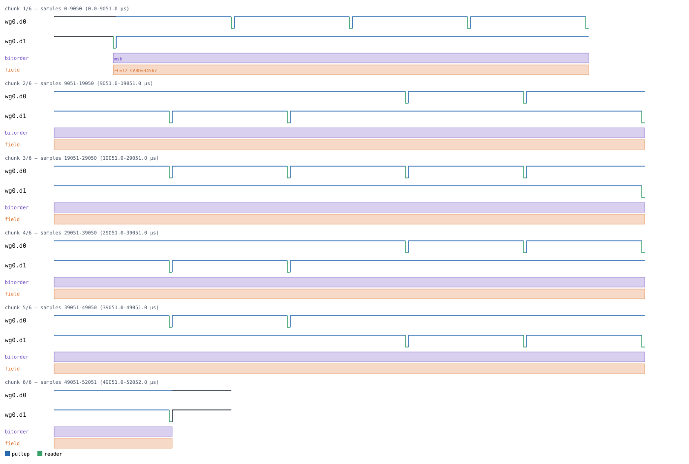
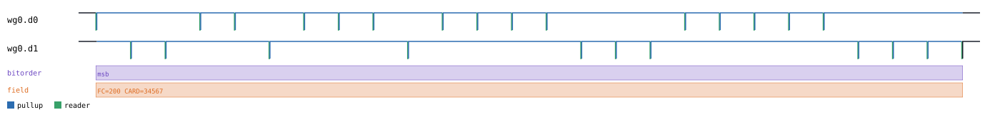
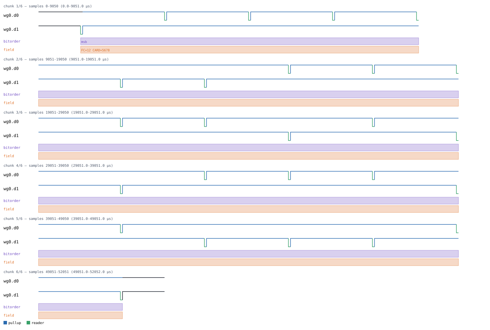
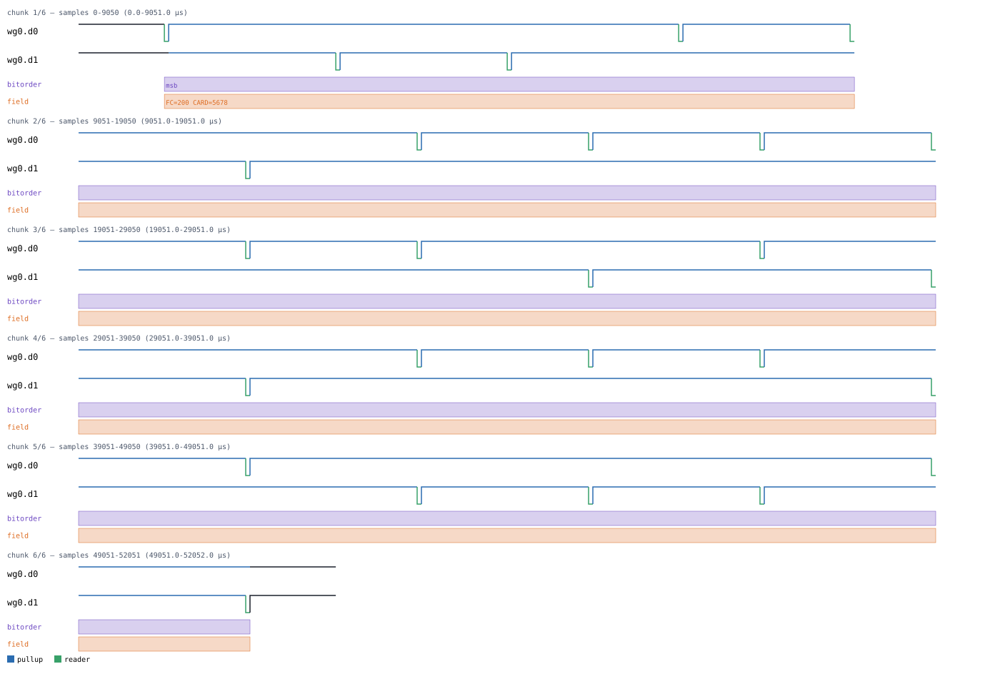
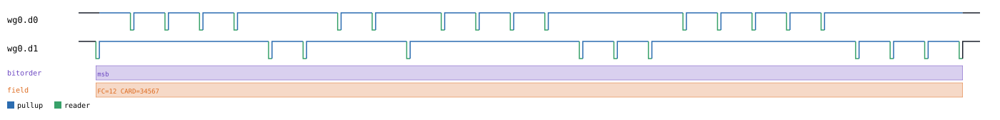

# Wiegand

Back to [usage overview](../USAGE.md).

## What this is

Wiegand is the wiring standard nearly every door-badge/card-access reader
uses to talk to a controller: two open-collector lines, conventionally
labeled `D0` and `D1`, both idling high, with **no clock signal at all**.
Each bit is a brief low pulse on exactly one of the two lines — a `0` bit
pulses `D0`, a `1` bit pulses `D1` — so the receiver recovers both the bit
value and its timing from which wire moved. This is electrically a
genuinely different shape from every other protocol in this project: there
is no shared clock line to synchronize to, and (unlike I2C/1-Wire, which
share one open-drain line) the "0" and "1" symbols each get their own
dedicated wire instead of being time-multiplexed onto one.

This page generates realistic Wiegand timing diagrams — a reader
transmitting a standard 26-bit access-control card read (parity + 8-bit
facility code + 16-bit card number) — without any real card or reader
hardware. The output is a diagram (SVG) and/or a capture file (`.sr`/`.vcd`)
you can open in PulseView, sigrok-cli, or GTKWave as if a logic analyzer
had actually probed the two wires.

Both `d0`/`d1` are open-collector (`SignalKind.TRISTATE`): a logic-1 level
in the diagram always means "the pull-up resistor is holding the line
high, nobody's driving it," never a reader actively driving high — same
convention as I2C's SDA/SCL and 1-Wire's DQ. This matters if you ever
hand-write a floating-bit payload — see
[the datatype/floating-marker guide](../USAGE.md#the-floating-bit-marker-system-lhz).

## Quick start

```bash
.venv/bin/python -m protowavegen --config examples/wiegand_basic.json
```

This runs `examples/wiegand_basic.json` (shown in full in the appendix
below) and writes `output/wiegand_basic.svg`/`.sr`/`.vcd` — a single
26-bit card transmission with facility code `12` and card number `34567`:



## What you can customize

Without touching the JSON at all, the CLI can change:
- **The facility code and card number** on the standard 26-bit frame
  (`facility_code`/`card_number` on `send_card_26bit`) — the two fields an
  end user actually cares about when simulating "what if this reader saw a
  different badge," reachable via `--data-int`/`--data-bits` (see the
  recipes below — `--set` turns out *not* to work here, which is worth
  knowing before you reach for it).
- **Raw bit patterns**, if you're not using the 26-bit helper at all —
  the lower-level `send_bits` operation takes any flat sequence of 0/1
  bits (optionally with floating positions), useful for simulating a
  nonstandard frame format real Wiegand hardware also uses in the field
  (34-bit, 37-bit, and other card formats all exist).
- **The pulse width and inter-bit interval** (`pulse_us`/`interval_us`) —
  these are constructor `params`, not operation fields, so changing them
  needs a JSON edit (see below).

## Recipes — customizing via the CLI

### Changing the facility code

`facility_code` is one of `send_card_26bit`'s two data fields. Despite
looking like a plain scalar (a single small integer), it's actually
registered as a *payload* field internally — the same bucket as a
byte-array — so `--set` refuses it outright:

```
$ .venv/bin/python -m protowavegen --config examples/wiegand_basic.json --set "wg0:0:facility_code=99"
ValueError: --set: 'facility_code' is a payload (byte-array) field, not a scalar — use
--data-hex/--data-string/--data-int/--data-bin/--data-bits/--data-file instead
```

The error message's own suggestion is right: this is a `--data-*` field.
`--data-int` reaches it directly, since `facility_code`/`card_number`
accept a plain integer under their default `"bytes"` datatype:

```bash
.venv/bin/python -m protowavegen --config examples/wiegand_basic.json --format svg \
    --data-int "wg0:0:facility_code:99"
```

It's also reachable via `--data-bits`, since `facility_code`/`card_number`
also each accept a `"bits"` datatype: an exact-width (8 bits here) string
of `0`/`1` characters, decoded with the same floating-marker alphabet
(`l/L/h/H/z/Z`) as everything else in this project:

```bash
.venv/bin/python -m protowavegen --config examples/wiegand_basic.json --format svg \
    --data-bits "wg0:0:facility_code:11001000"
```

`11001000` is `200` in binary — this changes the transmitted facility code
from `12` to `200` while leaving the card number untouched:



### Changing the card number

`card_number` works the same way, just 16 bits wide instead of 8:

```bash
.venv/bin/python -m protowavegen --config examples/wiegand_basic.json --format svg \
    --data-bits "wg0:0:card_number:0001011000101110"
```

`0001011000101110` is `5678` in binary:



Both flags chain in one invocation (each targets a different field on the
same operation via the inline `protocol_id:op_index:field:` prefix — see
[Chaining multiple overrides](../USAGE.md#chaining-multiple-overrides-in-one-invocation)),
letting you simulate an entirely different card in one command:

```bash
.venv/bin/python -m protowavegen --config examples/wiegand_basic.json --format svg \
    --data-bits "wg0:0:facility_code:11001000" \
    --data-bits "wg0:0:card_number:0001011000101110"
```



### When you still need to edit the JSON

`pulse_us` (default `50`) and `interval_us` (default `2000`) — how long
each bit's pulse lasts, and the gap between one bit's pulse and the next —
are constructor `params`, not operation fields, so there's no operation
for `--set`/`--data-*` to target. Widening the pulse and tightening the
interval means editing the config directly:

```diff
-      "id": "wg0", "type": "wiegand",
+      "id": "wg0", "type": "wiegand", "params": { "pulse_us": 100, "interval_us": 1000 },
```



Neither value is tied to any particular reader's datasheet — real Wiegand
readers vary in exact pulse/interval timing, so both are representative
defaults rather than a spec-mandated number.

---

## Appendix — operations reference

`type: "wiegand"` — `WiegandBus`, `protocols/wiegand.py`.

### Constructor params

```json
"params": { "pulse_us": 50, "interval_us": 2000 }
```

- `pulse_us` (default `50`), `interval_us` (default `2000`) — representative
  defaults, not tied to any one reader's datasheet.

### Operations

- **`send_bits`** — `bits`, `datatype="bytes"`. `bits` is a plain
  `list[int]` (each element 0/1, default) or, with `datatype="bits"`, a
  flat `0`/`1`/`l/L`/`h/H`/`z/Z` string via `decode_bits_with_floating`
  (no byte-alignment needed — a card frame's bit count usually isn't a
  multiple of 8) — reachable from the CLI via `--data-bits` (e.g.
  `--data-bits "wg0:0:bits:0z1"`), which tags the `"bits"` datatype this
  field expects. Confirmed working: a scratch config with
  `{"op": "send_bits", "bits": [1,0,1,0]}` overridden via
  `--data-bits "wg0:0:bits:0z1"` runs cleanly and resolves the floating `z`
  position via `D0`/`D1`'s pull-high, same as `facility_code`/
  `card_number` below.
- **`send_card_26bit`** — `facility_code`, `card_number`, each with its own
  `facility_code_datatype`/`card_number_datatype` (both default `"bytes"`).
  Builds the standard 26-bit format (leading even parity over the first 12
  data bits, 8-bit facility code, 16-bit card number, trailing odd parity
  over the last 12 data bits) — the most common Wiegand card format, though
  far from the only one in the field. With the default `"bytes"` datatype
  each field is a plain range-checked int (facility_code 0-255, card_number
  0-65535); with `"bits"` it's an exact-width (8 or 16 characters) `0`/`1`/
  `l/L`/`h/H`/`z/Z` string instead, and parity is always computed over the
  already-resolved concrete bits, so a floating marker never affects
  parity correctness. Both fields are registered internally as payload
  fields (not plain scalars), which is why `--set` refuses them — reach
  them via `--data-int` or `--data-bits` instead (see the recipes above).

### Example — `examples/wiegand_basic.json`

```json
{
  "samplerate": 1000000,
  "protocols": [
    {
      "id": "wg0",
      "type": "wiegand",
      "operations": [
        { "op": "send_card_26bit", "facility_code": 12, "card_number": 34567 }
      ]
    }
  ],
  "outputs": [
    { "type": "svg", "path": "output/wiegand_basic.svg" },
    { "type": "sigrok", "path": "output/wiegand_basic.sr" },
    { "type": "vcd", "path": "output/wiegand_basic.vcd" }
  ]
}
```
